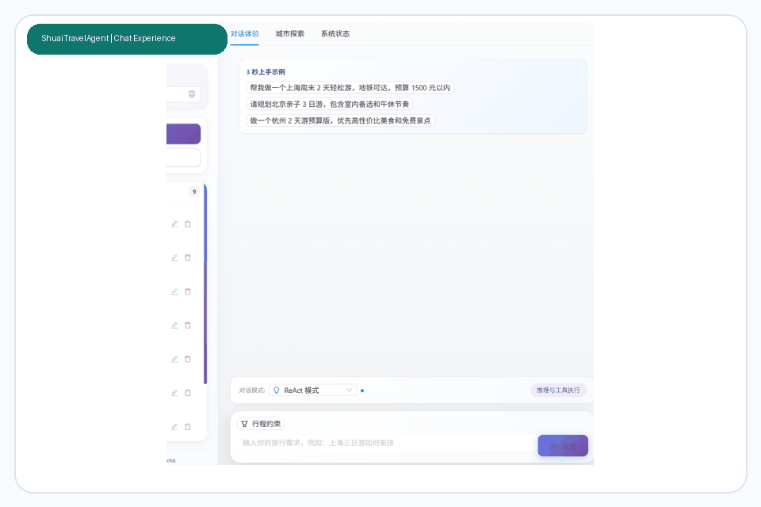
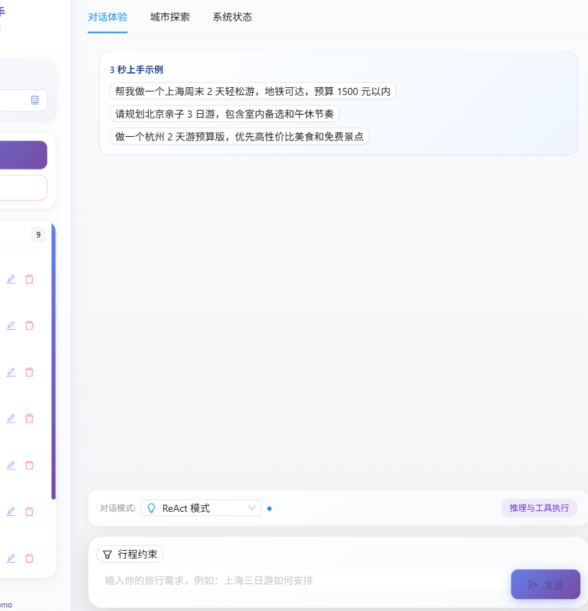
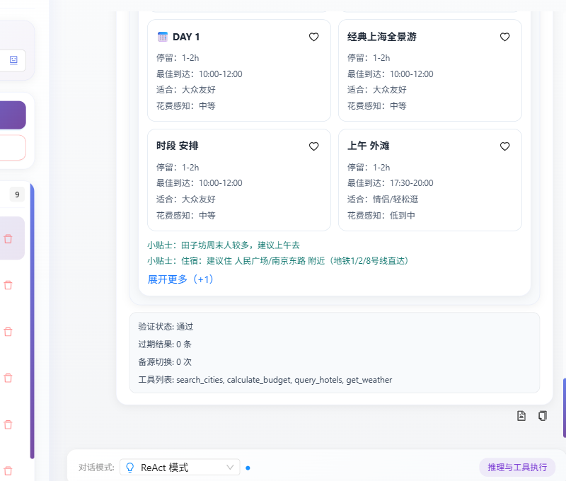

# moyuan-travel-agent


moyuan-travel-agent 是一个面向真实旅行决策场景的 AI 旅行助手项目，覆盖“问问题 -> 生成方案 -> 调整预算/约束 -> 对比方案 -> 导出分享”的完整链路。

它不是只输出一段长文本，而是尽量把旅行建议整理成可继续操作的结构化结果：每日行程卡、预算联动、候选城市探索、对比模式、冲突检测、导出图片与分享链接。

## 目录

- [快速演示](#快速演示)
- [产品预览](#产品预览)
- [当前核心能力](#当前核心能力)
- [技术栈](#技术栈)
- [项目结构](#项目结构)
- [本地访问地址](#本地访问地址)
- [快速开始](#快速开始)
- [常用接口](#常用接口)
- [测试与质量](#测试与质量)
- [文档导航](#文档导航)
- [适合继续优化的方向](#适合继续优化的方向)

## 快速演示



## 产品预览

### 1. 对话与流式执行



### 2. 城市探索与决策卡片


### 3. 行程工具箱与结果整理



## 当前核心能力

### 对话与 Agent

- 三种对话模式：`direct`、`react`、`plan`
- SSE 流式输出：阶段、工具调用、推理片段、最终答案、执行元数据
- 会话管理：新建、清空、删除、重命名、切换模型
- 高风险问题保护：时效校验、fallback 标记、可信度与风险提示

### 行程结果增强

- 长文本自动拆成每日行程卡
- 行程卡内置预算展示、路线信息、时间段结构化展示
- 预算滑杆：省钱 / 均衡 / 舒适
- 多方案对比：并排比较后继续细化
- 冲突检测：时间冲突、路程过长、闭馆风险，并给出一键修复建议
- Checklist、出发提醒、可信度条、风险提示
- 结果导出：图片长图、分享短链

### 城市探索

- 100+ 城市探索池（当前内置 150+）
- 快速筛选：周末、预算、亲子、少走路、雨天、美食
- 场景入口：`周末快闪 / 亲子省心 / 预算吃好`
- 城市卡片决策信息：预算强度、步行强度、风格标签、推荐理由
- shortlist、收藏池、对比池与详情抽屉：先收集候选，再进入并排对比
- 一键以某座城市继续生成完整旅行方案

### 地图与路线

- 支持真实路线距离预览
- 行程卡中可触发“真实路线”与“按距离重排”
- 当前路线能力基于高德方案接入

## 技术栈

- Frontend: Next.js 16 + React 19 + TypeScript + antd
- Web API: FastAPI
- Agent: LangChain + LangGraph
- Model: MiniMax M2.5（Anthropic 兼容接口）

## 项目结构

```text
moyuan-travel-agent/
├── .editorconfig         # 编辑器编码、换行与缩进规范
├── .gitattributes        # Git 文本归一化与二进制文件策略
├── agent/                  # Agent 图、节点、工具、记忆、checkpoint
├── web/                    # FastAPI 路由、服务、仓储、存储
├── frontend/               # Next.js 前端
├── tests/                  # 后端/集成测试
├── docs/                   # 文档中心
├── config/                 # 服务与模型配置
├── data/                   # 本地运行数据
├── scripts/                # benchmark / replay / quality gate 等脚本
├── dev.ps1                 # 本地开发、测试与基础设施命令入口
├── compose.yaml            # 根目录 Compose
├── requirements-dev.txt    # 本地开发与静态检查依赖
└── Dockerfile.backend      # Web API Dockerfile
```

当前前端已经按 harness engineering 的思路逐步薄化主入口：

- `frontend/src/components/ChatArea.tsx` 负责 chat workspace 装配，主逻辑落在 `frontend/src/components/chat-area/`
- `frontend/src/components/chat-area/useChatRuntime.ts` 已继续下沉，流缓冲、artifact 运行态、run lifecycle、share/session hydration 和 input policy 分别落在 `useStreamBuffer.ts`、`useArtifactRuntimeState.ts`、`useChatRunState.ts`、`useChatSessionHydration.ts`、`chatInputPolicy.ts`、`runtimeMessageBuilders.ts`
- `frontend/src/components/chat-area/chatRuntimeReplay.ts` 负责把后端 `chat stream golden fixture` 回放成前端最终运行时快照，作为 frontend harness 的 replay/golden 基线
- `frontend/src/context/AppContext.tsx` 现在主要保留全局 provider 装配，session cache / history recovery 与 model bootstrap 已分别下沉到 `frontend/src/context/useSessionHistoryState.ts` 和 `frontend/src/context/useModelBootstrapState.ts`；其中 `useSessionHistoryState.ts` 会在会话恢复时补调 `artifactClient.getLatestArtifact()`，把缺失的 persisted artifact 回填到最新 assistant message diagnostics，并把 `sessionId` 一并补回 diagnostics，供后续 compare/history UI 继续读取 artifact history
- `frontend/src/services/api/artifactClient.ts` 现在同时提供 `getLatestArtifact()` 和 `getArtifactHistory()`，为 session restore、artifact compare/history UI 与 compare tab 的 artifact-history 优先路径提供稳定数据面
- `web/moyuan_web/bootstrap.py` 现在统一收口 repo root + `web/` 的导入入口，`tests/conftest.py` 会直接复用它来初始化 pytest 的导入边界，避免 root tests 继续各自写 `sys.path` 补丁
- `scripts/bootstrap_paths.py` 现在统一承接 benchmark / replay / runtime / snapshot 脚本的导入入口，`agent_benchmark.py`、`agent_replay.py`、`runtime_doctor.py`、`export_openapi_snapshot.py` 等脚本不再各自内联 repo root / `web/` 注入
- `agent/travel_agent/memory/conflict_resolution.py` 现在统一承接 memory 冲突检测、澄清提示排序、显式覆盖闭环、resolved 审计日志和 persisted conflict schema 归一化，`agent/travel_agent/graph/memory_integration.py` 已进一步退化为会话 memory 编排层
- `agent/travel_agent/contracts/skills.py`、`agent/travel_agent/skills/registry.py` 与 `agent/travel_agent/subagents/registry.py` 现在把 `skills market` 收口成显式 schema + selection policy：默认 skill 会带 `owner / version / input / output / evidence / freshness / fallback / docs / eval` 元数据，以及 `priority / intent_signals / preferred_context` 选择规则；`AgentRuntime` diagnostics 也会暴露 `subagent_skill_policies`，不再把能力选择继续藏在 prompt 里；配套 onboarding 清单见 [docs/governance/skills-market-onboarding.md](docs/governance/skills-market-onboarding.md)，catalog 见 [docs/reference/skills-market-catalog.md](docs/reference/skills-market-catalog.md)
- `scripts/docstring_audit.py` 现在不只检查 docstring 是否存在，还会识别低信息量模板文档，并用 `docs/reference/docstring-audit.low-info-baseline.json` 记录存量基线；`--strict` 会同时拦截新增缺失项和新增低信息量项
- `scripts/complexity_budget.py` 现在会对高复杂度热点文件执行“只减不增”的行数预算门禁，并用 `docs/reference/complexity-budget.json` 记录当前预算基线；`--strict` 会拦截热点文件无序膨胀
- `docs/governance/` 现在统一承接 `ADR / RFC / Design Review` 流程，配套 `scripts/decision_record_audit.py` 会检查记录模板和必填章节，避免跨层设计决策再次漂回口头约定
- `frontend/src/components/MessageList.tsx` 负责消息区装配，渲染与诊断逻辑落在 `frontend/src/components/message-list/`
- `frontend/src/components/TravelPlanToolkit.tsx` 负责 trip-plan workspace 装配，`travel-plan-toolkit/sections.tsx` 已退化成 facade，真实 itinerary / compare / practical 视图块落在 `frontend/src/components/travel-plan-toolkit/sections/`，而 export/share/favorites/route 这类动作编排已经下沉到 `travel-plan-toolkit/useTravelPlanToolkitActions.ts`
- `frontend/src/components/travel-plan-toolkit/shared/artifact.ts` 负责统一的 artifact delivery descriptor，集中收口 overview 指标、destinations / budget / verification 摘要、分享文本、导出文件名和 HTML 交付内容；当 `TravelPlanToolkit` 已拿到结构化 artifact 时，overview、分享短链、图片导出和 share html 内容都会优先消费同一份 descriptor，而不是继续各自拼装
- `frontend/tests/features/trip-plan/travelPlanDeliverySnapshot.test.ts` 现在会基于 `tests/golden/frontend_chat_runtime_golden_fixture.json` 回放结构化 artifact，并把最终 HTML 交付内容固化到 `frontend/tests/features/trip-plan/__snapshots__/travelPlanDeliverySnapshot.test.ts.snap`，锁住 delivery harness 的模板与字段回归
- `frontend/src/components/travel-plan-toolkit/useArtifactHistoryCompare.ts` 负责 compare tab 的 artifact-history 协调；当 diagnostics 里已有 `sessionId` 时，会优先拉取 `artifactClient.getArtifactHistory(sessionId)` 并把 persisted artifact snapshots 组装成 compare variants
- `frontend/src/components/travel-plan-toolkit/actionPrompts.ts` 现在也会优先携带 artifact 上下文来构造 quick refine、候选池重做和 variant continue prompt，使“继续编辑”不再只依赖原始长文本
- `frontend/src/components/travel-plan-toolkit/sections/itinerary/day-card/` 继续把单日行程卡拆成 `ItineraryConflictSection / ItinerarySpotDecisionGrid / ItineraryTipsBlock` 三个 view adapter，收口风险提醒、景点决策卡和 tips 区块
- `frontend/src/components/travel-plan-toolkit/sections/itinerary/budget-panel/` 继续把预算面板拆成 `BudgetModeToolbar / BudgetStatsSummary / BudgetQuickRefineBar / BudgetConfidencePanel` 四个 view adapter，收口预算档位、预算统计、quick refine 和 confidence 风险提示
- `frontend/src/components/travel-plan-toolkit/sections/compare-tab/` 继续把对比视图拆成 `CompareEmptyState / VariantComparisonTable / VariantActionBar` 三个 view adapter，收口空态、对比表和继续细化动作；其中 compare table 现在同时支持 text-first 和 artifact-history 两条输入路径
- `frontend/src/components/travel-plan-toolkit/sections/conflicts-tab/` 继续把冲突检测视图拆成 `ConflictSummaryTag / ConflictCardContent / DayConflictCard` 三个 view adapter，收口摘要标签、按日冲突卡和一键修复动作
- `frontend/src/components/travel-plan-toolkit/sections/practical-tab/` 继续把实用信息视图拆成 `PracticalInfoGrid / PracticalInfoCardItem / PracticalToneTag` 三个 view adapter，收口信息卡网格、单卡内容和 tone 标签
- `frontend/src/components/travel-plan-toolkit/sections/reminders-tab/` 继续把出发提醒视图拆成 `RemindersList / ReminderCardContent / ReminderPhaseTag` 三个 view adapter，收口提醒卡列表、单卡内容和阶段标签
- `frontend/src/components/travel-plan-toolkit/sections/checklist-tab/` 继续把执行清单视图拆成 `ChecklistList / ChecklistItemRow / ChecklistStatusTag` 三个 view adapter，收口清单列表、单项行和完成状态 affordance
- `frontend/src/components/travel-plan-toolkit/shared/` 已按领域拆成 `timeline / budget / risk / practical / reminders / checklist / content / subagents / types` helper 模块，`shared.tsx` 现在只保留兼容 facade
- `frontend/src/components/travel-plan-toolkit/actionPrompts.ts` 与 `useTravelPlanToolkitActions.ts` 已把 variant continue、favorites quick refine、导出分享和路线预览动作从主组件里抽离；其中图片导出也会优先带上 artifact 派生的标题、摘要和文件名，配套 `frontend/tests/features/trip-plan/travelPlanActionPrompts.test.ts`、`travelPlanShared.test.ts` 与 `TravelPlanToolkit.test.tsx` 已锁住 prompt 构造、导出元信息和候选池重做方案边界
- 前端测试目录已经按 feature 语义收口到 `frontend/tests/features/`，当前 `chat / app-shell / trip-plan / city-explorer / shared` 五类工作区各自维护边界测试，避免目录语义继续漂移
- `frontend/src/components/CityExplorer.tsx` 负责 city-explorer workspace 装配，筛选、shortlist、对比和详情逻辑落在 `frontend/src/components/city-explorer/`
- `frontend/src/components/city-explorer/sections.tsx` 现在只保留兼容 facade，Hero / FilterBar / ComparePanel / Grid / DetailDrawer 已拆到 `frontend/src/components/city-explorer/sections/`
- `frontend/src/components/city-explorer/sections/hero/` 继续把 `HeroSection` 下沉成 `HeroSummaryHeader / CuratedPromptPanel / FavoriteShortlistPanel` 三个 view 协作器，并锁住 shortlist 的“去规划”边界
- `frontend/src/components/city-explorer/sections/grid/` 继续把 `GridSection` 下沉成 `GridSummaryBar / CityGridCard / CityGridCardMetrics / CityGridCardActions` 四个 view 协作器，并锁住城市卡的“规划”动作边界
- `frontend/src/services/api.ts` 只保留兼容 facade，真实 endpoint client 在 `frontend/src/services/api/`

更详细的目录说明见 [docs/reference/project-structure.md](docs/reference/project-structure.md)。

## 本地访问地址

- Frontend: `http://localhost:33001`
- API: `http://localhost:38000`
- API Docs: `http://localhost:38000/rapidoc`
- Health: `http://localhost:38000/api/health`
- Ready: `http://localhost:38000/api/ready`
- Metrics: `http://localhost:38000/api/metrics`
- Prometheus: `http://localhost:39090` (`observability` profile)
- Grafana: `http://localhost:33002` (`observability` profile)

## 快速开始

### 1. 准备环境

- Python 3.13+
- Node.js 20+
- uv
- npm
- Docker / Docker Compose（可选，但推荐用于联调）

### 2. 安装依赖

```bash
uv python install 3.13
uv venv .venv --python 3.13
.\.venv\Scripts\activate
uv pip install -r requirements-dev.txt

cd frontend
npm install
cd ..
```

安装完成后，建议先看一眼统一命令入口：

```bash
powershell -ExecutionPolicy Bypass -File .\dev.ps1 help
```

### 3. 准备配置

```bash
copy config\llm_config.yaml.example config\llm_config.yaml
copy config\server_config.yaml.example config\server_config.yaml
```

根据实际模型服务填写 `api_key`、`api_base`、`model`。

`server_config.yaml` 负责统一：

- `web.host / web.port`
- `frontend.port`
- `cors_origins`
- `request_timeout_seconds`
- `rate_limit_max_requests`
- `metrics_enabled / metrics_path`
- `structured_logging`
- `fail_fast_validation`

如果只是运行服务、完全不做开发，也可以只安装：

```bash
uv pip install -r requirements.txt
```

### 4. 启动后端

```bash
.\.venv\Scripts\python.exe -m uvicorn moyuan_web.main:app --host 0.0.0.0 --port 38000 --app-dir web
```

### 5. 启动前端

```bash
cd frontend
npm run dev
```

### 6. 开始体验

1. 打开 `http://localhost:33001`
2. 选择模型与对话模式
3. 在“行程约束”里补充亲子/预算/无车等前置条件
4. 输入旅行需求，等待流式生成
5. 在结果区继续调整预算、查看多方案、检测冲突、导出图片或分享

更完整的启动说明见 [docs/getting-started/quick-start.md](docs/getting-started/quick-start.md)。

### 6.1 常用统一命令入口

```bash
powershell -ExecutionPolicy Bypass -File .\dev.ps1 test
powershell -ExecutionPolicy Bypass -File .\dev.ps1 infra-check
powershell -ExecutionPolicy Bypass -File .\dev.ps1 compose-config
powershell -ExecutionPolicy Bypass -File .\dev.ps1 container-smoke
```

说明：

- `test`: 后端 `unit/local` + 前端 `lint/test/build`
- `infra-check`: `ruff`、`mypy`、`docstring`、`complexity budget`、`decision records`、runtime doctor、契约快照、release manifest，以及在 Docker 可用时附带 compose 渲染校验
- `compose-config`: 渲染默认和 `observability` profile 的 Compose 配置
- `container-smoke`: 本地构建 backend / frontend 镜像

### 7. Docker Compose 启动

如果想以统一的前后端容器方式联调，优先使用根目录 Compose：

```bash
docker compose up --build
```

如果想连同 Prometheus 和 Grafana 一起启动本地观测栈：

```bash
docker compose --profile observability up --build
```

如果当前网络拉取 Docker Hub 基础镜像较慢，可以直接切到镜像站：

```bash
powershell -ExecutionPolicy Bypass -File .\dev.ps1 compose-up `
  -PythonBaseImage "5ykpmdvdg6to97.xuanyuan.run/library/python:3.13-slim" `
  -NodeBaseImage "5ykpmdvdg6to97.xuanyuan.run/library/node:22-alpine"
```

如果只想验证本地镜像构建：

```bash
powershell -ExecutionPolicy Bypass -File .\dev.ps1 container-smoke `
  -PythonBaseImage "5ykpmdvdg6to97.xuanyuan.run/library/python:3.13-slim" `
  -NodeBaseImage "5ykpmdvdg6to97.xuanyuan.run/library/node:22-alpine"
```

相关资产：

- [compose.yaml](/D:/moyuan/moyuan-travel-agent/compose.yaml)
- [Dockerfile.backend](/D:/moyuan/moyuan-travel-agent/Dockerfile.backend)
- [frontend/Dockerfile](/D:/moyuan/moyuan-travel-agent/frontend/Dockerfile)

## 常用接口

### Chat

- `POST /api/chat/stream`

请求示例：

```json
{
  "message": "请给我一个上海周末两日游建议，预算 1500 元以内",
  "session_id": "optional-session-id",
  "mode": "react"
}
```

### Session

- `POST /api/session/new`
- `GET /api/sessions`
- `PUT /api/session/{session_id}/name`
- `PUT /api/session/{session_id}/model`
- `DELETE /api/session/{session_id}`
- `POST /api/clear?session_id=...`

### Artifacts

- `GET /api/artifacts/{session_id}/latest`
  - 前端 session restore 会优先用它补齐 persisted artifact，避免刷新后只能回退到纯文本恢复
- `GET /api/artifacts/{session_id}/history?limit=10`
  - 返回当前 session 中 newest-first 的 artifact 快照列表；现在 compare/history UI 会直接消费这条 contract，不再继续扫描原始 session messages 来拼对比方案

### City Explorer

- `GET /api/cities`
- `GET /api/cities/{city_id}`
- `GET /api/cities/{city_id}/attractions`
- `GET /api/regions`
- `GET /api/tags`

### Health

- `GET /api/health`
- `GET /api/health/llm`
- `GET /api/health/tools`
- `GET /api/health/tools/intents`
- `GET /api/ready`
- `GET /api/live`
- `GET /api/metrics`

完整接口说明见 [docs/reference/api-reference.md](docs/reference/api-reference.md)。

## 部署与观测

### readiness 与启动校验

后端启动时会执行真实 startup checks，并把结果暴露到 `/api/ready`。当前会检查：

- `server_config` 是否可解析
- `data/` 是否可写
- `llm_config` 是否存在且至少有一个 active model
- 依赖容器能否 resolve
- Chat runtime 是否能初始化

如果希望启动失败时直接退出，可设置：

```bash
set MOYUAN_FAIL_FAST_STARTUP_VALIDATION=true
```

### request_id / trace_id

前端 REST 与 SSE 请求都会自动携带：

- `X-Request-ID`
- `X-Trace-ID`

后端会把它们写入：

- 响应头
- 结构化日志
- SSE payload 的 `request_id / trace_id`

### runtime doctor

运行维护时，推荐先跑一遍：

```bash
python scripts/runtime_doctor.py --json
python scripts/runtime_doctor.py --base-url http://localhost:38000 --strict
```

它会检查：

- `config/server_config.yaml` / `config/llm_config.yaml`
- `data/` 可写性与运行态文件
- 备份归档目录
- OpenAPI / SSE 契约快照
- 可选的 live `/api/health`、`/api/ready`、`/api/metrics`

### Prometheus metrics

当前默认暴露：

- `GET /api/metrics`

主要指标包括：

- `moyuan_http_requests_total`
- `moyuan_http_request_duration_seconds`
- `moyuan_http_in_flight_requests`
- `moyuan_chat_stream_requests_total`
- `moyuan_sse_events_total`
- `moyuan_readiness_state`

## 测试与质量

### 前端

```bash
cd frontend
npm run lint
npm run test:run
npm run build
```

### 后端

```bash
python -m pytest tests -m "unit and not local and not external_api" -q
python -m pytest tests -m "local and not external_api" -q
python -m ruff check --config ruff.toml scripts web/moyuan_web
python scripts/docstring_audit.py --strict
python scripts/complexity_budget.py --strict
python scripts/decision_record_audit.py --strict
mypy --config-file mypy.ini scripts/export_openapi_snapshot.py scripts/export_release_manifest.py scripts/export_support_bundle.py scripts/export_sse_contract_snapshot.py scripts/runtime_backup.py scripts/runtime_data_utils.py scripts/runtime_doctor.py scripts/runtime_prune.py scripts/runtime_restore.py web/moyuan_web/app_meta.py web/moyuan_web/main.py web/moyuan_web/middleware/__init__.py web/moyuan_web/observability.py web/moyuan_web/routes/chat.py web/moyuan_web/routes/health.py web/moyuan_web/services/share_service.py web/moyuan_web/startup_checks.py
```

其中 `python scripts/docstring_audit.py --strict` 当前会同时检查两类问题：

- 缺失 docstring
- 新增低信息量 docstring（历史存量由 `docs/reference/docstring-audit.low-info-baseline.json` 管理）
- 热点文件超出复杂度预算（由 `python scripts/complexity_budget.py --strict` 检查）
- 治理记录缺失必填章节（由 `python scripts/decision_record_audit.py --strict` 检查）

### 推荐统一入口

- `powershell -ExecutionPolicy Bypass -File .\dev.ps1 test`
- `powershell -ExecutionPolicy Bypass -File .\dev.ps1 infra-check`
- `powershell -ExecutionPolicy Bypass -File .\dev.ps1 snapshots`
- `powershell -ExecutionPolicy Bypass -File .\dev.ps1 support-bundle`
- `powershell -ExecutionPolicy Bypass -File .\dev.ps1 container-smoke`

### Agent 质量脚本

- `python scripts/agent_benchmark.py --output-dir docs/benchmarks`
- `uv run --offline python scripts/agent_subagent_scorecard.py --output-dir docs/benchmarks`
- `python scripts/agent_golden_eval.py --dataset tests/golden/agent_react_golden.json --report docs/benchmarks/agent_golden_eval_latest.json --min-pass-rate 0.0`
- `python scripts/agent_quality_gate.py --golden-report ... --benchmark-report ... --baseline-benchmark-report ...`

### 运行数据与契约维护脚本

- `python scripts/runtime_backup.py`
- `python scripts/runtime_restore.py --archive ...`
- `python scripts/runtime_prune.py --keep-latest-backups 10 --max-backup-age-days 14`
- `python scripts/runtime_doctor.py --json`
- `python scripts/export_openapi_snapshot.py`
- `python scripts/export_sse_contract_snapshot.py`
- `python scripts/export_frontend_chat_runtime_golden_fixture.py`
- `python scripts/export_release_manifest.py --git-sha <sha> --git-ref <ref> --owner <owner>`
- `python scripts/export_support_bundle.py --base-url http://localhost:38000`

### 契约与安全基线

- OpenAPI snapshot: [docs/reference/openapi.snapshot.json](docs/reference/openapi.snapshot.json)
- SSE snapshot: [docs/reference/sse-contract.snapshot.json](docs/reference/sse-contract.snapshot.json)
- Chat stream replay fixture: [tests/golden/chat_stream_golden_fixture.json](/D:/moyuan/moyuan-travel-agent/tests/golden/chat_stream_golden_fixture.json)
- Frontend chat runtime replay fixture: [tests/golden/frontend_chat_runtime_golden_fixture.json](/D:/moyuan/moyuan-travel-agent/tests/golden/frontend_chat_runtime_golden_fixture.json)
- Subagent scorecard report: [docs/benchmarks/agent_subagent_scorecard_latest.md](docs/benchmarks/agent_subagent_scorecard_latest.md)
- CI dependency audit: `pip-audit -r requirements.txt`
- CI secret scan: Dockerized `gitleaks` with [`.gitleaks.toml`](/D:/moyuan/moyuan-travel-agent/.gitleaks.toml)

### 发布与观测资产

- Release workflow: [`.github/workflows/release.yml`](/D:/moyuan/moyuan-travel-agent/.github/workflows/release.yml)
- Release manifest: [`scripts/export_release_manifest.py`](/D:/moyuan/moyuan-travel-agent/scripts/export_release_manifest.py)
- Support bundle: [`scripts/export_support_bundle.py`](/D:/moyuan/moyuan-travel-agent/scripts/export_support_bundle.py)
- Grafana dashboard: [`ops/observability/grafana-dashboard.json`](/D:/moyuan/moyuan-travel-agent/ops/observability/grafana-dashboard.json)
- Prometheus alerts: [`ops/observability/prometheus-alerts.yml`](/D:/moyuan/moyuan-travel-agent/ops/observability/prometheus-alerts.yml)
- Local Prometheus config: [`ops/observability/prometheus.yml`](/D:/moyuan/moyuan-travel-agent/ops/observability/prometheus.yml)

### 仓库规范与容器校验

- 编辑器规范：[`/.editorconfig`](/D:/moyuan/moyuan-travel-agent/.editorconfig)
- Git 文本归一化：[`/.gitattributes`](/D:/moyuan/moyuan-travel-agent/.gitattributes)
- 本地命令入口：[`/dev.ps1`](/D:/moyuan/moyuan-travel-agent/dev.ps1)
- CI 的 `container-validate` 会执行 `docker compose config`、`docker compose --profile observability config`、后端镜像 smoke build、前端镜像 smoke build，并上传 `deployment-validation-artifacts`

更多测试与回放说明见 [docs/testing/testing-guide.md](docs/testing/testing-guide.md)。

## 文档导航

### 教学入口：按任务场景跳转

- 系统学习整个项目：
  先看 [docs/teaching/README.md](docs/teaching/README.md)
- `30 分钟速览`：
  看 [docs/teaching/01-total-plan-and-learning-method.md](docs/teaching/01-total-plan-and-learning-method.md)
- `半天上手`：
  依次看 [docs/teaching/01-total-plan-and-learning-method.md](docs/teaching/01-total-plan-and-learning-method.md)、[docs/teaching/02-chat-mainline-and-frontend.md](docs/teaching/02-chat-mainline-and-frontend.md)、[docs/teaching/03-web-api-session-and-storage.md](docs/teaching/03-web-api-session-and-storage.md)
- `改 Bug 前先找主链`：
  先看 [docs/teaching/02-chat-mainline-and-frontend.md](docs/teaching/02-chat-mainline-and-frontend.md)，再按故障落点跳到 [docs/teaching/03-web-api-session-and-storage.md](docs/teaching/03-web-api-session-and-storage.md)、[docs/teaching/04-agent-core-tools-memory-checkpoint.md](docs/teaching/04-agent-core-tools-memory-checkpoint.md)、[docs/teaching/05-testing-debugging-and-change-practice.md](docs/teaching/05-testing-debugging-and-change-practice.md)
- `我要改前端`：
  优先看 [docs/teaching/02-chat-mainline-and-frontend.md](docs/teaching/02-chat-mainline-and-frontend.md) 和 [docs/teaching/05-testing-debugging-and-change-practice.md](docs/teaching/05-testing-debugging-and-change-practice.md)
- `我要改 Web API`：
  优先看 [docs/teaching/03-web-api-session-and-storage.md](docs/teaching/03-web-api-session-and-storage.md) 和 [docs/teaching/05-testing-debugging-and-change-practice.md](docs/teaching/05-testing-debugging-and-change-practice.md)
- `我要改 Agent`：
  优先看 [docs/teaching/04-agent-core-tools-memory-checkpoint.md](docs/teaching/04-agent-core-tools-memory-checkpoint.md) 和 [docs/teaching/05-testing-debugging-and-change-practice.md](docs/teaching/05-testing-debugging-and-change-practice.md)
- `我要做 Agent 架构升级 / agent-subagent-skills 规划`：
  优先看 [docs/architecture/agent-subagent-skills-architecture-roadmap.md](docs/architecture/agent-subagent-skills-architecture-roadmap.md)、[docs/architecture/system-architecture.md](docs/architecture/system-architecture.md)、[docs/teaching/04-agent-core-tools-memory-checkpoint.md](docs/teaching/04-agent-core-tools-memory-checkpoint.md)
- `我要看部署 / 配置 / readiness / trace / CI`：
  优先看 [docs/architecture/infrastructure-foundations.md](docs/architecture/infrastructure-foundations.md)、[docs/reference/configuration-reference.md](docs/reference/configuration-reference.md)、[docs/testing/testing-guide.md](docs/testing/testing-guide.md)
- `我要发起大改动 / 补 ADR / 写设计评审`：
  优先看 [docs/governance/README.md](docs/governance/README.md)、[docs/architecture/harness-engineering-next-cycle-roadmap.md](docs/architecture/harness-engineering-next-cycle-roadmap.md)
- `我要接一个新的 skill / 看 skills market 约束`：
  优先看 [docs/reference/skills-market-catalog.md](docs/reference/skills-market-catalog.md)、[docs/governance/skills-market-onboarding.md](docs/governance/skills-market-onboarding.md)、[docs/teaching/04-agent-core-tools-memory-checkpoint.md](docs/teaching/04-agent-core-tools-memory-checkpoint.md)
- `面试前 2 小时复习`：
  优先看 [docs/teaching/01-total-plan-and-learning-method.md](docs/teaching/01-total-plan-and-learning-method.md)、[docs/teaching/06-interview-highlights-and-system-evolution.md](docs/teaching/06-interview-highlights-and-system-evolution.md)、[docs/teaching/07-thinking-questions-homework-and-answers.md](docs/teaching/07-thinking-questions-homework-and-answers.md)

### 其他文档入口

- [docs/README.md](docs/README.md): 文档总入口
- [docs/getting-started/quick-start.md](docs/getting-started/quick-start.md): 快速启动
- [docs/getting-started/ai-travel-agent-zero-to-one.md](docs/getting-started/ai-travel-agent-zero-to-one.md): 面向新人的 AI 旅游 Agent 从 0 到 1 教学教程
- [docs/architecture/system-architecture.md](docs/architecture/system-architecture.md): 系统架构
- [docs/architecture/agent-subagent-skills-architecture-roadmap.md](docs/architecture/agent-subagent-skills-architecture-roadmap.md): Agent 应用层与 `Supervisor -> Subagents -> Skills` 演进路线图
- [docs/architecture/infrastructure-foundations.md](docs/architecture/infrastructure-foundations.md): 运行与部署、配置、readiness、CI、trace、metrics 总览
- [docs/architecture/data-storage.md](docs/architecture/data-storage.md): 运行数据、备份、恢复与清理策略
- [docs/governance/README.md](docs/governance/README.md): ADR / RFC / Design Review 统一入口
- [docs/reference/api-reference.md](docs/reference/api-reference.md): API 参考
- [docs/reference/project-structure.md](docs/reference/project-structure.md): 目录结构
- [docs/reference/backend-maintainer-playbook.md](docs/reference/backend-maintainer-playbook.md): 后端维护与排障手册
- [docs/reference/frontend-message-rendering.md](docs/reference/frontend-message-rendering.md): 前端消息渲染与 `<think>` 折叠机制
- [docs/testing/testing-guide.md](docs/testing/testing-guide.md): 测试与回放

## 适合继续优化的方向

- 把地图预览继续升级为更完整的路线编辑体验
- 补更多真实 provider 的酒店/门票/交通数据源
- 为城市探索加入热度排序、季节排序和更多主题榜单
- 为分享页增加更轻量的外部只读浏览体验
