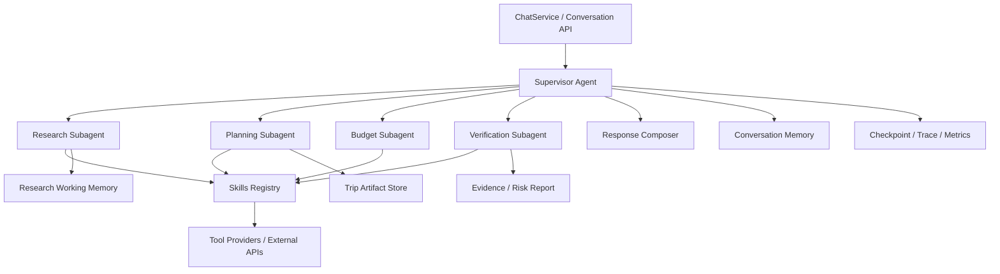

# Agent Subagent Skills Architecture Roadmap

## Implementation Status

Phase 1 and the first slice of Phase 2 have now started landing in code with a compatibility-first approach:

- [`agent/travel_agent/runtime/agent_runtime.py`](/D:/moyuan/moyuan-travel-agent/agent/travel_agent/runtime/agent_runtime.py)
- [`agent/travel_agent/supervisor/builder.py`](/D:/moyuan/moyuan-travel-agent/agent/travel_agent/supervisor/builder.py)
- [`agent/travel_agent/supervisor/nodes.py`](/D:/moyuan/moyuan-travel-agent/agent/travel_agent/supervisor/nodes.py)
- [`agent/travel_agent/subagents/registry.py`](/D:/moyuan/moyuan-travel-agent/agent/travel_agent/subagents/registry.py)
- [`agent/travel_agent/subagents/research.py`](/D:/moyuan/moyuan-travel-agent/agent/travel_agent/subagents/research.py)
- [`agent/travel_agent/subagents/planning.py`](/D:/moyuan/moyuan-travel-agent/agent/travel_agent/subagents/planning.py)
- [`agent/travel_agent/subagents/verification.py`](/D:/moyuan/moyuan-travel-agent/agent/travel_agent/subagents/verification.py)
- [`agent/travel_agent/skills/registry.py`](/D:/moyuan/moyuan-travel-agent/agent/travel_agent/skills/registry.py)
- [`agent/travel_agent/artifacts/models.py`](/D:/moyuan/moyuan-travel-agent/agent/travel_agent/artifacts/models.py)
- [`agent/travel_agent/memory/conflict_resolution.py`](/D:/moyuan/moyuan-travel-agent/agent/travel_agent/memory/conflict_resolution.py)
- [`web/moyuan_web/services/chat_service.py`](/D:/moyuan/moyuan-travel-agent/web/moyuan_web/services/chat_service.py)

The current implementation goal is intentionally conservative:

- keep the existing LangGraph topology stable
- move Web integration onto `AgentRuntime`
- introduce `Supervisor`, `Subagents`, `Skills`, and `Artifact` layers as real code boundaries
- preserve current SSE behavior while attaching artifact-first payloads and subagent events for future evolution
- keep shrinking `memory_integration.py` by migrating conflict handling into dedicated memory collaborators
- default `SkillRegistry` entries now expose governed `owner / version / input / output / selection policy / evidence / freshness / fallback / docs / eval` metadata, with onboarding guidance in [docs/governance/skills-market-onboarding.md](/D:/moyuan/moyuan-travel-agent/docs/governance/skills-market-onboarding.md)
- subagent-side skill selection is now an explicit contract exposed through `selection_policy()` / `selection_plan()` and `AgentRuntime` diagnostics, instead of staying buried in prompt heuristics
- replay / eval side now also has a committed subagent scorecard baseline via [scripts/agent_subagent_scorecard.py](/D:/moyuan/moyuan-travel-agent/scripts/agent_subagent_scorecard.py) and [docs/benchmarks/agent_subagent_scorecard_latest.md](/D:/moyuan/moyuan-travel-agent/docs/benchmarks/agent_subagent_scorecard_latest.md)

这份文档专门回答一个问题：

moyuan-travel-agent 当前已经有一个可运行的 LangGraph Agent，但如果要从“单个能回答问题的 Agent”升级成“能支撑复杂旅行决策产品的 Agent 系统”，下一阶段应该怎么演进。

本文重点从两个层面展开：

1. Agent 应用层
   - 也就是 Web API、ChatService、SSE、Artifact、工作流、会话系统如何围绕 Agent 升级。
2. Agent 架构层
   - 也就是从当前单主 Agent 升级成 `Supervisor Agent -> Subagents -> Skills -> Tool Providers` 的体系。

## 1. 这份路线图适合什么场景

适合这些需求：

- 你准备继续增强 Agent 架构，而不是只加一个新工具
- 你要把当前单图结构升级成多 Agent 协同
- 你想让前端不再主要依赖“长文本二次解析”，而是消费结构化产物
- 你要给团队做一次架构评审，说明接下来 1-3 个迭代的改造方向
- 你要规划一个能兼容当前系统、但更利于未来扩展的 Agent 平台骨架

## 2. 当前基线：项目已经具备什么

当前仓库里的 Agent 主体已经具备比较扎实的第一代工程化能力。

### 2.1 当前主链

当前主链可以概括为：

```text
Frontend
  -> /api/chat/stream
  -> ChatService
  -> LangGraph TravelAgent
  -> tools / memory / checkpoint
  -> SSE 回推
  -> Frontend 渲染与二次结构化
```

对应核心文件：

- [chat_service.py](/D:/moyuan/moyuan-travel-agent/web/moyuan_web/services/chat_service.py)
- [builder.py](/D:/moyuan/moyuan-travel-agent/agent/travel_agent/graph/builder.py)
- [state.py](/D:/moyuan/moyuan-travel-agent/agent/travel_agent/graph/state.py)
- [nodes.py](/D:/moyuan/moyuan-travel-agent/agent/travel_agent/graph/nodes.py)
- [travel_tools.py](/D:/moyuan/moyuan-travel-agent/agent/travel_agent/tools/travel_tools.py)
- [memory_integration.py](/D:/moyuan/moyuan-travel-agent/agent/travel_agent/graph/memory_integration.py)
- [persistent_checkpointer.py](/D:/moyuan/moyuan-travel-agent/agent/travel_agent/graph/persistent_checkpointer.py)

### 2.2 当前已经具备的优点

当前实现并不简单，它已经具备很多后续演进的重要基础：

- 有明确的主图结构：
  - `intent -> strategy -> direct/react/plan -> execute -> verify -> answer -> self_check`
- 有比较成熟的工具治理：
  - timeout
  - retry
  - parallelism
  - stale
  - fallback
  - tool health diagnostics
- 有 memory / checkpoint / session 三套概念分层
- 有 SSE 事件流、request_id / trace_id、metrics、readiness、质量门禁
- 有 benchmark / golden eval / replay / CI contract snapshot 这样的工程能力

也就是说，当前系统不是“缺乏 Agent 工程化”，而是“第一代单主 Agent 工程化已经成形，接下来该升级成多层架构”。

## 3. 当前架构最明显的瓶颈

如果继续沿着当前形态堆功能，会遇到 8 类问题。

### 3.1 `nodes.py` 过重

[nodes.py](/D:/moyuan/moyuan-travel-agent/agent/travel_agent/graph/nodes.py) 当前同时承担了：

- intent 分类
- strategy 选择
- planner
- executor
- verify
- self-check
- answer synthesis

这会带来两个问题：

- 单文件持续膨胀，维护成本越来越高
- 很难把某个能力独立做 A/B、单独评测或替换

### 3.2 tools 是“平铺工具集”，不是“技能系统”

[travel_tools.py](/D:/moyuan/moyuan-travel-agent/agent/travel_agent/tools/travel_tools.py) 当前更像 `tool adapters + mock fallback + provider bridge`，但还不是 skill 层。

缺的不是更多工具，而是更高一层的能力：

- tool 负责“做一次调用”
- skill 应负责“在一个领域目标下，协调多个 tool / policy / fallback / evidence contract”

### 3.3 当前还是单主脑 Agent

[builder.py](/D:/moyuan/moyuan-travel-agent/agent/travel_agent/graph/builder.py) 里的图虽然已经有分支和回环，但本质还是单一主 Agent 图。

这意味着：

- research、planning、budget、verification 都在一条图里竞争复杂度
- 很难让每个领域有自己的工作记忆和评价规则
- 很难在未来接入更强的 specialized agent

### 3.4 应用层仍然偏文本优先

当前前端的很多增强能力仍然依赖：

- SSE 文本片段
- 最终 answer 文本
- 前端再做行程解析与工具箱增强

这说明当前是“text-first, UI-enhanced”，还不是“artifact-first”。

### 3.5 状态模型已经开始变大

[state.py](/D:/moyuan/moyuan-travel-agent/agent/travel_agent/graph/state.py) 里的 `AgentState` 已经包含很多字段，这本身没有问题，但继续无节制增长会带来：

- 状态含义越来越模糊
- 各节点之间的耦合越来越高
- 子系统边界难以建立

### 3.6 `verify` 与 `self_check` 还没有独立成评估子系统

当前 [nodes.py](/D:/moyuan/moyuan-travel-agent/agent/travel_agent/graph/nodes.py) 里的 `verify_node` 和 `self_check_node` 已经体现出质量闭环思想，但它们还没有真正成为“独立 evaluator”。

这会限制后续扩展：

- 证据覆盖率评估
- 风险分级
- 预算一致性
- 交通可执行性
- 日程冲突检测

### 3.7 Memory 还是“单主系统视角”

[memory_integration.py](/D:/moyuan/moyuan-travel-agent/agent/travel_agent/graph/memory_integration.py) 已经很好，但当前 memory 主要面向整个 session。

后续如果进入多 Agent 体系，就要区分：

- 用户长期偏好
- 当前会话上下文
- 子 Agent working memory
- artifact memory
- verifier evidence memory

### 3.8 SSE 协议还没为多 Agent 做准备

当前 SSE 事件已经很不错，但如果要进入 subagent / skills 架构，仅靠当前的：

- `stage`
- `tool_start`
- `tool_end`
- `metadata`

是不够表达全链协作的。

## 4. 目标架构：Supervisor Agent -> Subagents -> Skills

下一阶段最推荐的总体形态如下：



### 4.1 各层职责

#### Conversation / Application Layer

负责：

- 接受用户请求
- 维护 session
- 发起任务
- 把 supervisor 输出转换成 SSE / HTTP 响应
- 承担 artifact 持久化与读取

当前落点：

- [chat_service.py](/D:/moyuan/moyuan-travel-agent/web/moyuan_web/services/chat_service.py)

未来建议：

- `ChatService` 不再直接组装底层 graph 细节
- 增加 `AgentRuntime` 或 `ConversationOrchestrator`

#### Supervisor Agent

负责：

- 意图理解
- 判断要调用哪些 subagent
- 组织整轮任务
- 汇总 artifacts
- 决定是否需要继续调用 verifier 或补充 research

当前落点：

- [builder.py](/D:/moyuan/moyuan-travel-agent/agent/travel_agent/graph/builder.py)
- [nodes.py](/D:/moyuan/moyuan-travel-agent/agent/travel_agent/graph/nodes.py)

未来建议：

- 当前 graph 保留，但职责收缩成 supervisor graph

#### Subagents

负责：

- 一个明确领域内的局部目标
- 局部工作记忆
- 局部评价标准
- 面向 artifact 的结构化输出

第一批最推荐 4 个：

- `ResearchSubagent`
- `PlanningSubagent`
- `BudgetSubagent`
- `VerificationSubagent`

#### Skills

负责：

- 组织多个 tool 完成一个领域技能
- 统一输入/输出 schema
- 定义 freshness policy
- 定义 fallback policy
- 定义 evidence/meta contract

Skill 和 Tool 不是一回事：

- tool：一次能力调用
- skill：一个领域操作单元

#### Tool Providers

负责：

- provider 适配
- 外部 API 请求
- mock / fallback
- raw `_meta`

这一层当前已经有雏形，主要就在 [travel_tools.py](/D:/moyuan/moyuan-travel-agent/agent/travel_agent/tools/travel_tools.py) 和相关 provider 适配里。

## 5. 推荐的 Subagent 划分

### 5.1 ResearchSubagent

职责：

- 候选城市研究
- 景点与开放信息查询
- 天气与基础出行信息整理
- 生成 `ResearchDossier`

主要消费 skills：

- `CityResearchSkill`
- `AttractionResearchSkill`
- `WeatherLookupSkill`
- `TravelTipsSkill`

### 5.2 PlanningSubagent

职责：

- 生成 itinerary draft
- 组织天级行程
- 排序与时间安排
- 生成 `ItineraryDraft`

主要消费 skills：

- `PlanSynthesisSkill`
- `RouteFeasibilitySkill`
- `ScheduleBalancingSkill`

### 5.3 BudgetSubagent

职责：

- 酒店与预算估算
- 预算平衡
- 费用分层
- 生成 `BudgetReport`

主要消费 skills：

- `HotelQuoteSkill`
- `BudgetAggregationSkill`
- `CostTradeoffSkill`

### 5.4 VerificationSubagent

职责：

- evidence coverage
- stale 检查
- 风险提示
- 行程冲突检测
- 预算一致性检查
- 输出 `VerificationReport`

主要消费 skills：

- `ConflictDetectionSkill`
- `RiskAuditSkill`
- `EvidenceCoverageSkill`
- `FreshnessAuditSkill`

## 6. 推荐的 Skills 体系

建议第一批 skill 不要超过 10 个，先围绕最关键的旅行决策闭环搭起来。

### 第一批 skills

- `CityResearchSkill`
- `AttractionResearchSkill`
- `WeatherLookupSkill`
- `HotelQuoteSkill`
- `BudgetAggregationSkill`
- `PlanSynthesisSkill`
- `RouteFeasibilitySkill`
- `ConflictDetectionSkill`
- `RiskAuditSkill`
- `PreferenceExtractionSkill`

### 每个 skill 至少要有的契约

每个 skill 应明确：

- `name`
- `description`
- `input_schema`
- `output_schema`
- `artifact_type`
- `allowed_subagents`
- `required_tools`
- `freshness_policy`
- `fallback_policy`
- `evidence_policy`
- `test fixture`

## 7. Artifact-first 的目标结构

当前项目下一阶段最关键的应用层升级，就是从 text-first 变成 artifact-first。

建议引入这几类统一产物：

- `TripIntent`
- `ResearchDossier`
- `ItineraryDraft`
- `BudgetReport`
- `VerificationReport`
- `TripPlanArtifact`

### 7.1 为什么必须引入 artifact

因为旅行决策不是一次纯文本回答，而是一个持续加工过程：

- 先研究候选
- 再规划草案
- 再评估预算
- 再校验风险
- 再局部修改

只有 artifact-first，后续这些能力才更容易做：

- 局部重算
- 一键替换城市
- 只重排某一天
- 多方案对比
- 分享结构化结果

## 8. 目录改造方案

下面是最推荐的目录演进方式。

### 8.1 当前核心目录

当前主要目录：

```text
agent/travel_agent/
├── graph/
├── llm/
└── tools/
```

### 8.2 目标目录

建议逐步演进到：

```text
agent/travel_agent/
├── artifacts/
│   ├── __init__.py
│   ├── trip_plan.py
│   ├── research.py
│   ├── budget.py
│   └── verification.py
├── contracts/
│   ├── __init__.py
│   ├── skill_contracts.py
│   ├── artifact_contracts.py
│   └── event_contracts.py
├── runtime/
│   ├── __init__.py
│   ├── agent_runtime.py
│   ├── supervisor_runtime.py
│   └── streaming_adapter.py
├── supervisor/
│   ├── __init__.py
│   ├── graph_builder.py
│   ├── router.py
│   └── supervisor_state.py
├── subagents/
│   ├── __init__.py
│   ├── research_subagent.py
│   ├── planning_subagent.py
│   ├── budget_subagent.py
│   └── verification_subagent.py
├── skills/
│   ├── __init__.py
│   ├── base.py
│   ├── registry.py
│   ├── research/
│   ├── planning/
│   ├── budget/
│   └── verification/
├── memory/
│   ├── __init__.py
│   ├── conversation_memory.py
│   ├── working_memory.py
│   └── artifact_memory.py
├── graph/
├── llm/
└── tools/
```

### 8.3 当前文件与未来落点的映射

| 当前文件 | 问题 | 未来建议落点 |
| --- | --- | --- |
| [graph/builder.py](/D:/moyuan/moyuan-travel-agent/agent/travel_agent/graph/builder.py) | 当前承担全部主图装配 | 保留为兼容层，新增 `supervisor/graph_builder.py` |
| [graph/nodes.py](/D:/moyuan/moyuan-travel-agent/agent/travel_agent/graph/nodes.py) | 过大、职责过多 | 拆到 `supervisor/` + `subagents/` |
| [graph/state.py](/D:/moyuan/moyuan-travel-agent/agent/travel_agent/graph/state.py) | 单大状态对象 | 新增 `supervisor_state.py`、artifact state |
| [tools/travel_tools.py](/D:/moyuan/moyuan-travel-agent/agent/travel_agent/tools/travel_tools.py) | tools 与 skill 未分层 | 保留 tool adapter，新增 `skills/registry.py` |
| [graph/memory_integration.py](/D:/moyuan/moyuan-travel-agent/agent/travel_agent/graph/memory_integration.py) | memory 主要面向整轮 session | 迁移到 `memory/`，拆 conversation / working / artifact memory |
| [graph/persistent_checkpointer.py](/D:/moyuan/moyuan-travel-agent/agent/travel_agent/graph/persistent_checkpointer.py) | 能力可保留 | 继续复用，提供 runtime-level 接口 |
| [chat_service.py](/D:/moyuan/moyuan-travel-agent/web/moyuan_web/services/chat_service.py) | 直接耦合 graph 细节 | 改为调 `agent_runtime.py` |

## 9. Phase 1：结构重构，不改变产品外观

### 9.1 目标

第一阶段不要急着上完整多 Agent 协同，而是先做“架构重构但不明显改变用户体验”。

目标是：

- 把当前单体 Agent 的边界拆清楚
- 让 skill / artifact / runtime 三层出现
- 让后续 subagent 演进有稳定骨架

### 9.2 Phase 1 代码落点

#### Agent 层

新增：

- `agent/travel_agent/artifacts/trip_plan.py`
- `agent/travel_agent/artifacts/research.py`
- `agent/travel_agent/artifacts/budget.py`
- `agent/travel_agent/artifacts/verification.py`
- `agent/travel_agent/contracts/skill_contracts.py`
- `agent/travel_agent/contracts/artifact_contracts.py`
- `agent/travel_agent/contracts/event_contracts.py`
- `agent/travel_agent/skills/base.py`
- `agent/travel_agent/skills/registry.py`
- `agent/travel_agent/runtime/agent_runtime.py`

重构：

- [builder.py](/D:/moyuan/moyuan-travel-agent/agent/travel_agent/graph/builder.py)
  - 逐步收缩为兼容入口
- [nodes.py](/D:/moyuan/moyuan-travel-agent/agent/travel_agent/graph/nodes.py)
  - 拆出 supervisor 级 node 文件
- [state.py](/D:/moyuan/moyuan-travel-agent/agent/travel_agent/graph/state.py)
  - 保留旧状态，同时新增 artifact state
- [travel_tools.py](/D:/moyuan/moyuan-travel-agent/agent/travel_agent/tools/travel_tools.py)
  - 保持 tool adapter 角色，不直接继续塞更高层编排

#### Web 层

重构：

- [chat_service.py](/D:/moyuan/moyuan-travel-agent/web/moyuan_web/services/chat_service.py)
  - 不再直接拼装 graph 细节
  - 通过 `AgentRuntime` 获取：
    - streamed events
    - final artifact
    - verification metadata

#### 测试层

新增建议：

- `tests/test_skill_registry_unit.py`
- `tests/test_artifact_contracts_unit.py`
- `tests/test_agent_runtime_unit.py`
- `tests/test_chat_stream_contract_local.py`

### 9.3 Phase 1 验收标准

- 对前端现有 SSE 协议保持兼容
- [chat_service.py](/D:/moyuan/moyuan-travel-agent/web/moyuan_web/services/chat_service.py) 不再直接依赖底层 graph 细节
- 初步引入 artifact contract
- 初步引入 skills registry
- 现有 benchmark / golden eval 不回归

## 10. Phase 2：子 Agent MVP

### 10.1 目标

第二阶段开始真正引入 subagent，但仍然保持“产品行为基本稳定，重点验证架构收益”。

建议先只落 3 个子 Agent：

- `ResearchSubagent`
- `PlanningSubagent`
- `VerificationSubagent`

`BudgetSubagent` 可以在第二阶段后半或第三阶段初进入。

### 10.2 Phase 2 代码落点

#### Agent 层

新增：

- `agent/travel_agent/subagents/research_subagent.py`
- `agent/travel_agent/subagents/planning_subagent.py`
- `agent/travel_agent/subagents/verification_subagent.py`
- `agent/travel_agent/supervisor/graph_builder.py`
- `agent/travel_agent/supervisor/router.py`
- `agent/travel_agent/supervisor/supervisor_state.py`

扩展：

- `agent/travel_agent/skills/research/`
- `agent/travel_agent/skills/planning/`
- `agent/travel_agent/skills/verification/`

重构：

- [builder.py](/D:/moyuan/moyuan-travel-agent/agent/travel_agent/graph/builder.py)
  - 兼容层转发到 supervisor graph
- [nodes.py](/D:/moyuan/moyuan-travel-agent/agent/travel_agent/graph/nodes.py)
  - 保留少量 legacy node，逐步下线

#### Memory / Checkpoint 层

新增：

- `agent/travel_agent/memory/conversation_memory.py`
- `agent/travel_agent/memory/working_memory.py`
- `agent/travel_agent/memory/artifact_memory.py`

重构：

- [memory_integration.py](/D:/moyuan/moyuan-travel-agent/agent/travel_agent/graph/memory_integration.py)
  - 从单块 memory manager 迁移为 facade

#### Web / SSE 层

扩展：

- [chat_service.py](/D:/moyuan/moyuan-travel-agent/web/moyuan_web/services/chat_service.py)
  - 支持新增事件但兼容旧事件

建议新增 SSE 事件：

- `subagent_start`
- `subagent_end`
- `skill_start`
- `skill_end`
- `artifact_patch`
- `verification_report`

#### 测试层

新增建议：

- `tests/test_research_subagent_unit.py`
- `tests/test_planning_subagent_unit.py`
- `tests/test_verification_subagent_unit.py`
- `tests/test_sse_subagent_events_local.py`

### 10.3 Phase 2 验收标准

- Supervisor 能根据意图调用 3 个子 Agent
- skills registry 真正接入 subagent 调用链
- SSE 能表达 subagent / skill 执行过程
- verification 变成独立子系统，而不是仅仅一个 graph 节点
- 性能与延迟可接受，不明显拖慢现有交互

## 11. Phase 3：Artifact-first 应用层升级

### 11.1 目标

第三阶段的重点不再只是 Agent 内部结构，而是整个应用架构升级。

目标是让项目从：

- “一个会回答旅行问题的聊天系统”

升级为：

- “一个围绕旅行 artifact 持续编辑、持续验证、持续重算的决策系统”

### 11.2 Phase 3 代码落点

#### Agent 层

新增：

- `agent/travel_agent/subagents/budget_subagent.py`
- `agent/travel_agent/skills/budget/`
- `agent/travel_agent/runtime/streaming_adapter.py`

增强：

- artifact patching
- partial rerun
- evaluator report merge

#### Web 层

新增建议：

- `web/moyuan_web/routes/artifact.py`
- `web/moyuan_web/services/artifact_service.py`

支持的能力：

- 获取当前 trip artifact
- 局部更新 artifact
- 请求局部重算
- 对比多个 artifact 版本

#### Frontend 层

后续落点建议：

- [api.ts](/D:/moyuan/moyuan-travel-agent/frontend/src/services/api.ts)
- [ChatArea.tsx](/D:/moyuan/moyuan-travel-agent/frontend/src/components/ChatArea.tsx)
- [TravelPlanToolkit.tsx](/D:/moyuan/moyuan-travel-agent/frontend/src/components/TravelPlanToolkit.tsx)
- `frontend/src/types/artifact.ts`

前端重点从：

- 解析 answer 文本

升级到：

- 直接消费 artifact
- 局部展示 patch
- 支持局部重算和版本对比

#### 测试层

新增建议：

- `tests/test_artifact_route_local.py`
- `tests/test_partial_replan_local.py`
- `tests/test_budget_subagent_unit.py`
- `tests/test_trip_artifact_snapshot_unit.py`

### 11.3 Phase 3 验收标准

- 前端主要消费 artifact，而不是依赖长文本二次解析
- 支持局部重排、局部预算重算、局部验证
- 支持多方案 artifact 对比
- share/export 能直接基于 artifact 生成

## 12. 推荐的迁移顺序

### 不推荐的方式

不要一口气：

- 重写整张 graph
- 同时改 SSE 协议
- 同时重做前端工具箱
- 同时重做 memory

这样风险会非常高。

### 推荐的迁移顺序

1. 先引入 contracts / artifacts / skill registry
2. 再让 `ChatService -> AgentRuntime`
3. 再引入 3 个 subagent MVP
4. 再扩展 SSE 事件
5. 最后让前端进入 artifact-first

## 13. 每个阶段需要同步的文档

### Phase 1

- [system-architecture.md](/D:/moyuan/moyuan-travel-agent/docs/architecture/system-architecture.md)
- [api-reference.md](/D:/moyuan/moyuan-travel-agent/docs/reference/api-reference.md)
- [testing-guide.md](/D:/moyuan/moyuan-travel-agent/docs/testing/testing-guide.md)
- [project-structure.md](/D:/moyuan/moyuan-travel-agent/docs/reference/project-structure.md)

### Phase 2

- [system-architecture.md](/D:/moyuan/moyuan-travel-agent/docs/architecture/system-architecture.md)
- [api-reference.md](/D:/moyuan/moyuan-travel-agent/docs/reference/api-reference.md)
- [04-agent-core-tools-memory-checkpoint.md](/D:/moyuan/moyuan-travel-agent/docs/teaching/04-agent-core-tools-memory-checkpoint.md)
- [testing-guide.md](/D:/moyuan/moyuan-travel-agent/docs/testing/testing-guide.md)

### Phase 3

- [system-architecture.md](/D:/moyuan/moyuan-travel-agent/docs/architecture/system-architecture.md)
- [product-requirements.md](/D:/moyuan/moyuan-travel-agent/docs/product/product-requirements.md)
- [api-reference.md](/D:/moyuan/moyuan-travel-agent/docs/reference/api-reference.md)
- [02-chat-mainline-and-frontend.md](/D:/moyuan/moyuan-travel-agent/docs/teaching/02-chat-mainline-and-frontend.md)

## 14. 如果只选最优先的 4 件事

如果资源有限，我最建议优先做：

1. 引入 `AgentRuntime + contracts + artifacts`
2. 把 [nodes.py](/D:/moyuan/moyuan-travel-agent/agent/travel_agent/graph/nodes.py) 拆成 supervisor / subagent 可迁移结构
3. 在当前 tools 之上加 `skills registry`
4. 把 `verify/self_check` 升级成独立 verification subagent

## 15. 一句话结论

moyuan-travel-agent 的下一阶段，不应该再继续把单个主 Agent 做得越来越重，而应该把它升级成：

`Conversation Application -> Supervisor Agent -> Domain Subagents -> Skills -> Tool Providers -> Artifact + Evidence`

这样它才能从“会回答旅行问题的聊天 Agent”，演进成“能支撑复杂旅行决策、持续编辑、持续验证、持续重算的 Agent 应用系统”。
## Phase 3 Status Update

The first application-layer slice of Phase 3 is now active in code:

- [`frontend/src/types/index.ts`](/D:/moyuan/moyuan-travel-agent/frontend/src/types/index.ts)
  - added `TripPlanArtifact`, `ArtifactPatch`, and `SubagentEvent`
- [`frontend/src/utils/agentArtifacts.ts`](/D:/moyuan/moyuan-travel-agent/frontend/src/utils/agentArtifacts.ts)
  - added frontend-side artifact merge utilities for streaming patches
- [`frontend/src/services/api.ts`](/D:/moyuan/moyuan-travel-agent/frontend/src/services/api.ts)
  - maps new SSE events into dedicated callbacks
- [`frontend/src/components/ChatArea.tsx`](/D:/moyuan/moyuan-travel-agent/frontend/src/components/ChatArea.tsx)
  - maintains per-run artifact state and subagent timeline
- [`frontend/src/components/MessageList.tsx`](/D:/moyuan/moyuan-travel-agent/frontend/src/components/MessageList.tsx)
  - renders artifact/subagent diagnostics
- [`frontend/src/components/TravelPlanToolkit.tsx`](/D:/moyuan/moyuan-travel-agent/frontend/src/components/TravelPlanToolkit.tsx)
  - consumes structured artifact summary before falling back to text heuristics
- [`agent/travel_agent/subagents/budget.py`](/D:/moyuan/moyuan-travel-agent/agent/travel_agent/subagents/budget.py)
  - promotes budget estimation into a real domain subagent with dedicated artifact patches
- [`web/moyuan_web/services/artifact_service.py`](/D:/moyuan/moyuan-travel-agent/web/moyuan_web/services/artifact_service.py)
  - exposes persisted trip artifacts as an application-layer service boundary
- [`web/moyuan_web/routes/artifact.py`](/D:/moyuan/moyuan-travel-agent/web/moyuan_web/routes/artifact.py)
  - adds `GET /api/artifacts/{session_id}/latest` and `GET /api/artifacts/{session_id}/history` as public artifact retrieval endpoints
- [`frontend/src/services/api/artifactClient.ts`](/D:/moyuan/moyuan-travel-agent/frontend/src/services/api/artifactClient.ts)
  - synchronizes frontend API clients with the latest/history artifact retrieval contract

Current status:

1. Backend can emit artifact and subagent events.
2. Frontend can now consume and merge them during one streaming run.
3. Final assistant messages keep artifact/subagent diagnostics in local UI state.
4. Toolkit uses structured artifact summary as the primary overview layer.
5. Detailed day-card generation still falls back to text parsing until richer itinerary artifact schemas land.
6. Budget estimation is no longer implicit runtime metadata only; it now has a dedicated `BudgetSubagent`.
7. Application layer now has a stable artifact-read path instead of relying only on session message replay.
8. The Phase 2 -> Phase 3 transition is effectively complete: runtime emits multi-subagent artifacts, and Web/API exposes persisted artifact state for downstream product surfaces.
9. The frontend session-history harness now consumes the persisted artifact read path during session restore, so artifact-first UI no longer depends only on chat-stream replay or pre-existing message diagnostics.
10. The trip-plan product surface has started to consume artifact summaries directly for overview and sharing, which makes downstream user actions less dependent on raw answer text.
11. The trip-plan continue/edit actions now carry artifact context into refinement prompts, so downstream editing flows can evolve from text-first follow-ups toward artifact-aware product operations.
12. The trip-plan export action now also consumes artifact-derived title, summary, and filename metadata, so the final image delivery path is aligned with the artifact-first product surface instead of falling back to generic text-first exports.
13. The trip-plan overview layer now reads from a dedicated artifact overview descriptor instead of scattered field access, which gives the product surface a more stable contract for destinations, budget, verification, evidence, and risk summaries.
14. The application layer now exposes artifact history in newest-first order, and the trip-plan compare surface consumes it as a stable artifact-native input surface instead of forcing the frontend to scan raw session messages.
15. Stream completion diagnostics and session restore now preserve `sessionId`, so the frontend can rehydrate artifact history for compare/history UI even after refresh or session switching.
