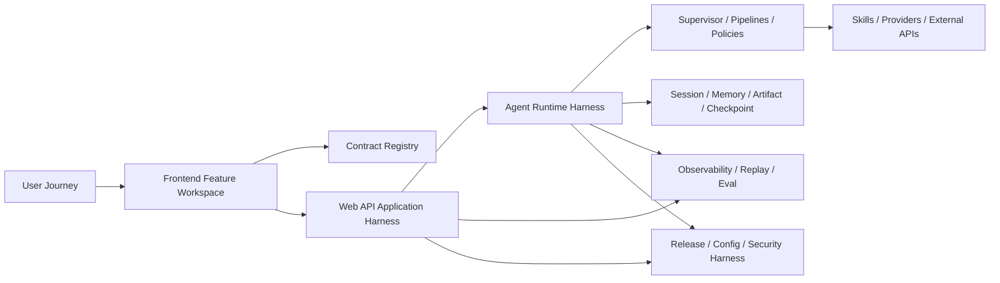

# Harness Engineering 项目演进总方案（2026）

## 1. 文档定位

这份文档不是某一次重构任务单，而是 `moyuan-travel-agent` 的项目级演进总纲。

它回答的是下面这个问题：

从当前“已经可运行、功能较完整”的 AI 旅行产品，如何演进成一个具备稳定执行骨架、可持续交付能力、可观测、可评估、可扩展的产品与工程系统。

本文与现有文档的关系如下：

- `harness-engineering-refactor-design.md`
  关注当前代码基线、复杂度热点和重构优先级
- `agent-subagent-skills-architecture-roadmap.md`
  关注 Agent 架构的纵深升级
- `infrastructure-foundations.md`
  关注配置、部署、CI、observability、readiness
- `agent-dialogue-4-week-execution-plan.md`
  关注短周期执行排期

而这份文档负责把它们统一成一条完整演进路线。

## 2. North Star

`moyuan-travel-agent` 的长期目标不是做一个“会聊天的旅行问答框”，而是做一个可以承接真实旅行决策过程的 AI 旅行工作台。

北极星能力可以概括成五条：

1. 用户能从模糊需求快速走到可执行方案  
2. 系统输出以 artifact 为核心，而不是只依赖长文本  
3. AI 运行链路有稳定的 harness，不因局部升级而整体脆弱  
4. 高风险场景有验证、证据、fallback 与可观测闭环  
5. 团队能持续迭代，不会反复退回到“大文件 + 隐式耦合”状态  

## 3. 当前阶段判断

基于当前仓库现状，可以把项目判断为：

- 产品层：已经具备可体验的 MVP+，功能丰富
- Web API 层：已经开始进入 harness 化阶段
- Agent 层：已经有 supervisor/subagent/skills 的骨架，但复杂度仍主要压在旧 graph
- Frontend 层：交互能力强，但仍以大组件和大服务文件为主
- 工程治理层：已有 CI、health、metrics、snapshot、benchmark，但还未完全贴合复杂度黑洞

这意味着项目当前最适合的路线不是继续无节制加功能，而是：

- 一边保护已有体验
- 一边补齐执行底座
- 再在底座上迭代产品能力

## 4. Harness Engineering 下的八条能力主线

项目演进建议围绕八条主线展开。

### 4.1 Contract Harness

目标：

- REST、SSE、artifact、health payload 成为单一真相源

当前问题：

- 前端类型、后端 schema、SSE 事件仍有手工同步成分

目标状态：

- 契约中心统一定义
- 前端类型由契约生成或映射
- snapshot 成为门禁而不是文档附件

### 4.2 Application Harness

目标：

- `Frontend -> Web API -> Agent Runtime` 主链路具有稳定装配骨架

当前问题：

- `main.py`、`stream_mixin.py`、部分 startup/bootstrap 仍承担过多职责

目标状态：

- Router 只做 transport
- Application service 只做编排
- bootstrap 只做装配与生命周期控制

### 4.3 Agent Runtime Harness

目标：

- 将 AI 高波动逻辑限制在可替换的 pipeline 与 policy 边界内

当前问题：

- `graph/nodes.py`、`memory_integration.py` 仍是复杂度中心

目标状态：

- intent、planning、execution、verification、answer、memory、policy 可分别演进
- supervisor/subagent 成为真正执行框架，不只是包装层

### 4.4 Frontend Feature Harness

目标：

- 前端按领域切片，而不是继续依赖超大页面组件

当前问题：

- `ChatArea`、`MessageList`、`TravelPlanToolkit`、`CityExplorer`、`api.ts` 都承担过多职责

目标状态：

- `chat / city-explorer / trip-plan / session / system-status` 成为一等 feature
- stream、contracts、actions、view 分层清晰

### 4.5 Data & Memory Harness

目标：

- session、memory、artifact、checkpoint 的生命周期可控、可回放、可治理

当前问题：

- memory 与 graph 耦合较深
- artifact 还没有完全成为跨层共享核心对象

目标状态：

- conversation memory、working memory、artifact store、evidence memory 分层明确

### 4.6 Observability & Eval Harness

目标：

- 系统升级不靠“感觉没坏”，而靠回放、benchmark、golden、metrics 证明

当前问题：

- 观测资产存在，但没有完全围绕复杂链路建立专项闭环

目标状态：

- 每次大迁移都有回放样本、质量基线和趋势报告

### 4.7 Release & Security Harness

目标：

- 本地、CI、容器、发布环境共享同一套配置与质量约束

当前问题：

- 路径注入与局部脚本导入方式仍不统一

目标状态：

- 导入方式稳定
- 配置来源可追踪
- secrets、依赖、安全检查进入常态化流程

### 4.8 Knowledge Harness

目标：

- 文档、命名、目录、评审与变更说明成为工程系统的一部分

当前问题：

- 部分文档已经很好，但仍偏“说明书”，缺少“长期路线总图”

目标状态：

- 架构文档、执行方案、参考文档、教学文档各有边界
- 大改动有 ADR/RFC 或等价设计记录

## 5. 目标演进终局

从 harness engineering 角度，项目的目标终局可以抽象成下面的形态：

这意味着未来的系统不再只是“请求进来，模型回一段答案”，而是：

- 用户在前端 feature 中完成探索、约束、比较、导出与分享
- 所有输入输出通过契约层传递
- Web API 作为稳定 BFF / Application Harness
- Agent Runtime 负责执行骨架和策略调度
- Artifact 作为跨层通用结果对象
- Eval、Replay、Observability 与 Release Harness 作为等权基础设施

## 6. 分阶段演进路线

建议把未来演进分成六个阶段。

## Phase 0：基线冻结与风险可视化

目标：

- 把今天的系统基线固定下来
- 建立演进前后的可比性

关键交付：

- OpenAPI / SSE / artifact baseline snapshot
- Top 10 大文件清单
- chat stream golden fixtures
- readiness / metrics / benchmark / golden 当前基线

完成标志：

- 后续每项迁移都能回答“和现在相比好在哪里、风险在哪里”

## Phase 1：Contract Spine + Web 主链收口

目标：

- 先把最容易引发跨层回归的主链路收口

关键交付：

- 统一的 SSE 事件注册中心
- artifact payload 统一模型
- `main.py` 继续下沉为装配层
- `stream_mixin.py` 继续拆分为 serializer / normalizer / finalizer / diagnostics

完成标志：

- 新增事件或字段时，不再需要前后端手动多处同步
- Web API 启动链、stream 链都有更清晰边界

## Phase 2：Agent Runtime 去单点巨石

目标：

- 真正把复杂度从旧 graph 中迁出

关键交付：

- `intent / planning / execution / verification / answer` pipeline 拆分
- `memory_integration.py` 拆成 `loader / persistence / summary / conflict_resolution`
- `policy_engine` 初版
- `artifact_builder` 和 `event_bus` 初版

完成标志：

- `graph/nodes.py` 与 `memory_integration.py` 不再是单点爆炸文件
- supervisor/subagent 不再只是形式上的存在

## Phase 3：Frontend 按领域切片

目标：

- 让前端从“大组件架构”过渡到“feature workspace”

关键交付：

- `features/chat`
- `features/city-explorer`
- `features/trip-plan`
- `shared/api` 与 `shared/contracts`
- `api.ts` 拆分为 endpoint client + stream client

完成标志：

- Top 5 大文件显著下降
- feature 级测试开始替代整页式测试

## Phase 4：Artifact-First 产品化

目标：

- 让产品层从“答案增强”走向“结果对象驱动”

关键交付：

- 行程 artifact、比较 artifact、证据 artifact、风险 artifact 明确化
- 前端更多直接消费 artifact，而不是自行重解析文本
- 分享、导出、对比、路线编辑围绕 artifact 构建

完成标志：

- 前端对长文本的二次解析进一步减少
- 结果可复用、可持久化、可分享、可再编辑

## Phase 5：Release / Ops / Governance 闭环

目标：

- 让系统进入长期稳定演进状态

关键交付：

- 路径注入逐步清退
- CI 对复杂区域建立专项门禁
- docstring 审计升级为“信息量治理”
- 统一 ADR / RFC / design review 流程

完成标志：

- 复杂度不会在后续迭代中重新无序增长

## 7. 时间维度建议

从 2026-03 开始，建议按三个时间跨度组织。

### 7.1 未来 0-6 周

重心：

- Phase 0 + Phase 1

建议成果：

- 合同脊柱完成首轮收口
- Web 主链进入更稳定的 harness 形态
- chat stream 回归风险显著降低

### 7.2 未来 2-4 个月

重心：

- Phase 2 + Phase 3

建议成果：

- Agent Runtime 去单点巨石
- Frontend 完成第一轮 feature 化
- artifact-first 的消费路径开始成型

### 7.3 未来 4-9 个月

重心：

- Phase 4 + Phase 5

建议成果：

- 产品能力真正围绕 artifact、evidence、policy 工作
- Eval、Replay、Release、Security、Docs 成为常态机制

## 8. 工作流与组织方式

完整演进方案如果只写技术阶段，不落到执行节奏，很容易失效。建议用下面这套节奏。

### 8.1 三层 backlog

建议把需求拆成三层：

1. Platform backlog  
   关注 contract、runtime、infra、eval、release

2. Product backlog  
   关注城市探索、路线编辑、分享页、预算工具箱、风险提示

3. Reliability backlog  
   关注 fallback、tool health、stale refresh、benchmark、golden、incident 修复

### 8.2 两种文档粒度

建议把设计文档分两层：

- Level 1：项目级总图  
  例如本文

- Level 2：专项设计  
  例如 contract spine、stream event bus、memory split、frontend feature migration

### 8.3 固定节奏

建议采用：

1. 每周一次 execution review  
   只看指标、回归、阻塞项和风险

2. 每两周一次 architecture review  
   只讨论下一阶段要不要改变边界

3. 每月一次 release review  
   汇总 benchmark、golden、incident、PR throughput、复杂度变化

### 8.4 变更管理

下面这些变更建议必须有专项设计记录：

- SSE 协议新增事件或字段
- Agent pipeline 新增阶段
- memory / artifact 数据结构改变
- 分享链接、导出结果、路线编辑等影响前后端协作的数据模型变化
- 配置来源优先级变化

## 9. 每条主线的关键交付清单

为了让后续排期更可执行，建议长期跟踪下面这些交付物。

### 9.1 Contract 主线

- REST schemas
- SSE event schemas
- artifact schemas
- contract snapshot scripts
- frontend generated types

### 9.2 Web API 主线

- application bootstrap
- service facade
- route resolver
- diagnostics / health aggregators
- startup lifecycle hooks

### 9.3 Agent 主线

- supervisor runtime
- pipelines
- policy engine
- event bus
- artifact builder
- subagent registry
- skill registry

### 9.4 Frontend 主线

- chat workspace
- city explorer workspace
- trip plan workspace
- shared api clients
- stream parser state machine
- export/share action modules

### 9.5 Data & Memory 主线

- session lifecycle
- memory persistence
- checkpoint recovery
- artifact storage
- support bundle / replay input

### 9.6 Quality 主线

- benchmark suite
- golden eval suite
- replay fixtures
- health endpoints
- regression matrices

### 9.7 Release 主线

- Docker / Compose
- CI pipelines
- configuration references
- security scanning
- observability dashboards and alerts

## 10. 量化指标体系

建议把后续演进统一映射到四组指标。

### 10.1 产品指标

- 用户从首次输入到形成可执行方案的时间
- artifact 使用率
- 城市探索到生成行程的转化率
- 分享与导出使用率

### 10.2 可靠性指标

- `/api/chat/stream` 成功率
- fallback 后可执行回答率
- verification pass rate
- readiness 通过率
- tool timeout / failure / stale refresh rate

### 10.3 工程指标

- Top 10 大文件总行数
- 路径注入次数
- 关键契约变更的跨层修改点数量
- PR 合并前平均回归耗时

### 10.4 运营指标

- benchmark pass rate
- golden pass rate
- incident 数量与平均恢复时间
- release 前后回归缺陷数

## 11. 风险地图

完整演进里最值得提前警惕的风险有七类。

1. 只做架构包装，不搬迁复杂度  
结果是名字变好了，系统没真正变稳。

2. 先拆前端外观，不先拆 stream/state  
结果是 UI 改很多，但复杂度核心没动。

3. 只做 Agent 升级，不做契约收口  
结果是每次事件和 artifact 变化都会拖垮联调效率。

4. 只做功能，不做 replay/eval  
结果是系统越来越强，但没人知道何时退化。

5. 过早平台化  
结果是还没证明价值的抽象层过多，工程速度反而下降。

6. 文档和命名失真  
结果是代码已经演进，团队心智模型仍停留在旧系统。

7. 缺少阶段退出标准  
结果是阶段一直“在推进”，却没有明确完成点。

## 12. 每阶段退出标准

建议所有阶段都用“退出标准”管理，而不是只看完成了多少任务。

### Phase 0 退出标准

- snapshot 固化
- benchmark / golden / health baseline 可重复运行

### Phase 1 退出标准

- contract spine 成型
- Web stream 主链可回放、可对照、可定位

### Phase 2 退出标准

- Agent 核心复杂度迁出旧 graph 主体

### Phase 3 退出标准

- 前端 feature 结构成型
- Top 5 大文件显著下降

### Phase 4 退出标准

- artifact 成为主结果对象
- 分享、对比、导出、继续编辑围绕 artifact 工作

### Phase 5 退出标准

- CI / release / docs / security / replay 形成长期闭环

## 13. 建议的接下来三个 Sprint

如果要马上开做，建议这样排。

### Sprint 1

- [已完成 2026-03-26] SSE 事件注册中心
  已落地：后端新增 `web/moyuan_web/api/events/chat_stream.py` 作为统一事件注册中心，`stream_mixin.py` 已统一通过注册中心校验后再序列化；前端 `api.ts` 也开始消费集中化的事件名常量；`docs/reference/sse-contract.snapshot.json` 已同步升级。
- [已完成 2026-03-26] artifact 契约收口
  已落地：新增 `web/moyuan_web/api/schemas/artifact.py` 作为正式 artifact schema；`plan_preview / artifact_patch / metadata / done` 的 artifact 负载已统一经过 schema 规范化；session 历史消息 `diagnostics.artifact` 也已统一为同一份公共 camelCase 契约。
- [已完成 2026-03-26] `stream_mixin.py` 再拆
  已落地：新增 `web/moyuan_web/services/chat/sse_serializer.py`、`stream_diagnostics.py`、`stream_finalizer.py` 三个协作器；`stream_mixin.py` 现在主要保留主流程编排和运行时事件归一化，serializer / finalizer / diagnostics 已独立出主文件。
- [已完成 2026-03-26] chat stream fixture 固化
  已落地：新增 `tests/golden/chat_stream_golden_fixture.json` 作为稳定回放基线，`scripts/export_sse_contract_snapshot.py` 已补充 replay fixture 导出能力；`tests/test_export_chat_stream_golden_fixture_script_unit.py` 会锁住 `direct / react / plan` 三种模式下的 `event sequence` 和 `plan_preview / artifact_patch / metadata / done` 关键载荷。

### Sprint 2

- [已完成 2026-03-26] `main.py` 继续下沉
  已落地：新增 `web/moyuan_web/bootstrap_app.py` 作为应用装配协作器，统一收口 `CORS / 依赖预热 / router 注册 / root + openapi metadata`；`web/moyuan_web/main.py` 现在主要保留 `create_app()` 委托和 `uvicorn` 启动入口。
- [已完成 2026-03-26] `graph/nodes.py` 先拆 `planning`
  已落地：新增 `agent/travel_agent/pipelines/planning.py` 与 `agent/travel_agent/pipelines/__init__.py`，默认计划生成、工具策略补齐、计划标准化、计划校验和计划阶段输出构建已从 `graph/nodes.py` 抽成独立 `PlanningPipeline`；`AgentNodes.plan_node()` 现在主要保留委托入口，`graph/nodes.py` 体量已进一步下降到 `3093` 行。
- [已完成 2026-03-26] `memory_integration.py` 先拆 `persistence`
  已落地：新增 `agent/travel_agent/memory/persistence.py` 与 `agent/travel_agent/memory/__init__.py`，主备快照恢复、原子写入和磁盘持久化细节已从 `AgentMemoryManager` 中抽成 `MemoryPersistenceStore`；`memory_integration.py` 当前已下降到 `2795` 行。
- [已完成 2026-03-26] 前端 stream 类型改为消费统一契约
  已落地：`frontend/src/types/index.ts` 已集中定义 chat stream 事件名与 artifact 类型，`frontend/src/services/api.ts` 已统一消费契约常量并收口事件解析逻辑。

### Sprint 3

- [已完成 2026-03-26] `graph/nodes.py` 再拆 `verification`
  已落地：新增 `agent/travel_agent/pipelines/verification.py`，高风险 query 判定、required tool 缺失重试、stale refresh 降级和 `VerifyIssue / VerifyResult` 标准化已从 `graph/nodes.py` 抽成独立 `VerificationPipeline`；`AgentNodes.verify_node()` 现在主要保留委托入口，`graph/nodes.py` 已进一步下降到 `2968` 行，配套测试 `tests/test_agent_verification_pipeline_unit.py` 已锁住关键回退分支。
- [已完成 2026-03-26] `api.ts` 拆成 endpoint client
  已落地：新增 `frontend/src/services/api/` 目录，按领域拆出 `health / session / model / city / map / share / chat` client，并把 SSE 解析独立到 `chatStreamParser.ts`；`frontend/src/services/api.ts` 现在仅保留 1 行兼容 facade，`AppContext / ChatArea / CityExplorer / Sidebar / SystemStatusPanel / TravelPlanToolkit` 已切到分域 client，配套测试 `frontend/src/services/api/chatStreamParser.test.ts` 已锁住 plan preview / done / error 三类关键事件。
- [已完成 2026-03-26] `MessageList.tsx` 先拆 renderer 与 actions
  已落地：新增 `frontend/src/components/message-list/` 目录，拆出 `markdownRenderer.tsx / messageItems.tsx / messageSections.tsx / messageActions.tsx` 四个协作器；`frontend/src/components/MessageList.tsx` 当前已降到 `80` 行，主入口只保留列表编排和 streaming 分支委托，原来的 markdown 归一化、消息渲染和复制/导出动作都已分层落位。
- [已完成 2026-03-26] `TravelPlanToolkit.tsx` 拆成 feature 协作器
  已落地：新增 `frontend/src/components/travel-plan-toolkit/shared.tsx` 与 `sections.tsx`，把 overview、itinerary、compare、checklist、favorites、practical、reminders、conflicts 视图块都拆成独立协作器；`frontend/src/components/TravelPlanToolkit.tsx` 现在主要保留状态、交互和 feature 编排，新增 `frontend/tests/unit/components/TravelPlanToolkit.test.tsx` 锁住 tab 切换、方案对比与 checklist/practical 入口，同时在 `frontend/tests/setup.ts` 补齐 `matchMedia / getComputedStyle` polyfill，前端 `lint / vitest / build` 均已通过。
- [已完成 2026-03-26] `ChatArea.tsx` 拆成 shell + runtime hook
  已落地：新增 `frontend/src/components/chat-area/` 目录，拆出 `useChatRuntime.ts / ChatComposer.tsx / ChatConversationView.tsx / ExecutionInsights.tsx / shared.ts`；`frontend/src/components/ChatArea.tsx` 当前已降到 `92` 行，主入口只保留 tabs、view switch 和组件装配，原来的流式运行时状态、SSE 编排、约束输入区和执行洞察面板都已分层落位，配套 `frontend/tests/unit/components/ChatComposer.test.tsx` 已锁住发送/停止和约束展示边界，前端 `lint / vitest / build` 均已通过。
- [已完成 2026-03-26] `CityExplorer.tsx` 拆成 city-explorer workspace
  已落地：新增 `frontend/src/components/city-explorer/shared.tsx` 与 `sections.tsx`，把场景 prompt、筛选条、shortlist、对比池、城市网格和详情抽屉拆成独立协作器；`frontend/src/components/CityExplorer.tsx` 当前已降到 `232` 行，主入口主要保留数据拉取、筛选状态和 feature 编排，新增 `frontend/tests/unit/components/CityExplorer.test.tsx` 锁住场景 prompt 触发与详情抽屉加载边界，前端 `lint / vitest / build` 均已通过。
- [已完成 2026-03-26] `useChatRuntime.ts` 继续下沉成 stream / artifact / finalization helper
  已落地：新增 `frontend/src/components/chat-area/useStreamBuffer.ts`、`useArtifactRuntimeState.ts`、`runtimeMessageBuilders.ts` 三个协作器，分别承接流缓冲与滚动同步、artifact/subagent 运行态和 final reasoning/diagnostics 拼装；`frontend/src/components/chat-area/useChatRuntime.ts` 当前已降到 `449` 行，新增 `frontend/tests/unit/components/runtimeMessageBuilders.test.ts` 锁住 reasoning timestamp、completion diagnostics 和 stopped diagnostics 语义；前后端回归 `uv run --with pytest --with pytest-asyncio pytest -q`、`npm run lint`、`npm run test:run`、`npm run build` 均已通过。
- replay / benchmark / golden 对齐新链路

## 14. 结论

符合 harness engineering 思路的项目演进，不是“不断给当前系统堆更多模块”，而是分阶段把：

- 契约
- 主链
- 运行时
- 数据与记忆
- 观测与评估
- 发布与治理

都建设成可承载变化的底座。

对 `moyuan-travel-agent` 来说，最合理的节奏是：

1. 先稳 contract 与 Web 主链  
2. 再拆 Agent 运行时巨石  
3. 再做前端 feature 化  
4. 再推进 artifact-first 产品化  
5. 最后用 release/governance 把成果固化下来  

只有这样，项目才会从“功能很多但维护风险高”，演进到“功能很多且能长期稳定扩展”。
