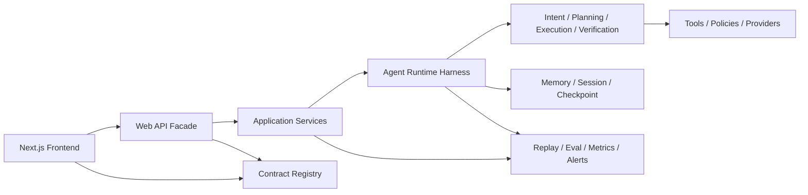

# Harness Engineering 重构规划（2026-03 基线）

## 1. 设计视角

本文把 `harness engineering` 理解为一种“为变化而设计执行底座”的工程视角。

如果你要看项目级长期路线，而不是当前代码基线上的重构优先级，请继续阅读：

- [Harness Engineering 项目演进总方案（2026）](harness-engineering-evolution-roadmap.md)

它不只关心功能能不能跑，更关心下面这些问题：

- 系统主链路是否有清晰的执行骨架
- 输入输出契约是否能成为单一真相源
- AI 运行时里的高波动逻辑是否被约束在可替换边界内
- 观测、回放、评估、发布是否跟运行时同等重要
- 团队能否在不放大风险的前提下持续迭代

放到 `moyuan-travel-agent` 上，`harness` 不是某一个文件，而是下面几层“约束与执行框架”的总和：

- Contract Harness：REST、SSE、artifact、health、share、session 的统一契约
- Runtime Harness：`Web API -> Agent Runtime -> Graph/Supervisor -> Tools` 的稳定执行骨架
- Policy Harness：超时、重试、fallback、可信度、风险提示、预算保护
- Replay & Eval Harness：回放、benchmark、golden eval、quality gate
- Release Harness：配置、容器、启动检查、metrics、dashboard、alert、CI

本轮规划的目标不是重写系统，而是让项目从“已经能用”升级到“可以持续演进”。

## 2. 当前基线快照

### 2.1 已经完成的收口项

过去几轮重构已经把不少基础工作做起来了，这些不是要推倒重来，而是本轮的起点：

- 项目命名已统一到 `moyuan-travel-agent`
- `web/shuai_web` 已迁到 `web/moyuan_web`
- `Web API` 路由契约已开始收口到 `web/moyuan_web/api/schemas`
- `ChatService` 已拆成 facade + `stream/history/health` mixin
- `CityService`、`MapService`、`SessionService` 已转成薄 facade + 子模块协作
- 默认服务注册已收口到 `bootstrap_services.py`
- `main.py` 与 `startup_checks.py` 已统一走容器初始化入口
- 路由包和服务包已做 lazy export，导入耦合比以前轻
- 项目已经有 `ready/health/metrics`、OpenAPI/SSE 快照、observability 资产和一定数量的单测

结论很明确：

- `Web API` 这一层已经开始具备 harness 的形状
- 真正还没有被收好的，是 `frontend` 和 `agent runtime`

### 2.2 当前复杂度热点

截至当前仓库基线，仍然最需要优先治理的文件如下：

#### Frontend

- `frontend/src/components/MessageList.tsx`：71 行
- `frontend/src/components/ChatArea.tsx`：85 行
- `frontend/src/components/TravelPlanToolkit.tsx`：287 行
- `frontend/src/components/CityExplorer.tsx`：232 行
- `frontend/src/services/api.ts`：1 行兼容 facade

第一轮巨石已经压薄，但复杂度并没有消失，而是迁移到了 feature 协作器：

- `frontend/src/components/city-explorer/sections/GridSection.tsx`：77 行
- `frontend/src/components/city-explorer/sections/hero/HeroSummaryHeader.tsx`：100 行
- `frontend/src/components/city-explorer/sections/hero/FavoriteShortlistPanel.tsx`：86 行
- `frontend/src/components/city-explorer/sections/grid/CityGridCard.tsx`：87 行
- `frontend/src/components/travel-plan-toolkit/sections/ToolkitItineraryTab.tsx`：107 行
- `frontend/src/components/travel-plan-toolkit/sections/itinerary/ItineraryDayCard.tsx`：111 行
- `frontend/src/components/chat-area/useChatRuntime.ts`：388 行

这些文件同时混合了：

- 页面状态
- 流式事件解析
- 交互编排
- 文本/结构化结果加工
- 导出与分享
- 局部 UI 主题与视图细节

这说明前端已经从“大页面组件驱动”迈到了“feature 协作器驱动”，并且已经开始把重逻辑从 `sections/*` 和 `useChatRuntime.ts` 往更细的 hook / view-model / section adapter 下沉；其中 `city-explorer/sections.tsx` 已经收口成 `6` 行 facade，chat runtime 这一支也已经先拆出 `useStreamBuffer.ts`、`useArtifactRuntimeState.ts`、`useChatRunState.ts`、`useChatSessionHydration.ts`、`chatInputPolicy.ts` 和 `runtimeMessageBuilders.ts`。

#### Web API

- `web/moyuan_web/services/chat/stream_mixin.py`：620 行
- `web/moyuan_web/main.py` 仍负责配置预热、容器初始化、router 装配和 root/openapi 入口

这说明 `Web API` 已经开始变薄，但 `stream` 主链路和应用启动骨架还没有完全独立成 harness。

#### Agent

- `agent/travel_agent/graph/nodes.py`：3304 行
- `agent/travel_agent/graph/memory_integration.py`：2688 行
- `agent/travel_agent/graph/builder.py`：837 行

当前 `agent runtime` 已经引入了 `runtime/`、`supervisor/`、`subagents/`、`skills/`，方向是对的，但真正的复杂度仍压在旧的 `graph/*` 主体里。

换句话说：

- “架构名词”已经变好了
- “执行复杂度”还没真正搬家

### 2.3 隐式耦合与工程治理问题

除了大文件，当前还有几类典型的 harness 缺口：

- [阶段进展 2026-03-27] `web/agent/scripts/tests` 中原先分散的 `ensure_project_paths()` / `sys.path` 注入已完成第一轮收口；当前 repo root / `web/` 导入入口主要收敛在 `web/moyuan_web/bootstrap.py`、`scripts/bootstrap_paths.py`、`tests/conftest.py` 与两份 `pyproject.toml` 的 `pythonpath` 配置
- `web/agent/scripts` 中仍有 241 处 `Purpose:` 模板化 docstring
- 前端契约仍主要靠 `frontend/src/types` 和手写 `api.ts` 维护
- `agent runtime` 的 artifact、subagent、SSE 事件还没有一个真正统一的事件注册中心
- CI 与静态检查虽然存在，但还没有围绕“高复杂度文件”建立专项门禁

这几类问题的共同本质是：

- 边界是“约定出来的”，不是“系统结构保证的”

## 3. 重构目标

本轮重构的北极星不是“拆文件”，而是建立一套稳定的执行底座。

### 3.1 目标能力

1. 契约成为单一真相源  
   REST、SSE、artifact、health payload 不再靠前后端手写双份维护。

2. 运行时骨架稳定  
   `Web API -> Agent Runtime -> Graph/Supervisor` 的执行链清晰可测，变更只影响局部。

3. AI 波动逻辑被隔离  
   intent、planning、execution、verification、answer、memory、policy 各自有明确边界。

4. 前端围绕领域组织  
   `chat / city-explorer / trip-plan / session / system-status` 成为一等模块，而不是继续堆大组件。

5. 工程治理对准复杂度黑洞  
   最大文件、流式主链、graph 主体、契约快照、回放和健康检查全部进入门禁。

### 3.2 非目标

这轮不做下面这些事：

- 不更换 `FastAPI / Next.js / LangGraph`
- 不一次性推翻当前所有 `graph/*` 逻辑
- 不为了“纯架构美观”牺牲当前可运行链路
- 不把重构做成大爆炸迁移

## 4. 设计原则

- Contract First：先收口输入输出，再拆内部实现
- Harness First：先稳定执行骨架，再优化具体能力
- Runtime First：先保护聊天与 SSE 主链，再扩散到其他模块
- Slice by Domain：前端按领域切，不按页面大组件切
- Replace by Adapter：优先加兼容层，不直接推翻调用方
- Observe Before Rewrite：所有关键迁移都必须能比较、回放、定位

## 5. 目标架构



### 5.1 Frontend 目标结构

建议从当前的“大组件堆叠”演进为：

```text
frontend/src/
├── app/
├── features/
│   ├── chat/
│   │   ├── components/
│   │   ├── hooks/
│   │   ├── stream/
│   │   ├── store/
│   │   └── contracts/
│   ├── city-explorer/
│   ├── trip-plan/
│   ├── session/
│   └── system-status/
├── shared/
│   ├── api/
│   ├── contracts/
│   ├── ui/
│   └── utils/
└── generated/
```

重点不是目录长什么样，而是职责要变清楚：

- 组件只负责渲染与交互
- stream 解析独立成状态机
- API client 不再承载所有 endpoint 逻辑
- 类型优先从契约生成，而不是手写散落

### 5.2 Web API 目标结构

`Web API` 应继续朝“薄路由、薄 facade、厚 contract、清晰应用层”演进：

```text
web/moyuan_web/
├── api/
│   ├── schemas/
│   └── events/
├── routes/
├── services/
│   ├── chat/
│   ├── city/
│   ├── map/
│   └── session/
├── application/
├── bootstrap/
├── dependencies/
└── observability/
```

目标状态：

- Router：只做 HTTP/SSE 映射
- Application Service：编排 session、runtime、repository、metrics
- Domain/Integration Service：只做各自子领域逻辑
- Bootstrap：只做容器、配置、启动顺序
- Contract Registry：统一定义 REST/SSE/artifact payload

### 5.3 Agent Runtime 目标结构

当前 `agent/travel_agent/runtime/agent_runtime.py` 已经是一个不错的兼容外壳，但它还在调用旧的 `graph.builder` 大入口。下一阶段应该把真正的复杂度分解为：

```text
agent/travel_agent/
├── contracts/
│   ├── events.py
│   ├── artifacts.py
│   └── skills.py
├── runtime/
│   ├── agent_runtime.py
│   ├── event_bus.py
│   ├── artifact_builder.py
│   ├── policy_engine.py
│   └── health.py
├── pipelines/
│   ├── intent.py
│   ├── planning.py
│   ├── execution.py
│   ├── verification.py
│   └── answer.py
├── memory/
│   ├── loader.py
│   ├── persistence.py
│   └── conflict_resolution.py
├── supervisor/
├── subagents/
└── skills/
```

核心目标：

- `graph/nodes.py` 不再承载所有策略与执行细节
- `memory_integration.py` 不再同时负责注入、持久化、摘要和冲突处理
- event、artifact、policy、subagent transition 都有独立落点

## 6. 七条重构主线

### 6.1 Contract Spine

这是第一优先级。

当前进度：

- [已完成 2026-03-26] SSE 事件注册中心已落地
- [已完成 2026-03-26] artifact 公共契约已落地，SSE 输出与 session 历史 diagnostics 已统一到同一份公共 camelCase 结构

目标：

- 建立统一的 REST 契约中心
- 建立统一的 SSE 事件中心
- 建立统一的 artifact payload 定义
- 让前端类型从契约生成或映射，而不是继续手写复制

建议动作：

- 在 `web/moyuan_web/api/` 下新增 `events/` 或 `contracts/`
- 把 chat stream 相关事件抽成判别联合模型
- 为 `plan_preview`、`artifact_patch`、`subagent_start/end`、`done` 建统一 schema
- 导出前端消费的类型快照或生成代码

验收标准：

- 新增或改动 SSE 事件时，不再需要同时手改多处前后端类型
- OpenAPI/SSE snapshot 能作为回归门禁

### 6.2 Web Application Harness

目标：

- 让 `main.py` 只负责应用装配
- 让 `chat stream` 主链路继续瘦身
- 让 `service facade` 模式推广到剩余 Web API 领域

当前进度：

- [已完成 2026-03-26] `stream_mixin.py` 已拆出 `sse_serializer / stream_diagnostics / stream_finalizer` 三个协作器，主 mixin 已进一步退化为编排层
- [已完成 2026-03-26] `main.py` 已继续下沉，新增 `web/moyuan_web/bootstrap_app.py` 统一收口 `CORS / 依赖预热 / router 注册 / root + openapi metadata`，主入口文件现在主要保留 app 委托与 `uvicorn` 启动逻辑

建议动作：

- 引入 `ApplicationContext` 或等价的启动装配对象
- 把 `main.py` 里的预热、容器、route include、health wiring 再收成更清晰的 bootstrap 层
- 把 `stream_mixin.py` 再拆成 `event_normalizer / sse_serializer / finalizer / diagnostics`
- 把 repository 与 storage 层边界补清楚

验收标准：

- `main.py` 不再承担业务初始化细节
- `stream_mixin.py` 继续下降到可维护体量
- Router 文件都只保留 transport 逻辑

### 6.3 Agent Runtime Harness

这是风险最高、收益也最高的一条线。

目标：

- 把旧 graph 里的复杂度迁到可替换的 pipeline 结构
- 让 supervisor/subagents 成为真正的执行框架，而不是只停留在包装层

当前进度：

- [已完成 2026-03-26] `planning` 主链已从 `graph/nodes.py` 中抽成独立 `PlanningPipeline`，新增 `agent/travel_agent/pipelines/planning.py` 负责默认计划生成、工具策略补齐、计划标准化、计划校验与阶段输出构建；`AgentNodes.plan_node()` 已退化为委托入口，`graph/nodes.py` 当前已降到 `3093` 行。
- [已完成 2026-03-26] `memory persistence` 已从 `memory_integration.py` 中抽成独立 `MemoryPersistenceStore`，新增 `agent/travel_agent/memory/persistence.py` 负责主备快照恢复、原子写入与磁盘持久化；`AgentMemoryManager` 现在主要保留会话序列化与语义层逻辑，`memory_integration.py` 当前已降到 `2795` 行。
- [已完成 2026-03-27] `memory conflict resolution` 已从 `memory_integration.py` 中抽成独立 `MemoryConflictResolutionHelper`，新增 `agent/travel_agent/memory/conflict_resolution.py` 负责偏好冲突检测、clarification hint 排序、同轮 retry 去重、显式覆盖闭环、resolved 审计日志与 persisted conflict schema 归一化；`AgentMemoryManager` 现通过 helper 委托这条高波动逻辑，`memory_integration.py` 当前已进一步降到 `2145` 行。
- [已完成 2026-03-26] `verification` 主链已从 `graph/nodes.py` 中抽成独立 `VerificationPipeline`，新增 `agent/travel_agent/pipelines/verification.py` 负责高风险 query 判定、required tool 缺失重试、stale refresh 降级与 `VerifyIssue / VerifyResult` 标准化；`AgentNodes.verify_node()` 已退化为委托入口，`graph/nodes.py` 当前已进一步降到 `2968` 行。
- [已完成 2026-03-27] `BudgetSubagent` 已进入默认 runtime 编队，新增 `agent/travel_agent/subagents/budget.py` 并把默认 registry 正式收口为 `research / planning / budget / verification`；`budget` 相关 skill ownership 也已同步收窄到预算链路，不再继续挂在 verification 兜底分支下。
- [已完成 2026-03-27] persisted artifact 读取链路已从聊天流旁路中抽成正式应用能力，新增 `web/moyuan_web/services/artifact_service.py` 与 `web/moyuan_web/routes/artifact.py`，提供 `GET /api/artifacts/{session_id}/latest` 稳定读取 session 历史中的最终 artifact；前端也已同步 `artifactClient.ts` 和 `LatestArtifactResponse` 契约，为 Phase 3 的 artifact-first UI 继续下沉补齐稳定输入面。
- [已完成 2026-03-27] persisted artifact 读取面已扩展到 history contract，`ArtifactService` 新增 `get_artifact_history()`，`routes/artifact.py` 新增 `GET /api/artifacts/{session_id}/history`，按 newest-first 暴露多次 artifact 快照；前端同步 `ArtifactHistoryResponse` 和 `artifactClient.getArtifactHistory()`，为 compare/history UI 提供稳定基座，而不必继续直接扫 session messages。

建议动作：

- 继续从 `graph/nodes.py` 拆 `intent / strategy / execution / answer`
- 再从 `memory_integration.py` 拆 `memory_load / memory_write / memory_summary`
- 把 `tool retry / timeout / circuit / risk policy` 独立成 `policy_engine`
- 把 artifact 生成逻辑从 runtime 和 stream 两边进一步抽成单独 builder

验收标准：

- `graph/nodes.py` 与 `memory_integration.py` 不再是单点爆炸文件
- 每条 pipeline 都可以单测、回放和对比输出

### 6.4 Frontend Feature Harness

目标：

- 把当前前端从“页面里堆逻辑”转成“功能域驱动”

当前进度：

- [已完成 2026-03-26] `frontend/src/services/api.ts` 已拆成 `frontend/src/services/api/` 下的分域 client 与 stream parser，新增 `health / session / model / city / map / share / chat` client 和 `chatStreamParser.ts`；`frontend/src/services/api.ts` 现在仅保留 1 行兼容导出，`AppContext / ChatArea / CityExplorer / Sidebar / SystemStatusPanel / TravelPlanToolkit` 已改为直接依赖领域 client，配套测试 `frontend/src/services/api/chatStreamParser.test.ts` 已锁住关键 stream 事件归一化。
- [已完成 2026-03-26] `MessageList.tsx` 已拆成 `message-list/` 目录下的 `markdownRenderer / messageItems / messageSections / messageActions` 四个协作器；`frontend/src/components/MessageList.tsx` 当前已降到 `80` 行，主入口只保留消息列表编排和 streaming 分支委托，现有 `MessageList` 单测与前端 `lint / vitest / build` 均已通过。
- [已完成 2026-03-26] `TravelPlanToolkit.tsx` 已拆成 `travel-plan-toolkit/` 目录下的 `shared / sections` 协作器，overview、每日行程、方案对比、执行清单、候选池、实用信息、出发提醒、冲突检测等视图块都已从主文件中抽离；`frontend/src/components/TravelPlanToolkit.tsx` 当前主要保留状态、交互和 feature 编排，配套 `frontend/tests/unit/components/TravelPlanToolkit.test.tsx` 已锁住 tab 切换、方案对比与 checklist/practical 入口，前端 `lint / vitest / build` 均已通过。
- [已完成 2026-03-27] `useSessionHistoryState.ts` 已把 persisted artifact recovery 收口进 session-history harness；恢复会话消息后会补调 `artifactClient.getLatestArtifact()`，并通过 `frontend/src/utils/sessionMessages.ts` 把最新 artifact 回填进最新 assistant message diagnostics，避免刷新后只能依赖纯文本或旧消息副本恢复结构化结果。
- [已完成 2026-03-27] `TravelPlanToolkit` 已把 overview/share 继续切到 artifact-first 优先路径；新增 `frontend/src/components/travel-plan-toolkit/shared/artifact.ts` 统一承接 destinations / budget / verification 摘要与分享 payload 构造，`useTravelPlanToolkitActions.ts` 的 share action 现在会优先分享结构化 artifact 摘要，overview 面板也会优先展示 artifact 的目的地、预算与校验信息。
- [已完成 2026-03-27] `TravelPlanToolkit` 已把 overview 面板继续收口成统一 `artifact overview descriptor`；`frontend/src/components/travel-plan-toolkit/shared/artifact.ts` 新增 `buildArtifactOverviewDescriptor()`，统一构造目的地、计划编号、预算、校验、证据条目、工具触达、风险提示与 subagent trail，`ToolkitOverviewPanel.tsx` 现在主要负责渲染这个 contract，而不再继续散点读取 artifact 字段。
- [已完成 2026-03-27] `TravelPlanToolkit` 已把 quick refine / favorites / variant continue 继续切到 artifact-aware prompt 路径；`frontend/src/components/travel-plan-toolkit/actionPrompts.ts` 新增 artifact-aware prompt builder，`useTravelPlanToolkitActions.ts` 现在会在继续编辑动作里优先带上 `planId / destinations / budget / verification` 这些结构化上下文，而不再只依赖原始长文本。
- [已完成 2026-03-27] `TravelPlanToolkit` 已把图片导出继续切到 artifact-first 交付路径；`frontend/src/components/travel-plan-toolkit/shared/artifact.ts` 新增 `buildArtifactExportDescriptor()` 统一构造导出标题、摘要与文件名，`useTravelPlanToolkitActions.ts` 的 export action 现在会先拼装 artifact-first 卡头再导出最终视图，避免图片交付继续退回纯文本命名。
- [已完成 2026-03-27] `TravelPlanToolkit` 已把 compare/history 切到 persisted artifact history 优先路径；后端 `web/moyuan_web/services/chat/stream_diagnostics.py` 现在会把 `sessionId` 带入 completion/failure diagnostics，前端 `frontend/src/components/chat-area/runtimeMessageBuilders.ts`、`frontend/src/context/useSessionHistoryState.ts` 与 `frontend/src/utils/sessionMessages.ts` 会在流式完成和 session restore 时保留这条 session 维度；新增 `frontend/src/components/travel-plan-toolkit/useArtifactHistoryCompare.ts` 后，compare tab 会优先调用 `artifactClient.getArtifactHistory(sessionId)` 组装 artifact-native variants，而不是继续直接扫 session messages 或退回纯文本 compare。
- [已完成 2026-03-26] `travel-plan-toolkit/sections.tsx` 已继续下沉成 `sections/` 目录下的 section adapters；`frontend/src/components/travel-plan-toolkit/sections.tsx` 当前已退化为 `9` 行 facade，真实实现已拆到 `ToolkitOverviewPanel / ToolkitItineraryTab / ToolkitCompareTab / ToolkitChecklistTab / ToolkitFavoritesTab / ToolkitPracticalTab / ToolkitRemindersTab / ToolkitConflictsTab` 八个模块，其中每日行程又继续下沉到 `sections/itinerary/ItineraryBudgetPanel.tsx / ItineraryDayCard.tsx`；配套 `frontend/tests/unit/components/TravelPlanToolkit.test.tsx` 现已补充默认 tab 下的 itinerary 动作边界，前端 `lint / vitest / build` 与后端全量 `pytest` 均已通过。
- [已完成 2026-03-26] `travel-plan-toolkit/sections/itinerary/ItineraryDayCard.tsx` 已继续下沉成 `day-card/` 目录下的 view adapters；新增 `frontend/src/components/travel-plan-toolkit/sections/itinerary/day-card/ItineraryConflictSection.tsx / ItinerarySpotDecisionGrid.tsx / ItineraryTipsBlock.tsx`，把风险提醒、景点决策卡和 tips 区块都从单日卡片主文件中抽离，`frontend/src/components/travel-plan-toolkit/sections/itinerary/ItineraryDayCard.tsx` 当前已降到 `111` 行；同时 `frontend/src/components/travel-plan-toolkit/shared.tsx` 里的 tips 前缀归一化与时间线分段语义也已同步收口，配套 `frontend/tests/unit/components/TravelPlanToolkit.test.tsx` 新增景点决策卡 / 小贴士 / 本日风险提醒边界并通过前端 `lint / vitest / build` 与后端全量 `pytest`。
- [已完成 2026-03-26] `travel-plan-toolkit/sections/itinerary/ItineraryBudgetPanel.tsx` 已继续下沉成 `budget-panel/` 目录下的 view adapters；新增 `frontend/src/components/travel-plan-toolkit/sections/itinerary/budget-panel/BudgetModeToolbar.tsx / BudgetStatsSummary.tsx / BudgetQuickRefineBar.tsx / BudgetConfidencePanel.tsx`，把预算档位控制、预算统计、quick refine 动作和 confidence 风险提示都从预算面板主文件中抽离，`frontend/src/components/travel-plan-toolkit/sections/itinerary/ItineraryBudgetPanel.tsx` 当前已降到 `54` 行；配套 `frontend/tests/unit/components/TravelPlanToolkit.test.tsx` 现已补充预算统计、可信度提示和 quick refine 触发边界，并通过前端 `lint / vitest / build` 与后端全量 `pytest`。
- [已完成 2026-03-26] `travel-plan-toolkit/sections/ToolkitCompareTab.tsx` 已继续下沉成 `compare-tab/` 目录下的 view adapters；新增 `frontend/src/components/travel-plan-toolkit/sections/compare-tab/CompareEmptyState.tsx / VariantComparisonTable.tsx / VariantActionBar.tsx`，把对比视图的空态、compare table 和 variant action bar 都从主文件中抽离，`frontend/src/components/travel-plan-toolkit/sections/ToolkitCompareTab.tsx` 当前已降到 `23` 行；配套 `frontend/tests/unit/components/TravelPlanToolkit.test.tsx` 现已补充对比指标区与“无可比较方案”空态边界，并通过前端 `lint / vitest / build` 与后端全量 `pytest`。
- [已完成 2026-03-26] `travel-plan-toolkit/sections/ToolkitConflictsTab.tsx` 已继续下沉成 `conflicts-tab/` 目录下的 view adapters；新增 `frontend/src/components/travel-plan-toolkit/sections/conflicts-tab/ConflictSummaryTag.tsx / ConflictCardContent.tsx / DayConflictCard.tsx`，把冲突摘要标签、按日冲突卡和一键修复动作都从主文件中抽离，`frontend/src/components/travel-plan-toolkit/sections/ToolkitConflictsTab.tsx` 当前已降到 `38` 行；配套 `frontend/tests/unit/components/TravelPlanToolkit.test.tsx` 现已补充冲突摘要、修复动作与无冲突空态边界，并通过前端 `lint / vitest / build` 与后端全量 `pytest`。
- [已完成 2026-03-26] `travel-plan-toolkit/sections/ToolkitPracticalTab.tsx` 已继续下沉成 `practical-tab/` 目录下的 view adapters；新增 `frontend/src/components/travel-plan-toolkit/sections/practical-tab/PracticalInfoGrid.tsx / PracticalInfoCardItem.tsx / PracticalToneTag.tsx`，把信息卡网格、单卡内容和 tone 标签都从主文件中抽离，`frontend/src/components/travel-plan-toolkit/sections/ToolkitPracticalTab.tsx` 当前已降到 `14` 行；同时 `frontend/src/components/travel-plan-toolkit/shared.tsx` 也补上了 `practicalToneLabel()` 统一语义，配套 `frontend/tests/unit/components/TravelPlanToolkit.test.tsx` 现已补充实用信息卡的 tone 标签边界，并通过前端 `lint / vitest / build` 与后端全量 `pytest`。
- [已完成 2026-03-26] `travel-plan-toolkit/sections/ToolkitRemindersTab.tsx` 已继续下沉成 `reminders-tab/` 目录下的 view adapters；新增 `frontend/src/components/travel-plan-toolkit/sections/reminders-tab/RemindersList.tsx / ReminderCardContent.tsx / ReminderPhaseTag.tsx`，把提醒卡列表、单卡内容和阶段标签都从主文件中抽离，`frontend/src/components/travel-plan-toolkit/sections/ToolkitRemindersTab.tsx` 当前已降到 `14` 行；同时 `frontend/src/components/travel-plan-toolkit/shared.tsx` 也补上了 `reminderPhaseMeta()` 统一语义，配套 `frontend/tests/unit/components/TravelPlanToolkit.test.tsx` 现已补充 reminder phase 标签与时间轴卡片边界，并通过前端 `lint / vitest / build` 与后端全量 `pytest`。
- [已完成 2026-03-26] `travel-plan-toolkit/sections/ToolkitChecklistTab.tsx` 已继续下沉成 `checklist-tab/` 目录下的 view adapters；新增 `frontend/src/components/travel-plan-toolkit/sections/checklist-tab/ChecklistList.tsx / ChecklistItemRow.tsx / ChecklistStatusTag.tsx`，把清单列表、单项行和完成状态 affordance 都从主文件中抽离，`frontend/src/components/travel-plan-toolkit/sections/ToolkitChecklistTab.tsx` 当前已降到 `26` 行；同时 `frontend/src/components/travel-plan-toolkit/shared.tsx` 也补上了 `checklistStatusMeta()` 统一语义，配套 `frontend/tests/unit/components/TravelPlanToolkit.test.tsx` 现已补充 checklist 勾选与状态标签边界，并通过前端 `lint / vitest / build` 与后端全量 `pytest`。
- [已完成 2026-03-26] `travel-plan-toolkit/shared.tsx` 已继续下沉成 `shared/` 目录下的领域 helper；新增 `frontend/src/components/travel-plan-toolkit/shared/timeline.tsx / budget.ts / risk.ts / practical.ts / reminders.ts / checklist.ts / content.ts / subagents.ts / types.ts`，把原来集中在 `shared.tsx` 里的 timeline 渲染、budget 映射、risk 颜色、practical/reminder/checklist 元信息、内容判定和类型定义都拆到按领域分组的模块里；`frontend/src/components/travel-plan-toolkit/shared.tsx` 当前已降到 `11` 行兼容 facade，并新增 `frontend/tests/unit/components/travelPlanShared.test.ts` 锁住 tips 归一化、budget mode 映射和共享元信息 helper 的边界。
- [已完成 2026-03-26] `TravelPlanToolkit.tsx` 已把 export/share/favorites/route action orchestration 下沉成独立 hook；新增 `frontend/src/components/travel-plan-toolkit/useTravelPlanToolkitActions.ts / actionPrompts.ts`，把 favorites quick refine、variant continue prompt、路线预览、按距离重排、图片导出与分享动作都从主组件中抽离，`ToolkitFavoritesTab.tsx` 也改成只消费 action props；配套 `frontend/tests/unit/components/travelPlanActionPrompts.test.ts` 与 `frontend/tests/unit/components/TravelPlanToolkit.test.tsx` 已锁住 prompt 构造与“用候选池重做方案”边界。
- [已完成 2026-03-26] `ChatArea.tsx` 已拆成 `chat-area/` 目录下的 `useChatRuntime / ChatComposer / ChatConversationView / ExecutionInsights / shared` 协作器；`frontend/src/components/ChatArea.tsx` 当前已降到 `92` 行，主入口只保留 tabs、view switch 和装配逻辑，原来的流式运行时状态、SSE 处理、约束输入区和执行洞察面板都已分层落位，配套 `frontend/tests/unit/components/ChatComposer.test.tsx` 已锁住发送/停止和约束展示边界，前端 `lint / vitest / build` 均已通过。
- [已完成 2026-03-26] `CityExplorer.tsx` 已拆成 `city-explorer/` 目录下的 `shared / sections` 协作器；场景 prompt、筛选条、shortlist、对比池、城市网格和详情抽屉都已从主文件中抽离，`frontend/src/components/CityExplorer.tsx` 当前已降到 `232` 行，主入口主要保留数据拉取、筛选状态和 feature 编排，配套 `frontend/tests/unit/components/CityExplorer.test.tsx` 已锁住场景 prompt 触发与详情抽屉加载边界，前端 `lint / vitest / build` 均已通过。
- [已完成 2026-03-26] `city-explorer/sections.tsx` 已继续下沉成 `sections/` 目录下的 `HeroSection / FilterBarSection / ComparePanelSection / GridSection / DetailDrawerSection` 五个 section modules；`frontend/src/components/city-explorer/sections.tsx` 当前仅保留 `6` 行兼容导出，顺手清理了城市探索链路里的乱码文案与 prompt，并通过 `aria-label` 收口详情 / 对比 / 规划动作的可访问名称，`frontend/tests/unit/components/CityExplorer.test.tsx` 现已覆盖场景 prompt、详情抽屉和对比 prompt 三条关键边界。
- [已完成 2026-03-26] `HeroSection.tsx` 已继续下沉成 `sections/hero/` 目录下的 `HeroSummaryHeader / CuratedPromptPanel / FavoriteShortlistPanel` 三个 view 协作器；`frontend/src/components/city-explorer/sections/HeroSection.tsx` 当前已降到 `44` 行，`city-explorer/shared.tsx` 里的 quick filters / curated prompts / profile fallback 文案以及 `CityExplorer.tsx / FilterBarSection.tsx / GridSection.tsx` 的核心乱码文案也已同步清理，配套 `frontend/tests/unit/components/CityExplorer.test.tsx` 现已锁住 shortlist 的收藏同步与“去规划”动作边界。
- [已完成 2026-03-26] `GridSection.tsx` 已继续下沉成 `sections/grid/` 目录下的 `GridSummaryBar / CityGridCard / CityGridCardMetrics / CityGridCardActions` 四个 view 协作器；`frontend/src/components/city-explorer/sections/GridSection.tsx` 当前已降到 `77` 行，列表统计、城市卡指标区和操作条都已从主文件中抽离，配套 `frontend/tests/unit/components/CityExplorer.test.tsx` 现已锁住城市卡“规划”动作边界。
- [已完成 2026-03-26] `chat-area/useChatRuntime.ts` 已继续下沉成更细的 stream / artifact / finalization helper；新增 `frontend/src/components/chat-area/useStreamBuffer.ts` 负责流缓冲、平滑刷新与滚动同步，`useArtifactRuntimeState.ts` 负责 artifact patch merge、subagent timeline 与 reset 语义，`runtimeMessageBuilders.ts` 负责 final reasoning timestamp、completion diagnostics 与 stopped diagnostics 拼装；`frontend/src/components/chat-area/useChatRuntime.ts` 当前已降到 `449` 行，配套 `frontend/tests/unit/components/runtimeMessageBuilders.test.ts` 已锁住 reasoning timestamp 与 completion/stopped diagnostics 语义，且全量 `pytest` 与前端 `lint / vitest / build` 均已通过。
- [已完成 2026-03-26] `chat-area/useChatRuntime.ts` 已继续下沉成更细的 input policy / send lifecycle helper；新增 `frontend/src/components/chat-area/useChatRunState.ts` 负责 waiting/thinking/tool/stage/runtime log 生命周期，`chatInputPolicy.ts` 负责输入校验、增强 prompt、session bootstrap 与 stopped message 构造；`frontend/src/components/chat-area/useChatRuntime.ts` 当前已降到 `415` 行，配套 `frontend/tests/unit/components/useChatRunState.test.ts` 与 `chatInputPolicy.test.ts` 已锁住 run lifecycle 与输入策略语义，同时顺手修正了错误分支未及时清理 `isStreaming` 的 UI 边界；前端 `lint / vitest / build` 与后端全量 `pytest` 均已通过。
- [已完成 2026-03-26] `chat-area/useChatRuntime.ts` 已继续下沉成 share / session hydration helper；新增 `frontend/src/components/chat-area/useChatSessionHydration.ts`，负责 share query 恢复、session 切换时的 transient runtime reset、metadata ref 收口和 skip-next-session-reset 语义；`frontend/src/components/chat-area/useChatRuntime.ts` 当前已降到 `388` 行，配套 `frontend/tests/unit/components/useChatSessionHydration.test.tsx` 已锁住 share 恢复、session 切换 reset 与 skip reset 三条边界，顺手也清理了 `ChatArea / ChatComposer / ChatModeSelector / QuickStartPrompts / ExecutionInsights / chatClient` 的乱码文案，前端 `lint / vitest / build` 与后端全量 `pytest` 均已通过。
- [已完成 2026-03-26] `AppContext.tsx` 已继续下沉成 session cache / history recovery helper；新增 `frontend/src/context/useSessionHistoryState.ts`，统一承接 session 列表过滤、localStorage 恢复、会话消息缓存、切换回放与 model recovery；`frontend/src/context/AppContext.tsx` 当前主要保留 provider 装配、model bootstrap 与流式全局状态，配套 `frontend/tests/unit/context/useSessionHistoryState.test.tsx` 已锁住 session 去重过滤、share query 下的本地恢复绕过，以及“切走再切回不重复打消息接口”的 cache 边界，现有 `frontend/tests/unit/context/AppContext.test.tsx` 也已继续覆盖 provider 级恢复链路。
- [已完成 2026-03-26] `AppContext.tsx` 已继续下沉成 model bootstrap helper；新增 `frontend/src/context/useModelBootstrapState.ts`，统一承接模型列表拉取、当前模型恢复、session model 同步与 bootstrap 选型回退；`frontend/src/context/AppContext.tsx` 当前进一步退化成 provider 装配层，`setCurrentModelId` 的上下文签名也已修正为 `Promise<void>`，调用方现在能正确感知 session model 同步失败，配套 `frontend/tests/unit/context/useModelBootstrapState.test.tsx` 已锁住 bootstrap 回退、session model 同步和异常透传三条边界。

建议动作：

- 继续把 `TravelPlanToolkit.tsx` 里的 tab assembly、derived state 和 one-click fix feedback orchestration 下沉成 workspace hook 或 view-model

验收标准：

- 前端 Top 5 大文件不再继续膨胀
- feature 级单测开始替代整页式测试

### 6.5 Package Boundary Harness

目标：

- 减少路径注入
- 让模块导入依赖安装边界，而不是依赖运行目录

建议动作：

- 把 `ensure_project_paths()` 逐步限制在兼容层
- 准备统一 workspace 或更清晰的可编辑安装方式
- 让 `scripts/` 通过稳定包入口导入 `agent` 和 `web`

验收标准：

- `web/agent/scripts/tests` 里的路径注入次数显著下降
- 本地、CI、容器的导入方式一致

### 6.6 Observability / Replay / Eval Harness

目标：

- 让重构不是“感觉没坏”，而是“可证明没坏”

当前进度：

- [已完成 2026-03-26] chat stream golden fixture 已固化，新增 `tests/golden/chat_stream_golden_fixture.json` 作为稳定回放基线；`scripts/export_sse_contract_snapshot.py` 已支持导出 replay fixture，`tests/test_export_chat_stream_golden_fixture_script_unit.py` 会校验 `direct / react / plan` 三种模式下的关键事件序列与 `plan_preview / artifact_patch / metadata / done` 载荷。
- [已完成 2026-03-26] frontend chat runtime replay fixture 已固化，`tests/golden/chat_stream_golden_fixture.json` 现已补齐 `answer_chunks / reasoning_chunks / stages` 三类前端消费样本；新增 `scripts/export_frontend_chat_runtime_golden_fixture.py`、`tests/golden/frontend_chat_runtime_golden_fixture.json` 与 `frontend/src/components/chat-area/chatRuntimeReplay.ts`，把 SSE fixture 回放成前端最终运行时快照；`frontend/tests/unit/components/chatRuntimeReplay.test.ts` 现在会锁住 parser / artifact merge / completion diagnostics 在新 frontend harness 边界上的最终结果。

建议动作：

- 为关键 chat 请求保留 golden stream fixture
- 为 `plan_preview`、`artifact_patch`、`done` 做 SSE 回放样例
- 将 benchmark/golden eval 与复杂模块迁移绑定
- 为 `subagent`、`fallback`、`verification loop` 补充 metrics

验收标准：

- 每次大迁移都有前后对照样本
- 回放结果能进入 CI 或至少进入人工变更清单

### 6.7 Governance Harness

目标：

- 让治理规则真正覆盖复杂区域，而不是只覆盖简单区域

建议动作：

- [已完成 2026-03-27] CI 把复杂文件纳入专项复杂度门禁，当前 `scripts/complexity_budget.py --strict` 已接入本地 `dev.ps1 infra-check` 与 GitHub Actions
- [已完成 2026-03-27] 对大文件设立“只减不增”预算，当前预算基线存放在 `docs/reference/complexity-budget.json`
- [已完成 2026-03-27] 把 `docstring_audit.py` 从“检查是否存在”升级为“检查是否有信息量”，当前 `--strict` 已同时拦截缺失 docstring 与新增低信息量模板 docstring，并通过 `docs/reference/docstring-audit.low-info-baseline.json` 管理历史存量
- 前端测试目录按 feature 重命名，避免目录语义漂移

验收标准：

- 重构过程中的复杂度下降可以被门禁反映出来
- 模板化文档逐步减少，不再鼓励低信息量 docstring

## 7. 分阶段路线图

### Phase 0：冻结当前基线

目标：

- 固化今天的契约、健康、回放和复杂度基准

交付：

- 当前 OpenAPI/SSE snapshot
- chat stream golden fixture
- Top 10 大文件清单
- 关键 metrics 清单

### Phase 1：契约与 Web API 主链收口

目标：

- 把 REST/SSE 契约变成单一真相源
- 把 Web API 启动骨架再薄一层

交付：

- 统一事件注册中心
- `main.py`/bootstrap 再收口
- `stream_mixin.py` 再拆

### Phase 2：Agent Runtime 去单点巨石

目标：

- 从旧 `graph/*` 中迁出真正的复杂度

交付：

- pipeline 拆分
- memory 子模块拆分
- policy engine 初版
- artifact builder 收口

### Phase 3：Frontend 按领域切片

目标：

- 让聊天、城市探索、行程工具箱成为一等 feature 模块

交付：

- `chat` feature 目录
- `city-explorer` feature 目录
- 拆分后的 API client
- feature 级测试

### Phase 4：边界、治理与发布闭环

目标：

- 让后续迭代不再重新长回“大文件 + 隐式耦合”

交付：

- 路径注入收缩
- CI 复杂度门禁（已完成第一阶段：热点文件 line-budget gate）
- richer docstring 审计（已完成第一阶段：覆盖率升级为信息量治理）
- replay/eval/observability 闭环

## 8. 推荐的首批 12 个动作

下面这些动作适合按顺序推进：

1. [已完成 2026-03-26] 建立 SSE 事件注册中心，并让 `plan_preview / artifact_patch / done / metadata` 进入统一注册表  
   已落地：`web/moyuan_web/api/events/chat_stream.py`，`stream_mixin.py` 的 SSE 序列化已改为统一校验出口，`sse-contract.snapshot.json` 已升级到注册表基线。
2. [已完成 2026-03-26] 把前端 stream 类型改为从统一契约消费  
   已落地：`frontend/src/types/index.ts` 已集中收口 chat stream 事件名与 artifact 类型，`frontend/src/services/api.ts` 已改为从统一契约常量消费事件类型。
3. [已完成 2026-03-26] 把 `stream_mixin.py` 再拆成 serializer/finalizer/diagnostics  
   已落地：新增 `web/moyuan_web/services/chat/sse_serializer.py`、`stream_diagnostics.py`、`stream_finalizer.py` 三个协作器，`stream_mixin.py` 已继续退化为主流程编排层。
4. [已完成 2026-03-26] 把 `main.py` 继续下沉为纯装配层  
   已落地：新增 `web/moyuan_web/bootstrap_app.py` 承接应用装配逻辑，`main.py` 已不再直接承载 `CORS / 依赖预热 / router include / metadata route` 的细节。
5. [已完成 2026-03-26] 从 `graph/nodes.py` 拆出 `planning` pipeline  
   已落地：新增 `agent/travel_agent/pipelines/planning.py`，`plan_node()` 已改为委托 `PlanningPipeline`；配套测试 `tests/test_agent_planning_pipeline_unit.py` 已锁住计划补齐与校验行为。
6. [已完成 2026-03-26] 从 `graph/nodes.py` 拆出 `verification` pipeline  
   已落地：新增 `agent/travel_agent/pipelines/verification.py`，`verify_node()` 已改为委托 `VerificationPipeline`；配套测试 `tests/test_agent_verification_pipeline_unit.py` 已覆盖缺失 required tool 重试与 stale refresh 降级行为，`graph/nodes.py` 当前已降到 `2968` 行。
7. [已完成 2026-03-26] 从 `memory_integration.py` 拆出 `memory persistence`  
   已落地：新增 `agent/travel_agent/memory/persistence.py`，`AgentMemoryManager` 已改为通过 `MemoryPersistenceStore` 处理主备恢复与原子写入；配套测试 `tests/test_agent_memory_persistence_unit.py` 与 `tests/test_agent_memory_unit.py` 已覆盖恢复行为。
8. [已完成 2026-03-27] 从 `memory_integration.py` 拆出 `memory conflict resolution`  
   已落地：新增 `agent/travel_agent/memory/conflict_resolution.py`，`AgentMemoryManager` 已改为通过 `MemoryConflictResolutionHelper` 处理偏好冲突检测、clarification hint 排序、同轮 retry 去重、显式覆盖闭环、resolved 审计日志与 persisted conflict schema 归一化；配套 `tests/test_agent_memory_unit.py` 与 `tests/test_agent_memory_persistence_unit.py` 已继续覆盖冲突澄清、恢复与 pending 清理行为。
9. [已完成 2026-03-26] 把 `frontend/src/services/api.ts` 拆成 endpoint client  
   已落地：新增 `frontend/src/services/api/` 目录，`api.ts` 已退化为兼容 facade；`AppContext / ChatArea / CityExplorer / Sidebar / SystemStatusPanel / TravelPlanToolkit` 已改用分域 client，`frontend/src/services/api/chatStreamParser.test.ts` 已覆盖 `plan_preview / done / error` 三类关键 stream 事件。
10. [已完成 2026-03-26] 把 `MessageList.tsx` 拆成 renderer 与动作层  
   已落地：新增 `frontend/src/components/message-list/` 目录，`MessageList.tsx` 已退化为 `80` 行的薄入口；消息 markdown 归一化、内容渲染、推理/诊断区块和复制/导出动作都已拆到独立协作器，现有 `tests/unit/components/MessageList.test.tsx` 与前端 `lint / vitest / build` 均已通过。
11. [已完成 2026-03-27] 将 `scripts/tests` 的路径注入逐步替换为稳定导入入口  
   已落地：新增 `scripts/bootstrap_paths.py` 统一承接 repo root / `web/` 导入初始化，`agent_benchmark.py / agent_golden_eval.py / agent_replay.py / runtime_doctor.py / export_openapi_snapshot.py / export_sse_contract_snapshot.py / runtime_backup.py / runtime_prune.py / runtime_restore.py` 等脚本已切到共享 bootstrap；`tests/conftest.py` 也开始复用 `web/moyuan_web/bootstrap.py`，并移除了 root tests 里分散的 `sys.path` 补丁，当前 `agent/web/scripts/tests` 范围内保留的路径入口已收缩到共享 helper 与 `pyproject.toml` 的 `pythonpath` 配置。
12. [已完成 2026-03-27] 把 docstring 审计从“覆盖率”升级到“信息量”规则  
   已落地：`scripts/docstring_audit.py` 新增低信息量 docstring 识别、baseline 写入与 `--strict` 双门禁；配套 `tests/test_docstring_audit_script_unit.py` 锁住缺失项、模板化 docstring 检测与 baseline round-trip 行为，`docs/reference/docstring-audit.low-info-baseline.json` 作为当前存量基线进入仓库。

## 9. 验收指标

重构不是靠感觉完成，建议至少跟踪下面这些指标：

- Top 10 大文件总行数下降
- `graph/nodes.py` 与 `memory_integration.py` 明显瘦身
- `frontend` Top 5 大组件全部进入 feature 目录
- 路径注入次数下降
- SSE 契约变更不再需要前后端手工双改
- 新增 regression fixture 可覆盖 `plan_preview / artifact_patch / done`
- frontend replay fixture 可覆盖 parser / artifact merge / completion diagnostics 最终态
- CI 对复杂模块的检查范围扩大

## 10. 风险与控制

### 风险 1：重构期间聊天主链回归

控制：

- 先固化 golden stream fixture
- 所有 stream 相关迁移都通过 replay 对照

### 风险 2：Supervisor 架构名义存在，但执行仍回落旧 graph

控制：

- 明确“包装层迁移”与“复杂度迁移”是两件事
- 优先迁出 planning / verification / memory

### 风险 3：前端拆分后样式和交互被破坏

控制：

- 先拆 stream/state，再拆 view
- 保留 feature 壳组件作为兼容层

### 风险 4：治理规则变严后影响日常开发速度

控制：

- 先对高复杂度文件建专项门禁
- 不一次性把全仓严格化

## 11. 结论

从 harness engineering 的角度看，`moyuan-travel-agent` 现在最需要的不是新增一批离散功能，而是把已经存在的能力挂到更稳定的执行框架上。

当前最值得投入的顺序是：

1. 契约脊柱  
2. Web API 主链收口  
3. Agent Runtime 去单点巨石  
4. Frontend 按领域切片  
5. 边界与治理闭环

只要沿着这五步推进，项目会从“功能很多但变化风险偏高”，逐步变成“功能很多且能稳定演进”的状态。
