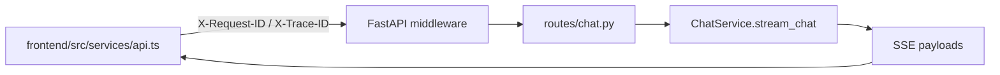

# Infrastructure Foundations

这份文档专门记录本项目当前已经落地的基础建设能力，以及后续继续演进时应优先维护的约束。

适合在这些场景进入：

- 需要统一本地启动、Docker 启动和 CI 行为
- 需要排查为什么 `/api/ready` 返回 `503`
- 需要定位一次请求在前端、Web API、Agent 之间的 `request_id / trace_id`
- 需要查看 CI 当前如何分层跑测试、产出 benchmark / golden eval / quality gate
- 需要确认改动某个基础设施文件后，应该同步哪些文档

## 1. 本轮基础建设交付概览

当前基础建设分成 4 个交付面：

1. 运行与部署收敛
2. 配置与 readiness 治理
3. CI 与测试分层
4. 全链路 trace + metrics

在此基础上，本轮又补了两类维护资产：

5. 数据生命周期治理
6. 仓库安全与契约治理基础

对应核心代码路径：

- 运行与部署
  - [`compose.yaml`](/D:/projects/shuai/ShuaiTravelAgent/compose.yaml)
  - [`Dockerfile.backend`](/D:/projects/shuai/ShuaiTravelAgent/Dockerfile.backend)
  - [`frontend/Dockerfile`](/D:/projects/shuai/ShuaiTravelAgent/frontend/Dockerfile)
  - [`frontend/docker-compose.yml`](/D:/projects/shuai/ShuaiTravelAgent/frontend/docker-compose.yml)
- 配置与 readiness
  - [`config/__init__.py`](/D:/projects/shuai/ShuaiTravelAgent/config/__init__.py)
  - [`config/server_config.yaml.example`](/D:/projects/shuai/ShuaiTravelAgent/config/server_config.yaml.example)
  - [`web/shuai_web/startup_checks.py`](/D:/projects/shuai/ShuaiTravelAgent/web/shuai_web/startup_checks.py)
  - [`web/shuai_web/routes/health.py`](/D:/projects/shuai/ShuaiTravelAgent/web/shuai_web/routes/health.py)
- CI 与测试分层
  - [`.github/workflows/ci.yml`](/D:/projects/shuai/ShuaiTravelAgent/.github/workflows/ci.yml)
  - [`pytest.ini`](/D:/projects/shuai/ShuaiTravelAgent/pytest.ini)
  - [`tests/conftest.py`](/D:/projects/shuai/ShuaiTravelAgent/tests/conftest.py)
- Trace 与 metrics
  - [`web/shuai_web/observability.py`](/D:/projects/shuai/ShuaiTravelAgent/web/shuai_web/observability.py)
  - [`web/shuai_web/middleware/__init__.py`](/D:/projects/shuai/ShuaiTravelAgent/web/shuai_web/middleware/__init__.py)
  - [`web/shuai_web/routes/chat.py`](/D:/projects/shuai/ShuaiTravelAgent/web/shuai_web/routes/chat.py)
  - [`web/shuai_web/services/chat_service.py`](/D:/projects/shuai/ShuaiTravelAgent/web/shuai_web/services/chat_service.py)
  - [`frontend/src/services/api.ts`](/D:/projects/shuai/ShuaiTravelAgent/frontend/src/services/api.ts)
- 数据生命周期
  - [`scripts/runtime_backup.py`](/D:/projects/shuai/ShuaiTravelAgent/scripts/runtime_backup.py)
  - [`scripts/runtime_restore.py`](/D:/projects/shuai/ShuaiTravelAgent/scripts/runtime_restore.py)
  - [`scripts/runtime_prune.py`](/D:/projects/shuai/ShuaiTravelAgent/scripts/runtime_prune.py)
  - [`scripts/runtime_doctor.py`](/D:/projects/shuai/ShuaiTravelAgent/scripts/runtime_doctor.py)
  - [`docs/architecture/data-storage.md`](/D:/projects/shuai/ShuaiTravelAgent/docs/architecture/data-storage.md)
- 安全与契约治理
  - [`SECURITY.md`](/D:/projects/shuai/ShuaiTravelAgent/SECURITY.md)
  - [`.github/dependabot.yml`](/D:/projects/shuai/ShuaiTravelAgent/.github/dependabot.yml)
  - [`.gitleaks.toml`](/D:/projects/shuai/ShuaiTravelAgent/.gitleaks.toml)
  - [`scripts/export_openapi_snapshot.py`](/D:/projects/shuai/ShuaiTravelAgent/scripts/export_openapi_snapshot.py)
  - [`scripts/export_sse_contract_snapshot.py`](/D:/projects/shuai/ShuaiTravelAgent/scripts/export_sse_contract_snapshot.py)
  - [`docs/reference/openapi.snapshot.json`](/D:/projects/shuai/ShuaiTravelAgent/docs/reference/openapi.snapshot.json)
  - [`docs/reference/sse-contract.snapshot.json`](/D:/projects/shuai/ShuaiTravelAgent/docs/reference/sse-contract.snapshot.json)

## 2. 运行与部署收敛

### 2.1 统一端口

当前统一端口基线是：

- Frontend: `33001`
- Web API: `38000`

这组端口同时体现在：

- 根 README
- Quick Start
- `compose.yaml`
- `frontend/docker-compose.yml`
- `config/server_config.yaml.example`
- 前端 Next.js 启动脚本与 rewrite

如果未来要改端口，至少要同步这些文件，不要只改某一层。

### 2.2 Docker / Compose 资产

推荐优先使用根目录 Compose：

```bash
docker compose up --build
```

对应职责：

- [`Dockerfile.backend`](/D:/projects/shuai/ShuaiTravelAgent/Dockerfile.backend)
  - 安装 Python 依赖
  - 拷贝 `agent/`、`web/`、`config/`、`scripts/`
  - 以 `uvicorn` 启动 `shuai_web.main:app`
- [`frontend/Dockerfile`](/D:/projects/shuai/ShuaiTravelAgent/frontend/Dockerfile)
  - 先 `npm ci`
  - 再 `next build`
  - 最后以 standalone 模式运行前端
- [`compose.yaml`](/D:/projects/shuai/ShuaiTravelAgent/compose.yaml)
  - 把 `backend` 与 `frontend` 放进统一网络
  - 对外暴露 `38000/33001`
  - 挂载 `config/`、`data/`、`logs/`

当前两份 Dockerfile 都支持通过 build args 覆盖基础镜像：

- `PYTHON_BASE_IMAGE`
- `NODE_BASE_IMAGE`

这样在 Docker Hub 拉取受限时，可以直接切换到镜像站，例如：

```bash
powershell -ExecutionPolicy Bypass -File .\dev.ps1 compose-up `
  -PythonBaseImage "5ykpmdvdg6to97.xuanyuan.run/library/python:3.13-slim" `
  -NodeBaseImage "5ykpmdvdg6to97.xuanyuan.run/library/node:22-alpine"
```

### 2.3 运行方式建议

建议把运行方式统一成 3 类：

1. 本地开发
   - 手动启动前后端
   - 适合改代码和调试
2. Docker 联调
   - `docker compose up --build`
   - 适合复现部署环境和验证配置
3. CI 运行
   - 由 [`.github/workflows/ci.yml`](/D:/projects/shuai/ShuaiTravelAgent/.github/workflows/ci.yml) 自动准备配置、跑测试、跑质量门禁

## 3. 配置与 readiness 治理

### 3.1 配置来源优先级

当前 `ServerConfig` 的配置优先级是：

`环境变量 > config/server_config.yaml > 代码默认值`

实现入口在 [`config/__init__.py`](/D:/projects/shuai/ShuaiTravelAgent/config/__init__.py)。

其中重点字段包括：

- `web.host`
- `web.port`
- `frontend.port`
- `web.cors_origins`
- `middleware.request_timeout_seconds`
- `middleware.rate_limit_max_requests`
- `middleware.rate_limit_window_seconds`
- `observability.metrics_enabled`
- `observability.metrics_path`
- `observability.structured_logging`
- `startup.fail_fast_validation`

### 3.2 启动校验

启动校验在 [`web/shuai_web/startup_checks.py`](/D:/projects/shuai/ShuaiTravelAgent/web/shuai_web/startup_checks.py)。

当前会检查：

1. `server_config` 能否解析出有效配置
2. `data/` 是否可写
3. `config/llm_config.yaml` 是否存在且是否至少有一个 active model
4. 依赖容器能否 resolve 出 `SessionRepository` 和 `ChatService`
5. 聊天运行时能否初始化

校验结果会写入：

- `app.state.readiness_snapshot`
- Prometheus readiness gauge
- 结构化日志 `startup_validation`

### 3.3 `/api/ready`

[`web/shuai_web/routes/health.py`](/D:/projects/shuai/ShuaiTravelAgent/web/shuai_web/routes/health.py) 里的 `/api/ready` 现在返回真实检查结果，不再是静态 `ok`。

返回规则：

- `200`: `status == "ready"`
- `503`: `status == "not_ready"` 或 `status == "starting"`

响应结构包含：

- `status`
- `validated_at`
- `checks`

每个 `check` 都有：

- `name`
- `status`
- `message`
- `details`

### 3.4 fail-fast

如果设置：

```bash
SHUAI_FAIL_FAST_STARTUP_VALIDATION=true
```

那么应用在启动校验失败时会直接抛错退出，而不是“服务起来了但 readiness 一直不通过”。

## 4. CI 与测试分层

### 4.1 pytest markers

当前后端测试分成：

- `unit`
- `integration`
- `local`
- `external_api`
- `quality`

定义位置：

- [`pytest.ini`](/D:/projects/shuai/ShuaiTravelAgent/pytest.ini)
- [`tests/conftest.py`](/D:/projects/shuai/ShuaiTravelAgent/tests/conftest.py)

### 4.2 当前 CI 分层

[`ci.yml`](/D:/projects/shuai/ShuaiTravelAgent/.github/workflows/ci.yml) 里当前主要分成：

1. Backend unit
   - `pytest tests -m "unit and not local and not external_api" -q`
2. Backend local smoke
   - `pytest tests -m "local and not external_api" -q`
3. Docstring audit
   - `python scripts/docstring_audit.py --strict`
4. Benchmark
5. Golden eval
6. Benchmark trend
7. Quality gate
8. Frontend lint / test / build
9. `pip-audit`
10. Dockerized `gitleaks`
11. OpenAPI / SSE snapshot verification

### 4.3 CI 产物

当前 CI 会上传并总结这些质量产物：

- `docs/benchmarks/agent_benchmark_latest.json`
- `docs/benchmarks/agent_benchmark_latest.md`
- `docs/benchmarks/agent_benchmark_trend_latest.md`
- `docs/benchmarks/agent_golden_eval_latest.json`
- GitHub Step Summary 中的 backend / frontend summary

## 5. 全链路 trace 与 metrics

### 5.1 request_id / trace_id 主链

完整链路现在是：



关键行为：

- 前端 REST 和 SSE 都会主动生成 `X-Request-ID` / `X-Trace-ID`
- 中间件会把它们绑定到 request state 和 contextvars
- ChatService 会把它们写进结构化日志和 SSE payload
- 前端会把 SSE 里的 `request_id` / `trace_id` 继续带回调试信息

### 5.2 结构化日志

结构化日志入口在 [`web/shuai_web/observability.py`](/D:/projects/shuai/ShuaiTravelAgent/web/shuai_web/observability.py)。

目前会输出这些事件：

- `http_request`
- `http_request_failed`
- `http_request_timeout`
- `startup_validation`
- `chat_stream_started`
- `chat_stream_completed`
- `chat_stream_failed`

如果配置：

```bash
SHUAI_STRUCTURED_LOGGING=false
```

则会回退成普通日志文本，而不是 JSON 日志。

### 5.3 Prometheus metrics

Prometheus 指标同样由 [`web/shuai_web/observability.py`](/D:/projects/shuai/ShuaiTravelAgent/web/shuai_web/observability.py) 统一定义。

当前主要指标：

- `shuai_http_requests_total`
- `shuai_http_request_duration_seconds`
- `shuai_http_in_flight_requests`
- `shuai_chat_stream_requests_total`
- `shuai_sse_events_total`
- `shuai_readiness_state`

指标出口：

- 默认：`GET /api/metrics`
- 可通过 `observability.metrics_path` 或 `SHUAI_METRICS_PATH` 添加别名路径
- 可通过 `SHUAI_METRICS_ENABLED=false` 关闭

## 6. 推荐的运维自检顺序

### 6.1 启动后优先检查

```bash
curl http://localhost:38000/api/health
curl http://localhost:38000/api/ready
curl http://localhost:38000/api/metrics
```

如果 `/api/ready` 返回 `503`，优先看：

1. `config/llm_config.yaml` 是否存在、是否至少有一个 active model
2. `data/` 目录是否可写
3. 启动日志中的 `startup_validation`
4. ChatService 初始化是否失败

### 6.2 流式对话异常时优先检查

1. 浏览器或前端日志中是否打印了 `request_id / trace_id`
2. `/api/chat/stream` 响应头是否带 `X-Request-ID / X-Trace-ID`
3. SSE payload 中是否有 `request_id / trace_id`
4. `/api/metrics` 中 `shuai_sse_events_total` 是否增长

## 7. 数据生命周期治理

### 7.1 备份

当前推荐命令：

```bash
python scripts/runtime_backup.py
python scripts/runtime_backup.py --label before-upgrade
python scripts/runtime_doctor.py --json
python scripts/runtime_doctor.py --base-url http://localhost:38000 --strict
```

默认会备份：

- session 主文件与 `.bak`
- agent memory 主文件与 `.bak`
- checkpoint SQLite
- share links
- failure clusters

### 7.2 恢复

当前推荐命令：

```bash
python scripts/runtime_restore.py --archive artifacts/runtime_backups/runtime_backup_<timestamp>.zip
```

默认会先创建一次 `pre-restore` 安全备份，再覆盖运行文件。

### 7.3 清理

当前推荐命令：

```bash
python scripts/runtime_prune.py --keep-latest-backups 10 --max-backup-age-days 14
python scripts/runtime_prune.py --max-session-age-seconds 2592000 --max-failure-age-days 30 --vacuum-checkpoints
```

## 8. 安全与契约治理基础

### 8.1 安全基线

当前仓库已经补上：

- [`SECURITY.md`](/D:/projects/shuai/ShuaiTravelAgent/SECURITY.md)
- [`.github/dependabot.yml`](/D:/projects/shuai/ShuaiTravelAgent/.github/dependabot.yml)

这代表项目已经至少有：

- 安全问题上报入口说明
- Python / npm 依赖更新建议机制
- 敏感配置文件与模板文件边界说明
- CI 中的 `pip-audit` 依赖审计
- CI 中的 Dockerized `gitleaks` secret scan

### 8.2 OpenAPI 快照

契约治理的第一步已经补上：

```bash
python scripts/export_openapi_snapshot.py
```

默认产物：

- [`docs/reference/openapi.snapshot.json`](/D:/projects/shuai/ShuaiTravelAgent/docs/reference/openapi.snapshot.json)

这个文件的用途不是“给用户看”，而是：

- 评审接口变更
- 做 schema diff
- 未来接入契约回归检查

### 8.3 SSE 快照

流式契约现在也会导出稳定快照：

```bash
python scripts/export_sse_contract_snapshot.py
```

默认产物：

- [`docs/reference/sse-contract.snapshot.json`](/D:/projects/shuai/ShuaiTravelAgent/docs/reference/sse-contract.snapshot.json)

它重点保护：

- `direct / react / plan` 三种模式的事件顺序
- `session_id / reasoning_* / stage / tool_* / metadata / done` 的字段形状
- `request_id / trace_id / run_id` 等动态值在快照中的归一化方式

## 9. 改基础设施时的文档同步矩阵

### 改运行端口 / Docker / Compose

至少同步：

- [`README.md`](/D:/projects/shuai/ShuaiTravelAgent/README.md)
- [`docs/getting-started/quick-start.md`](/D:/projects/shuai/ShuaiTravelAgent/docs/getting-started/quick-start.md)
- [`docs/reference/configuration-reference.md`](/D:/projects/shuai/ShuaiTravelAgent/docs/reference/configuration-reference.md)
- [`docs/reference/project-structure.md`](/D:/projects/shuai/ShuaiTravelAgent/docs/reference/project-structure.md)

### 改 readiness / health / startup check

至少同步：

- [`docs/reference/api-reference.md`](/D:/projects/shuai/ShuaiTravelAgent/docs/reference/api-reference.md)
- [`docs/architecture/system-architecture.md`](/D:/projects/shuai/ShuaiTravelAgent/docs/architecture/system-architecture.md)
- [`docs/architecture/infrastructure-foundations.md`](/D:/projects/shuai/ShuaiTravelAgent/docs/architecture/infrastructure-foundations.md)

### 改 trace / metrics / 日志

至少同步：

- [`README.md`](/D:/projects/shuai/ShuaiTravelAgent/README.md)
- [`docs/reference/api-reference.md`](/D:/projects/shuai/ShuaiTravelAgent/docs/reference/api-reference.md)
- [`docs/testing/testing-guide.md`](/D:/projects/shuai/ShuaiTravelAgent/docs/testing/testing-guide.md)
- [`docs/architecture/system-architecture.md`](/D:/projects/shuai/ShuaiTravelAgent/docs/architecture/system-architecture.md)

### 改 CI / pytest marker / quality gate

至少同步：

- [`README.md`](/D:/projects/shuai/ShuaiTravelAgent/README.md)
- [`docs/getting-started/development-workflow.md`](/D:/projects/shuai/ShuaiTravelAgent/docs/getting-started/development-workflow.md)
- [`docs/testing/testing-guide.md`](/D:/projects/shuai/ShuaiTravelAgent/docs/testing/testing-guide.md)

## 10. P1 基础设施继续完善

### 10.5 编码与仓库规范治理

为了减少 Windows / Linux 之间的换行、编码和 diff 噪音，仓库现在补上了两份顶层规范文件：

- [`.editorconfig`](/D:/projects/shuai/ShuaiTravelAgent/.editorconfig)
- [`.gitattributes`](/D:/projects/shuai/ShuaiTravelAgent/.gitattributes)

这两份文件分别负责：

- 编辑器保存时的编码、缩进、换行
- Git 提交时的文本归一化和二进制文件识别

它们最主要保护的是：

- Markdown / YAML / JSON 不被错误改成其他换行
- PowerShell 脚本保留 `CRLF`
- 图片、PDF、SQLite 不被当成文本文件处理

### 10.6 本地命令入口统一

根目录新增了统一命令脚本：

- [`dev.ps1`](/D:/projects/shuai/ShuaiTravelAgent/dev.ps1)

它把原来分散的本地命令统一成固定任务，包括：

- `test`
- `ruff`
- `mypy`
- `docstring`
- `snapshots`
- `release-manifest`
- `support-bundle`
- `infra-check`
- `compose-config`
- `compose-up`
- `compose-observability`
- `container-smoke`

推荐优先把它当成“维护者本地入口”，而不是每次现查脚本名。

### 10.7 容器与发布闭环验证

CI 现在多了一层专门的部署验证任务：

- [`.github/workflows/ci.yml`](/D:/projects/shuai/ShuaiTravelAgent/.github/workflows/ci.yml) 中的 `container-validate`

它覆盖：

1. release manifest 导出
2. 默认 Compose 渲染
3. `observability` profile Compose 渲染
4. 后端镜像 smoke build
5. 前端镜像 smoke build
6. `deployment-validation-artifacts` 上传

本地推荐用这条命令先预检查：

```bash
powershell -ExecutionPolicy Bypass -File .\dev.ps1 compose-config
```

如果这一步已经失败，通常不必等 CI 再报一次。

如果失败原因只是基础镜像拉取慢，可以直接切镜像站后再跑：

```bash
powershell -ExecutionPolicy Bypass -File .\dev.ps1 container-smoke `
  -PythonBaseImage "5ykpmdvdg6to97.xuanyuan.run/library/python:3.13-slim" `
  -NodeBaseImage "5ykpmdvdg6to97.xuanyuan.run/library/node:22-alpine"
```

### 10.1 静态质量门禁

当前新增的静态质量基线包括：

- [`ruff.toml`](/D:/projects/shuai/ShuaiTravelAgent/ruff.toml)
- [`mypy.ini`](/D:/projects/shuai/ShuaiTravelAgent/mypy.ini)
- [`.github/workflows/ci.yml`](/D:/projects/shuai/ShuaiTravelAgent/.github/workflows/ci.yml)

CI 里当前会对基础设施相关核心文件执行：

- `ruff check --config ruff.toml ...`
- `mypy --config-file mypy.ini ...`

设计原则是先覆盖 release / observability / startup / contract / runtime maintenance 相关文件，再逐步扩面，而不是一次性把整个历史代码库都纳入静态门禁。

### 10.2 release workflow

当前 release 基础设施已经补到：

- [`.github/workflows/release.yml`](/D:/projects/shuai/ShuaiTravelAgent/.github/workflows/release.yml)
- [`scripts/export_release_manifest.py`](/D:/projects/shuai/ShuaiTravelAgent/scripts/export_release_manifest.py)
- [`web/shuai_web/app_meta.py`](/D:/projects/shuai/ShuaiTravelAgent/web/shuai_web/app_meta.py)

这套流程的目标是：

- tag 或手动触发时构建 backend / frontend 镜像
- 推送到 `ghcr.io`
- 导出 release manifest
- 在 tag release 时自动创建 GitHub Release

同时，后端 `/` 与 `/api/health` 现在也会暴露 `build` 元数据，便于排查当前实例实际运行的是哪一次构建。

### 10.3 dashboard 与 alert 资产

当前仓库已经补了最小可用的观测消费资产：

- [`ops/observability/README.md`](/D:/projects/shuai/ShuaiTravelAgent/ops/observability/README.md)
- [`ops/observability/grafana-dashboard.json`](/D:/projects/shuai/ShuaiTravelAgent/ops/observability/grafana-dashboard.json)
- [`ops/observability/prometheus-alerts.yml`](/D:/projects/shuai/ShuaiTravelAgent/ops/observability/prometheus-alerts.yml)

Dashboard 重点覆盖：

- HTTP 请求速率
- p95 延迟
- in-flight 请求
- chat stream outcome
- SSE event rate
- readiness state

Alert 重点覆盖：

- `ShuaiReadinessDown`
- `ShuaiHttp5xxSpike`
- `ShuaiChatStreamFailures`
- `ShuaiSseEventStall`

### 10.4 local observability stack 与 support bundle

当前仓库还补了两类偏运维实战的资产：

- local observability stack
  - `compose.yaml` 里的 `prometheus` / `grafana` profile
  - `ops/observability/prometheus.yml`
  - `ops/observability/grafana-provisioning/`
- runtime support bundle
  - `scripts/export_support_bundle.py`

推荐命令：

```bash
docker compose --profile observability up --build
python scripts/export_support_bundle.py --base-url http://localhost:38000
```

Support bundle 适合在这些场景使用：

- `/api/ready`、`/api/metrics`、SSE 流式链路偶发失败，准备交给维护者排查
- 想把 doctor 报告、运行时文件清单、契约快照、health/ready/metrics 响应一次打包
- 发版后需要留一份当前实例的基础运行证据
