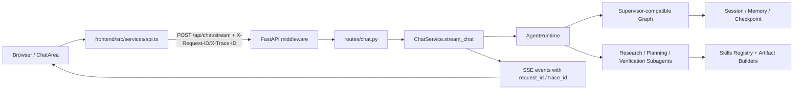
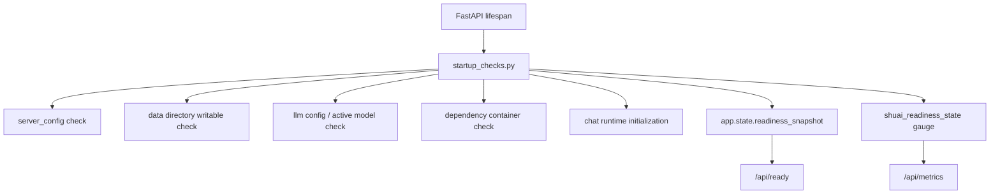

# System Architecture

## 总体结构

ShuaiTravelAgent 由三层组成：

1. Frontend：Next.js 对话与旅行工具 UI
2. Web API：FastAPI 路由、服务编排、startup checks、observability
3. Agent：LangGraph 驱动的意图识别、计划、执行、验证链路

```text
Browser
  -> FastAPI /api/chat/stream (SSE)
    -> RequestLogging / RateLimit / Timeout Middleware
      -> ChatService
        -> AgentRuntime
           -> Supervisor-compatible Graph
           -> Research / Planning / Verification Subagents
              -> intent -> strategy -> plan -> execute -> verify -> answer -> self_check
           -> Skills Registry / Artifact Builders
      -> Session / Memory / Checkpoint Storage
      -> Health / Metrics / Ready endpoints
```

## 分层职责

### Frontend (`frontend/`)

负责把 Agent 的流式能力变成真正可交互的旅行产品界面。

核心职责：

- 对话输入、约束面板、模式切换
- 流式展示 reasoning / stage / tool event / answer
- 为 REST 与 SSE 请求生成 `X-Request-ID / X-Trace-ID`
- 行程结果二次结构化：每日卡片、预算滑杆、对比、冲突检测、导出图片、分享
- 城市探索、候选池、对比池与继续追问入口
- 调用地图预览、分享短链、城市详情等 API

关键文件：

- [`frontend/src/app/page.tsx`](/D:/projects/shuai/ShuaiTravelAgent/frontend/src/app/page.tsx)
- [`frontend/src/components/ChatArea.tsx`](/D:/projects/shuai/ShuaiTravelAgent/frontend/src/components/ChatArea.tsx)
- [`frontend/src/components/MessageList.tsx`](/D:/projects/shuai/ShuaiTravelAgent/frontend/src/components/MessageList.tsx)
- [`frontend/src/components/TravelPlanToolkit.tsx`](/D:/projects/shuai/ShuaiTravelAgent/frontend/src/components/TravelPlanToolkit.tsx)
- [`frontend/src/components/CityExplorer.tsx`](/D:/projects/shuai/ShuaiTravelAgent/frontend/src/components/CityExplorer.tsx)
- [`frontend/src/services/api.ts`](/D:/projects/shuai/ShuaiTravelAgent/frontend/src/services/api.ts)
- [`frontend/next.config.js`](/D:/projects/shuai/ShuaiTravelAgent/frontend/next.config.js)

### Web API (`web/shuai_web/`)

负责把前端请求组织成稳定的服务入口，并承接会话、城市、分享、健康状态、metrics 与 startup readiness。

核心职责：

- 暴露 `/api/chat/stream` SSE 接口
- 管理 `session`、`model`、`city`、`map`、`share`、`health`
- 在中间件中注入 `request_id / trace_id`
- 汇总工具健康、intent 聚合与可观测性结果
- 在启动时执行 readiness checks
- 暴露 `/api/ready` 与 `/api/metrics`

关键文件：

- [`web/shuai_web/main.py`](/D:/projects/shuai/ShuaiTravelAgent/web/shuai_web/main.py)
- [`web/shuai_web/middleware/__init__.py`](/D:/projects/shuai/ShuaiTravelAgent/web/shuai_web/middleware/__init__.py)
- [`web/shuai_web/observability.py`](/D:/projects/shuai/ShuaiTravelAgent/web/shuai_web/observability.py)
- [`web/shuai_web/startup_checks.py`](/D:/projects/shuai/ShuaiTravelAgent/web/shuai_web/startup_checks.py)
- [`web/shuai_web/routes/chat.py`](/D:/projects/shuai/ShuaiTravelAgent/web/shuai_web/routes/chat.py)
- [`web/shuai_web/routes/health.py`](/D:/projects/shuai/ShuaiTravelAgent/web/shuai_web/routes/health.py)
- [`web/shuai_web/services/chat_service.py`](/D:/projects/shuai/ShuaiTravelAgent/web/shuai_web/services/chat_service.py)

### Agent (`agent/travel_agent/`)

负责真正的推理执行逻辑，把用户问题转成工具调用、验证链路和最终答案。

核心职责：

- `AgentRuntime` 作为应用层入口，屏蔽底层 graph 细节
- Supervisor 兼容层承接当前单图，并为后续 subagent 拆分预留边界
- `Research / Planning / Verification` 三个 subagent 已经作为最小实现接入运行时
- Skill Registry 把领域能力与底层 tools 解耦
- Artifact Builders 产出结构化行程结果，减少前端对长文本二次解析的依赖
- 计划生成、工具执行、验证、自检仍暂时运行在当前 LangGraph 主图中
- 会话记忆、摘要、偏好画像与 checkpoint 持久化继续沿用现有机制

关键文件：

- [`agent/travel_agent/runtime/agent_runtime.py`](/D:/projects/shuai/ShuaiTravelAgent/agent/travel_agent/runtime/agent_runtime.py)
- [`agent/travel_agent/supervisor/builder.py`](/D:/projects/shuai/ShuaiTravelAgent/agent/travel_agent/supervisor/builder.py)
- [`agent/travel_agent/supervisor/nodes.py`](/D:/projects/shuai/ShuaiTravelAgent/agent/travel_agent/supervisor/nodes.py)
- [`agent/travel_agent/subagents/registry.py`](/D:/projects/shuai/ShuaiTravelAgent/agent/travel_agent/subagents/registry.py)
- [`agent/travel_agent/subagents/research.py`](/D:/projects/shuai/ShuaiTravelAgent/agent/travel_agent/subagents/research.py)
- [`agent/travel_agent/subagents/planning.py`](/D:/projects/shuai/ShuaiTravelAgent/agent/travel_agent/subagents/planning.py)
- [`agent/travel_agent/subagents/verification.py`](/D:/projects/shuai/ShuaiTravelAgent/agent/travel_agent/subagents/verification.py)
- [`agent/travel_agent/skills/registry.py`](/D:/projects/shuai/ShuaiTravelAgent/agent/travel_agent/skills/registry.py)
- [`agent/travel_agent/artifacts/models.py`](/D:/projects/shuai/ShuaiTravelAgent/agent/travel_agent/artifacts/models.py)
- [`agent/travel_agent/graph/builder.py`](/D:/projects/shuai/ShuaiTravelAgent/agent/travel_agent/graph/builder.py)
- [`agent/travel_agent/graph/nodes.py`](/D:/projects/shuai/ShuaiTravelAgent/agent/travel_agent/graph/nodes.py)
- [`agent/travel_agent/graph/runtime_config.py`](/D:/projects/shuai/ShuaiTravelAgent/agent/travel_agent/graph/runtime_config.py)
- [`agent/travel_agent/graph/memory_integration.py`](/D:/projects/shuai/ShuaiTravelAgent/agent/travel_agent/graph/memory_integration.py)
- [`agent/travel_agent/graph/persistent_checkpointer.py`](/D:/projects/shuai/ShuaiTravelAgent/agent/travel_agent/graph/persistent_checkpointer.py)
- [`agent/travel_agent/tools/travel_tools.py`](/D:/projects/shuai/ShuaiTravelAgent/agent/travel_agent/tools/travel_tools.py)

## 主要请求链路

### 对话链路



链路要点：

- 前端对 REST 和 SSE 都会生成 `request_id / trace_id`
- 中间件负责绑定上下文、打日志、记 metrics、返回 headers
- `ChatService` 通过 `AgentRuntime` 进入 Agent 应用层，而不是直接调用 graph builder
- `AgentRuntime` 负责拼装 skill registry、subagent registry、artifact-first payload 和 supervisor 兼容入口
- 当前已经向 SSE 暴露 `subagent_start / subagent_end / artifact_patch`
- `ChatService` 继续负责把 trace 写进 SSE payload 与结构化日志
- 前端收到 `metadata` 后，会把 `requestId / traceId` 带回 UI 调试上下文

### readiness / metrics 链路



## SSE 事件协议

前端主要消费这些事件：

- `session_id`
- `reasoning_start`
- `reasoning_chunk`
- `reasoning_end`
- `plan_preview`
- `stage`
- `subagent_start`
- `subagent_end`
- `artifact_patch`
- `tool_start`
- `tool_end`
- `answer_start`
- `chunk`
- `metadata`
- `error`
- `done`

现在额外的重要约定：

- SSE payload 会带 `request_id`
- SSE payload 会带 `trace_id`
- 流式响应头会带 `X-Request-ID / X-Trace-ID`

## 可观测性

### 结构化日志

结构化日志入口：

- [`web/shuai_web/observability.py`](/D:/projects/shuai/ShuaiTravelAgent/web/shuai_web/observability.py)

当前重点事件：

- `startup_validation`
- `http_request`
- `http_request_failed`
- `http_request_timeout`
- `chat_stream_started`
- `chat_stream_completed`
- `chat_stream_failed`

### Prometheus metrics

默认指标：

- `shuai_http_requests_total`
- `shuai_http_request_duration_seconds`
- `shuai_http_in_flight_requests`
- `shuai_chat_stream_requests_total`
- `shuai_sse_events_total`
- `shuai_readiness_state`

默认出口：

- `GET /api/metrics`

## 持久化与运行数据

默认会落盘以下数据：

- `data/sessions/sessions.json`
- `data/agent_memory.json`
- `data/langgraph_checkpoints.sqlite3`
- `data/runtime_failure_clusters.jsonl`

详细说明见 [data-storage.md](data-storage.md)。

## 部署资产

当前本地与容器启动的核心资产：

- [`compose.yaml`](/D:/projects/shuai/ShuaiTravelAgent/compose.yaml)
- [`Dockerfile.backend`](/D:/projects/shuai/ShuaiTravelAgent/Dockerfile.backend)
- [`frontend/Dockerfile`](/D:/projects/shuai/ShuaiTravelAgent/frontend/Dockerfile)
- [`config/server_config.yaml.example`](/D:/projects/shuai/ShuaiTravelAgent/config/server_config.yaml.example)

## 当前设计重点

### 0. 从“单图直接接 Web”升级为“AgentRuntime 应用层入口”

当前已经落地的 Phase 1 变化是：

- `ChatService` 不再直接依赖 `graph.builder` 里的多个函数
- `AgentRuntime` 成为 Web 层与 Agent 内核之间的稳定入口
- `SupervisorTravelAgentGraph` 和 `SupervisorNodes` 先以兼容方式接管现有单图
- `SkillRegistry` 与 `TripPlanArtifact` 先作为新架构承载层落地

这一步的目的不是立即拆完多 Agent，而是先把“未来怎么拆”变成代码里的真实边界

### 0.1 Phase 2 已开始：最小 subagent 已接入

当前已经进一步落地：

- `ResearchSubagent`
- `PlanningSubagent`
- `VerificationSubagent`

它们目前仍复用现有 LangGraph 主图和 skills/tool 体系，但已经具备：

- 独立目录和注册表
- 独立技能映射
- 独立 SSE 事件
- 独立 artifact patch 能力

### 1. 从“服务能起”升级为“服务真的 ready”

项目现在不再只靠 `/api/health` 证明系统可用，而是增加：

- startup validation
- `/api/ready`
- `fail_fast_validation`

### 2. 从“能流式返回”升级为“能跨层追踪”

一次聊天现在可以从前端一路追到 Web API 和 SSE：

- 请求头中的 `X-Request-ID / X-Trace-ID`
- 中间件日志
- ChatService 结构化日志
- SSE payload 中的 `request_id / trace_id`

### 3. 从“有测试”升级为“测试分层 + 质量门禁”

现在的质量体系分成：

- pytest marker 分层
- docstring audit
- benchmark
- golden eval
- quality gate
- GitHub Step Summary + artifact

## 相关文档

- [../architecture/infrastructure-foundations.md](infrastructure-foundations.md)
- [../reference/api-reference.md](../reference/api-reference.md)
- [../reference/project-structure.md](../reference/project-structure.md)
- [../testing/testing-guide.md](../testing/testing-guide.md)

## Phase 3 Frontend Consumption

The current system is no longer only "artifact-capable" on the backend. The frontend now consumes the new application-layer payloads directly:

- [`frontend/src/services/api.ts`](/D:/projects/shuai/ShuaiTravelAgent/frontend/src/services/api.ts)
  - parses `subagent_start`
  - parses `subagent_end`
  - parses `artifact_patch`
  - carries `artifact` through `plan_preview`, `metadata`, and `done`
- [`frontend/src/components/ChatArea.tsx`](/D:/projects/shuai/ShuaiTravelAgent/frontend/src/components/ChatArea.tsx)
  - merges incremental artifact patches during one run
  - records subagent timeline events
  - persists final artifact/subagent diagnostics into the assistant message
- [`frontend/src/components/MessageList.tsx`](/D:/projects/shuai/ShuaiTravelAgent/frontend/src/components/MessageList.tsx)
  - renders artifact-backed diagnostics
  - shows subagent trace in message-level diagnostics and streaming state
- [`frontend/src/components/TravelPlanToolkit.tsx`](/D:/projects/shuai/ShuaiTravelAgent/frontend/src/components/TravelPlanToolkit.tsx)
  - prefers structured artifact metadata for intent / plan / verification / evidence summary
  - keeps free-text itinerary parsing as a compatibility fallback instead of the primary source of truth

This means the end-to-end request path is now:

```text
ChatService / AgentRuntime
  -> SSE(subagent_start, subagent_end, artifact_patch, metadata.artifact, done.artifact)
  -> api.ts callback channels
  -> ChatArea artifact merge + subagent timeline
  -> Message diagnostics
  -> TravelPlanToolkit structured summary + text fallback parsing
```
## Session Hydration For Phase 3

Phase 3 不再只依赖浏览器内存里的流式状态。当前链路已经变成：

1. `ChatService` 在 assistant 最终消息中持久化 `diagnostics`
2. `diagnostics` 内包含 `artifact` 与 `subagentEvents`
3. `GET /api/session/{session_id}/messages` 对前端暴露公开消息视图
4. `AppContext` 在刷新或切换会话时重新拉取消息
5. `MessageList` / `TravelPlanToolkit` 直接复用持久化后的结构化结果

这一步让 `artifact-first` 从“仅流式运行时可见”升级成“会话级可恢复状态”。
