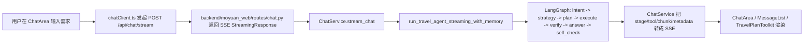

# AI 旅游 Agent 从 0 到 1 教学教程

这篇文档给第一次接触 `moyuan-travel-agent` 的同学准备。

目标不是只让你“把项目跑起来”，而是帮助你真正理解这类项目最重要的部分:

- 它为什么是一个 `Agent` 项目，而不是普通聊天机器人
- 一次旅行问题是怎样从前端流到后端，再流进 LangGraph 的
- Agent 的状态、节点、工具、验证、记忆、checkpoint 分别解决什么问题
- 新人应该先看哪些代码，怎么改一处功能而不迷路

如果你时间很少，建议按下面顺序阅读:

1. 本文第 1-4 节，建立整体心智模型
2. 本文第 5 节，专门理解 Agent 图
3. 本文第 6 节，把 SSE 和前端展示对应起来
4. 本文第 8-10 节，开始按练习路径动手

## 1. 先建立一个总认知

`moyuan-travel-agent` 不是“用户问一句，LLM 回一段文字”的 Demo。

它想解决的是一个更接近真实业务的问题:

1. 用户先提出旅行需求，比如“上海周末 2 天，预算 1500 元以内，带老人，尽量少走路”
2. 系统不只回答文本，还要把结果组织成可以继续操作的结构
3. 用户还可以继续调预算、做多方案对比、检查行程冲突、看路线、导出分享

所以这个项目的核心不是“能不能回答”，而是:

- 能不能识别这是哪类旅行任务
- 能不能决定要不要查工具
- 能不能把工具调用变成有计划的执行
- 能不能验证结果是否可靠、是否过期
- 能不能把结果继续加工成产品级界面

这就是它被设计成 `Agent` 项目的原因。

## 2. 这套系统的三层结构

项目当前是很典型的三层:

```text
Frontend (Next.js)
  -> Backend API (FastAPI)
    -> Agent (LangGraph + LangChain + Tools + Memory)
```

你可以把三层理解成三个问题:

- Frontend: 用户如何提需求、看过程、继续调整结果
- Backend API: 如何把浏览器请求转成稳定的后端接口和 SSE 流
- Agent: 如何真正做意图识别、计划、执行、验证和最终回答

最重要的入口文件分别是:

- 前端入口: `frontend/src/app/page.tsx`
- 前端主工作区: `frontend/src/components/ChatArea.tsx`
- API 入口: `backend/moyuan_web/main.py`
- 对话服务: `backend/moyuan_web/services/chat_service.py`
- Agent 图入口: `agent/travel_agent/graph/builder.py`
- Agent 节点实现: `agent/travel_agent/graph/nodes.py`

## 3. 先用“用户发一句话”理解全链路

假设用户在页面输入:

```text
请给我一个上海周末 2 天轻松游，预算 1500 元以内，地铁可达
```

这句话会经历下面这条链路:



这条链路里最值得新人记住的点是:

1. 前端拿到的不是一次性 JSON，而是持续到达的 SSE 事件流
2. 后端并不自己推理，它主要负责组织会话、初始化模型和把 Agent 事件转成前端能消费的格式
3. 真正的“Agent 设计”主要发生在 `agent/travel_agent/graph/`

## 4. 为什么说它是“Agent 设计类项目”

很多人第一次看这类项目，会把注意力全部放在“用了 LangGraph”。

其实更重要的是它背后的设计取舍:

### 4.1 它有明确状态

Agent 的共享状态定义在 `agent/travel_agent/graph/state.py`。

里面不是只有 `messages`，还包括:

- `intent` / `intent_detail`
- `strategy` / `strategy_detail`
- `routing`
- `plan_id` / `plan`
- `execution_state` / `execution_stats` / `execution_summary`
- `verify_result`
- `tool_results`
- `answer`
- `session_id` / `run_id`

这说明项目不是一次 LLM 调用，而是“多阶段状态推进”。

### 4.2 它有明确节点

在 `builder.py` 里，图被编译成这几个节点:

- `intent`
- `strategy`
- `plan`
- `execute`
- `verify`
- `answer`
- `direct_answer`
- `self_check`

这意味着系统会先判断“这是什么问题”，再判断“走不走工具链路”，然后才进入执行。

### 4.3 它有明确约束

这个项目不是让 Agent 无限自主，而是给它加了很多边界:

- 高风险问题必须验证
- 单轮工具数、耗时、token 都有预算
- 工具失败会进入 fallback / circuit breaker / cooldown
- 结果过期会要求 refresh retry
- 最终回答还要做 self check

这部分正是工程化 Agent 和玩具 Demo 的差别。

## 5. Agent 主流程拆解

这一节是全文重点。

### 5.1 `intent` 节点: 先判断用户到底要什么

代码入口: `agent/travel_agent/graph/nodes.py`

`intent_node` 会输出:

- `intent`
- `confidence`
- `entities`
- `requires_tools`

当前支持的主要意图有:

- `recommend`
- `attractions`
- `itinerary`
- `budget`
- `tips`
- `general`
- `unclear`

它优先尝试结构化输出，如果结构化失败，再退回 JSON 解析或关键词兜底。

这一步解决的是:

- 用户到底是在问目的地推荐，还是在问预算，还是要完整行程
- 后面应不应该走工具链

### 5.2 `strategy` 节点: 决定走直接回答还是计划执行

`strategy_node` 的核心不是生成内容，而是做路由。

它会综合判断:

- `intent`
- `requires_tools`
- `confidence`
- 是否属于高风险问题
- 需要哪些必选工具和可选工具

最后得到两个关键结果:

- `routing = "plan"` 或 `"direct"`
- `requires_verification = true/false`

这里有一个很重要的工程思想:

不是所有问题都值得进入完整 Agent 流。

如果问题足够简单，或者无需外部工具，就可以走 `direct_answer`。
但如果涉及预算、价格、酒店、政策、签证、退改等高风险内容，就会被强制要求验证。

### 5.3 `plan` 节点: 把问题翻译成一串可执行步骤

`plan_node` 的输出包括:

- `plan_id`
- `plan_explanation`
- `plan`
- `validation_status`
- `validation_errors`
- `execution_budget`

默认计划模板在 `nodes.py` 里 `_default_plan(...)`。

比如 `itinerary` 意图的默认链路大致是:

1. `query_attractions`
2. `get_weather`
3. `plan_itinerary`

其中前两个步骤可以并行，第三步依赖前两个结果。

这一步做了三件事:

1. 生成计划
2. 根据策略强制补齐 required tools
3. 对计划做校验，防止工具未注册或计划不合法

所以 `plan` 节点并不只是“写个 TODO 列表”，而是在做真正的执行前准备。

### 5.4 `execute` 节点: 真正的工具编排中心

这是整个 Agent 最工程化的一部分。

它做的事包括:

- 找出当前还能执行的 pending steps
- 检查依赖是否满足
- 根据执行预算选择本轮要跑哪些工具
- 控制并行度
- 记录 execution trace
- 给每个工具结果打上 metadata
- 统计 fallback、stale、provider、duration、error_code

你可以把 `execute` 理解成一个“轻量调度器”。

这里不是简单地 `for step in plan: tool.invoke()`，而是带这些策略:

- 循环调用防护
- 同工具同签名重复调用限制
- 单轮工具预算限制
- 最大执行回合限制
- 成本预算限制
- circuit breaker
- timeout / retry
- stale data refresh

如果你以后要做更复杂的多工具 Agent，这一段最值得反复读。

### 5.5 `verify` 节点: 不是有结果就算结束

很多 Agent 项目只做到“工具执行成功”。

但本项目继续问了一步:

“这些结果能不能用来支撑最终结论？”

`verify_node` 主要检查:

- 高风险问题是否真的拿到了成功工具结果
- 必选工具是否缺失
- 结果是否过期
- 是否存在可刷新的 stale 数据
- 结果时间跨度是否不一致
- 是否违反了高风险验证策略

如果发现天气或酒店结果 stale，而且工具支持 refresh，就会触发一次回到 `execute` 的重试。

这就是图里 `verify -> execute` 这条回边的意义。

所以这个项目不是线性的:

```text
plan -> execute -> answer
```

而是:

```text
plan -> execute -> verify -> (必要时回 execute) -> answer
```

### 5.6 `answer` 节点: 用证据组织最终回答

`answer_node` 会把前面的执行上下文重新组织成 prompt。

它会把这些内容拼进去:

- `plan_id`
- 各 step 的执行状态
- execution summary
- execution budget
- early stop reason
- 融合后的工具证据

然后再调用 LLM 生成最终答案。

这里的重点不是“让模型自由发挥”，而是“让模型基于执行证据写答案”。

对于高风险问题，回答里还会被强制补上证据来源段落，例如:

- `source`
- `fetched_at`

这一步体现的是 Agent 项目里很重要的一个原则:

模型负责“组织表达”，不是“替代执行和验证”。

### 5.7 `self_check` 节点: 最后再做一道出厂检查

`self_check_node` 当前检查比较轻量，但很实用:

- 回答是不是空的
- 结尾是不是完整
- 如果用过工具，回答里有没有 source trace

如果只差一个句号，它甚至会自动补上。

这说明项目把“最终输出质量”当成独立阶段处理，而不是顺带处理。

## 6. 前端为什么能看到“推理过程”和“执行时间线”

答案是: 后端把 Agent 的运行过程转成了 SSE 事件。

当前前端重点消费这些事件:

- `session_id`
- `reasoning_start`
- `reasoning_chunk`
- `reasoning_end`
- `plan_preview`
- `stage`
- `tool_start`
- `tool_end`
- `answer_start`
- `chunk`
- `metadata`
- `error`
- `done`

### 6.1 `ChatService` 的作用

入口在 `backend/moyuan_web/services/chat_service.py`。

它主要做这些事:

1. 初始化 LLM、tools、memory manager
2. 创建或恢复 session
3. 在 `plan` 模式下先生成 `plan_preview`
4. 调用 `run_travel_agent_streaming_with_memory(...)`
5. 把 Agent 事件映射成 SSE 文本流
6. 保存消息、更新 memory、记录健康指标

所以 `ChatService` 本质上是“Agent 运行时编排层”。

### 6.2 `ChatArea` 如何消费事件

前端入口在 `frontend/src/components/ChatArea.tsx`。

它会:

- 用 `apiService.fetchStreamChat(...)` 发请求
- 在 `onReasoning` 中累积 reasoning 文本
- 在 `onChunk` 中累积最终回答
- 在 `onStage` 中更新阶段状态
- 在 `onToolStart/onToolEnd` 中更新运行日志
- 在 `onMetadata` 中保存执行诊断
- 最后把完整消息塞回全局会话状态

这就是为什么页面能展示:

- 思考中
- 当前工具
- 执行阶段
- 计划预览
- 工具诊断
- 最终回答

### 6.3 `TravelPlanToolkit` 为什么很重要

很多新人会忽略这部分，但这其实是项目产品化最强的一层。

`frontend/src/components/TravelPlanToolkit.tsx` 会把 assistant 返回的文本再加工成:

- 每日行程卡
- 预算滑杆
- 多方案对比
- 冲突检测
- 候选池
- Checklist
- 出发提醒
- 导出图片
- 分享短链

这意味着:

Agent 只负责给出“高质量可解析内容”，前端继续把内容变成“可操作产品”。

这是做 AI 产品时非常值得借鉴的设计。

## 7. 记忆、Session、Checkpoint 各自解决什么问题

这三个概念很容易混。

### 7.1 Session

Session 是产品层概念。

它解决的是:

- 一个聊天窗口是谁
- 这个窗口存了哪些消息
- 当前窗口选了哪个模型

主要落盘位置:

- `data/sessions/sessions.json`

### 7.2 Memory

Memory 是 Agent 层概念。

它解决的是:

- 之前聊过什么
- 用户长期偏好是什么
- 有没有预算/人数/季节等偏好线索
- 有没有需要澄清的冲突信息

主要代码:

- `agent/travel_agent/graph/memory_integration.py`

主要落盘位置:

- `data/agent_memory.json`

这个 memory manager 不只保存历史消息，还会抽取 profile，例如:

- `budget_hint`
- `days_hint`
- `people_hint`
- `season_hint`
- `interests`
- `avoid_preferences`
- `pending_clarifications`

### 7.3 Checkpoint

Checkpoint 是 LangGraph 执行层概念。

它解决的是:

- 图执行过程中每一步状态如何持久化
- 如何做 replay / recovery / compaction

主要代码:

- `agent/travel_agent/graph/persistent_checkpointer.py`

主要落盘位置:

- `data/langgraph_checkpoints.sqlite3`

如果你想研究“图执行恢复”和“故障回放”，这里是关键。

## 8. 新人最推荐的阅读顺序

如果你要在 1-2 天内真正理解项目，建议这样读:

### 第一步: 看产品入口

- `README.md`
- `docs/architecture/system-architecture.md`
- `frontend/src/app/page.tsx`
- `frontend/src/components/ChatArea.tsx`

先知道系统长什么样、用户怎么交互。

### 第二步: 看 API 编排层

- `backend/moyuan_web/main.py`
- `backend/moyuan_web/routes/chat.py`
- `backend/moyuan_web/services/chat_service.py`

先知道 SSE 是怎么从后端出去的。

### 第三步: 看 Agent 图

- `agent/travel_agent/graph/state.py`
- `agent/travel_agent/graph/builder.py`
- `agent/travel_agent/graph/nodes.py`
- `agent/travel_agent/graph/prompt_templates.py`

先抓住状态、节点、边和决策逻辑。

### 第四步: 看工具与记忆

- `agent/travel_agent/tools/travel_tools.py`
- `agent/travel_agent/tools/travel_api.py`
- `agent/travel_agent/graph/memory_integration.py`

理解“执行的对象”和“长期上下文”。

### 第五步: 再回前端看渲染

- `frontend/src/services/api/chatClient.ts`
- `frontend/src/services/api/chatStreamParser.ts`
- `frontend/src/components/MessageList.tsx`
- `frontend/src/components/TravelPlanToolkit.tsx`
- `frontend/src/utils/travelPlan.ts`

这时候你会更容易看懂为什么 UI 能渲染这么多结构。

## 9. 新人动手练习路线

下面这条练习路线最适合从读懂到改懂。

### 练习 1: 手动跟一条请求

在页面选择 `plan` 模式，发一个问题:

```text
请规划杭州周末 2 天轻松游，预算 1200 元以内，少走路
```

然后观察:

1. 页面上的 `plan_preview`
2. 阶段流转
3. 工具开始/结束日志
4. 最终 `TravelPlanToolkit`

再回到代码看:

- `ChatArea.tsx`
- `chat_service.py`
- `nodes.py`

### 练习 2: 新增一个工具

目标: 比如新增“查询交通建议”的工具。

最小改动路径:

1. 在 `agent/travel_agent/tools/travel_tools.py` 增加 tool
2. 在 `get_travel_tools()` 注册
3. 在 `nodes.py` 的 tool policy / default plan 里接入
4. 让 answer prompt 能引用它的证据
5. 补一条测试

### 练习 3: 新增一个意图

例如增加 `transport` 意图。

你需要改:

1. `intent_node` 的可选意图
2. `INTENT_TOOL_POLICY`
3. `_default_plan(...)`
4. `prompt_templates.py` 的 guidance
5. 测试用例

这会帮助你真正理解“意图 -> 策略 -> 计划”。

### 练习 4: 调整验证策略

例如把某类问题也加入高风险集合。

你需要关注:

- `HIGH_RISK_KEYWORDS`
- `verify_node`
- `direct_answer_node`

做完这一步，你会开始理解 Agent guardrails 的设计方式。

## 10. 测试应该怎么学

这个项目的测试不只是回归保障，也很适合当“学习材料”。

推荐优先读:

- `tests/test_sse_streaming.py`
- `tests/test_agent_execution_optimization_integration.py`
- `tests/test_agent_memory_unit.py`
- `tests/test_agent_p0_guardrails_unit.py`

为什么推荐它们:

- `test_sse_streaming.py`: 帮你理解 SSE 契约
- `test_agent_execution_optimization_integration.py`: 帮你理解并行执行、stale refresh、降级逻辑
- `test_agent_memory_unit.py`: 帮你理解偏好记忆
- `test_agent_p0_guardrails_unit.py`: 帮你理解风控边界

常用命令:

```bash
python scripts/dev.py backend-test --pytest-slice all
python scripts/dev.py frontend-lint
python scripts/dev.py frontend-test
python scripts/dev.py frontend-build
```

Agent 质量脚本也值得知道:

```bash
python scripts/dev.py benchmark-report
python scripts/dev.py golden-report
```

## 11. 本地运行与当前状态

当前项目约定端口是:

- Frontend: `http://localhost:33001`
- API: `http://localhost:38000`
- API Docs: `http://localhost:38000/rapidoc`
- Health: `http://localhost:38000/api/health`

基于本地环境在 `2026-03-10` 的实际检查结果:

- 前端首页 `http://localhost:33001` 可访问，返回 `200`
- API 健康接口 `http://localhost:38000/api/health` 返回 `healthy`

健康接口当前返回里 `llm` 是 `not initialized`，这和代码设计是对得上的:

- `ChatService` 采用懒初始化
- 真正初始化 LLM/Tools/Memory 的入口在 `stream_chat(...)`

也就是说，第一次正式发起聊天前看到 `llm: not initialized` 是可能出现的。

如果发起首轮对话后依旧异常，再去检查:

- `backend/config/llm_config.yaml`
- 模型 provider 配置
- API key / base URL

## 12. 这个项目最值得新人学会的 6 个设计思想

### 12.1 先分层，再谈智能

很多 AI 项目一上来就把所有逻辑塞进 prompt。

这个项目反过来:

- 前端负责交互和结果产品化
- API 负责协议、会话和流式编排
- Agent 负责推理、工具执行与验证

这会让项目更容易维护。

### 12.2 先计划，再执行

直接 tool call 很快能做 Demo，但很难稳定。

计划层的价值是:

- 能解释
- 能审计
- 能验证
- 能调度

### 12.3 工具结果必须带 metadata

这里的 tool result 不只是正文，还有:

- `source`
- `fetched_at`
- `ttl_seconds`
- `is_stale`
- `provider_used`
- `fallback_used`

这为 verify、diagnostics、risk hint 都提供了基础。

### 12.4 风险问题必须显式验证

预算、价格、政策这类问题，如果没有验证，Agent 不应该装作自己很确定。

这一点在真实业务里特别重要。

### 12.5 产品不是回答，而是“可继续操作的结果”

`TravelPlanToolkit` 的存在说明:

- 真正有价值的 AI 产品，通常要把内容继续结构化
- 用户想要的是下一步动作，不只是长文本

### 12.6 Agent 需要 observability

这个项目会输出:

- stage
- tool_start / tool_end
- metadata
- execution_stats
- failure telemetry

这让排错、教学和优化都容易很多。

## 13. 如果你准备开始改代码

给新人的建议是:

1. 先改文案和前端展示，不要一开始就改图结构
2. 再改 tool policy 和默认 plan
3. 再去碰 verify / execute 这种核心链路
4. 每改一次都至少跑一遍 `pytest` 和前端 `build`

尤其是 `nodes.py`，它已经是项目最核心、也最容易牵一发动全身的文件。

## 14. 一句话总结

如果只用一句话总结这个项目:

`moyuan-travel-agent` 是一个把“旅行问答”升级成“可验证、可诊断、可继续操作的旅行决策系统”的 Agent 工程样例。

而你真正需要学会的，不只是 LangGraph 的写法，而是这套系统如何把:

- 意图识别
- 计划生成
- 工具执行
- 风险验证
- 记忆持久化
- SSE 流式协议
- 产品级结果加工

组织成一条完整链路。
