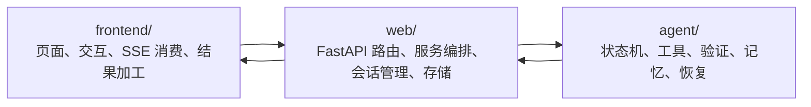
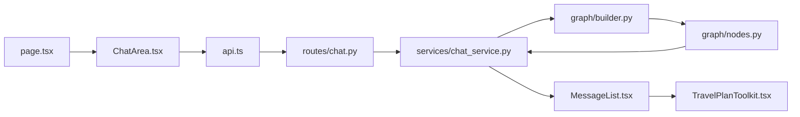
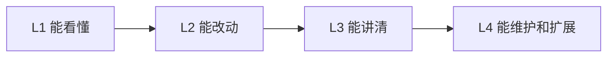

# 01. 总规划与学习方法

这篇文档是整套教学材料的“总纲”。

它最核心的作用不是解释某一个模块怎么写，而是帮你建立下面四个东西：

1. 这个项目到底是什么。
2. 应该按什么顺序学。
3. 学到什么程度算真正上手。
4. 如何把“会跑项目”升级成“能改、能讲、能维护”。

## 0. 这篇文档怎么用

这篇文档最适合在下面 3 个时刻阅读：

1. 第一次接触这个项目时
2. 已经读了几篇代码文档，但脑子里还没有整体结构时
3. 想规划 7 天 / 14 天 / 4 周学习路线时

建议把它当成：

- 导航图
- 学习合同
- 能力分级说明书

### 如果你现在带着任务来

如果你不是要从头学，而是带着一个具体任务来，建议直接这样用：

1. 想 `30 分钟速览`：
先看本章的“项目到底在做什么”“三层地图”“黄金主链”。
2. 想 `半天上手`：
读完本章后，立刻转到 [02-chat-mainline-and-frontend.md](02-chat-mainline-and-frontend.md) 和 [03-web-api-session-and-storage.md](03-web-api-session-and-storage.md)。
3. 想 `改 Bug`：
先回到黄金主链定位故障落点，再去对应层的章节看“最容易影响什么”和“面试追问”区块。
4. 想 `准备面试`：
先读本章的能力分级、术语表、面试视角重点，再去 [06-interview-highlights-and-system-evolution.md](06-interview-highlights-and-system-evolution.md)。
5. 想 `做改动并验收`：
读完本章后直接跳 [05-testing-debugging-and-change-practice.md](05-testing-debugging-and-change-practice.md) 和 [07-thinking-questions-homework-and-answers.md](07-thinking-questions-homework-and-answers.md)。

## 1. 项目到底在做什么

`ShuaiTravelAgent` 不是单纯的聊天 Demo，而是一个 AI 旅行助手工程样例。它同时覆盖了：

- 用户输入旅行约束
- 系统识别意图和风险
- Agent 计划或执行工具
- 中间事件流式回传
- 前端把答案加工成更可用的结果
- 会话、分享、地图、记忆、存储、测试与回放

所以学习时不能只盯着“模型回复了一段文本”，而要始终问：

- 用户怎么表达约束
- 系统怎么知道何时该用工具
- 工具结果怎么被验证
- 前端怎么把答案继续做成产品功能
- 失败后系统怎么降级和恢复

### 一句话定义

你可以先用一句话记住这个项目：

`ShuaiTravelAgent` 是一个把“AI 对话”做成“可执行旅行决策流程”的工程样例。

### 它和普通聊天 Demo 最大的差别

普通聊天 Demo 通常到“模型回了一段话”就结束了。

而当前项目还显式关心：

- 工具结果是否可靠
- 中间过程是否可见
- 结果是否能继续被结构化加工
- 状态是否能持久化和恢复
- 改动是否能被系统性验证

## 2. 三层地图

项目核心结构是三层：

```text
frontend/
  负责页面、交互、状态、SSE 消费、结构化结果呈现

web/
  负责 FastAPI 路由、服务编排、会话管理、SSE 输出、存储组织

agent/
  负责状态机、路由策略、工具执行、验证、自检、memory、checkpoint
```

### 一张三层地图



如果你把三层混在一起学，就会觉得“东西很多但抓不住主干”。最稳的学习方法永远是：

1. 先看三层各自解决什么问题。
2. 再看一条请求如何穿过三层。
3. 最后再深入每层内部的实现细节。

## 3. 黄金主链

整个项目最重要的学习主线是：

```text
frontend/src/app/page.tsx
  -> frontend/src/components/ChatArea.tsx
  -> frontend/src/services/api.ts
  -> web/shuai_web/routes/chat.py
  -> web/shuai_web/services/chat_service.py
  -> agent/travel_agent/graph/builder.py
  -> agent/travel_agent/graph/nodes.py
  -> frontend/src/components/MessageList.tsx
  -> frontend/src/components/TravelPlanToolkit.tsx
```

它几乎把整个系统的关键设计都串起来了：

- 前端状态如何组织
- SSE 协议如何定义
- FastAPI 如何流式返回
- ChatService 如何统一编排
- Agent 如何决策、执行、验证
- 最终答案如何变成可交互结果

### 一张黄金主链总图



## 4. 推荐的学习顺序

### 第一阶段：先建立整体地图

优先读：

- `README.md`
- `docs/README.md`
- `docs/reference/project-structure.md`
- `docs/architecture/system-architecture.md`

### 第二阶段：只追一条真实聊天链路

优先看：

- `frontend/src/app/page.tsx`
- `frontend/src/components/ChatArea.tsx`
- `frontend/src/services/api.ts`
- `web/shuai_web/routes/chat.py`
- `web/shuai_web/services/chat_service.py`
- `agent/travel_agent/graph/builder.py`

### 第三阶段：按模块深化

顺序建议：

1. 前端状态流与结果加工
2. Web API 与 session / storage
3. Agent 状态机与 tools / memory / checkpoint
4. 测试、调试、回归和改动实践
5. 面试难点和架构拓展

### 按任务目标找最短路径

- 目标是 `快速知道项目在干什么`
  读本章第 1、2、3 节。
- 目标是 `一两天内开始改前端`
  读本章第 3、7、8 节，然后去 [02-chat-mainline-and-frontend.md](02-chat-mainline-and-frontend.md)。
- 目标是 `一两天内开始改后端`
  读本章第 2、3、7、8 节，然后去 [03-web-api-session-and-storage.md](03-web-api-session-and-storage.md)。
- 目标是 `准备讲 Agent`
  读本章第 3、5、9、12 节，然后去 [04-agent-core-tools-memory-checkpoint.md](04-agent-core-tools-memory-checkpoint.md)。
- 目标是 `准备一次可靠改动`
  读本章第 6、11 节，然后去 [05-testing-debugging-and-change-practice.md](05-testing-debugging-and-change-practice.md) 和 [07-thinking-questions-homework-and-answers.md](07-thinking-questions-homework-and-answers.md)。

### 这一顺序为什么有效

因为它遵循的是“从外到内、从稳定到复杂”的顺序：

1. 先看整体地图，不容易迷路
2. 再看主链，先抓主干
3. 再看分层实现，补内部结构
4. 最后看 Agent、测试和演进，攻克最难的部分

## 5. 四种能力分级

### L1：能看懂

- 能说出项目三层结构
- 能追完聊天主链
- 知道主要入口文件

### L2：能改动

- 能定位某个需求应该改哪层
- 能完成一次小改动
- 能跑基础回归

### L3：能讲清

- 能解释为什么用 SSE
- 能解释为什么 route、service、repository、storage 要分层
- 能解释为什么 Agent 要用状态机而不是普通链式调用

### L4：能维护和扩展

- 能排查跨层问题
- 能评估改动风险
- 能设计演进方案并同步文档

### 一张能力成长图



## 6. 7 天 / 14 天 / 4 周路线

### 7 天上手

第 1 天：全局地图与主链  
第 2 天：SSE 与前端状态流  
第 3 天：Web API 与 session  
第 4 天：Agent 图与节点  
第 5 天：tools / memory / checkpoint  
第 6 天：测试与回归  
第 7 天：做一个小改动并复盘

### 14 天深入

在 7 天路线基础上增加：

- 代码阅读笔记
- 一次跨层改动
- 一次故障排查演练
- 一次完整回归
- 一次面试式口头讲解

### 4 周维护者路线

在 14 天基础上再增加：

- 稳定性与可观测性理解
- memory / checkpoint 深入
- provider / tool 扩展理解
- benchmark / golden eval / replay
- 文档更新和带教输出

### 更细的周节奏建议

#### 第 1 周

- 建立地图
- 跑通主链
- 完成前端和 Web 基础理解

#### 第 2 周

- 攻克 Agent
- 理解 tools / memory / checkpoint
- 画状态图与节点图

#### 第 3 周

- 做 1-2 个小改动
- 完成回归矩阵
- 做一次排障演练

#### 第 4 周

- 准备项目讲解
- 设计一个演进方案
- 产出带教资料或毕业任务记录

## 7. 各模块最适合的学习方法

### 前端：按状态流学

重点不是组件树，而是这些状态怎么变化：

- `messages`
- `streamingMessage`
- `streamingReasoning`
- `metadata`
- `currentSessionId`
- `chatMode`

### Web API：按分层学

固定把后端看成：

```text
route -> service -> repository -> storage
```

### Agent：按状态机学

固定顺序：

1. `state.py`
2. `builder.py`
3. `nodes.py`
4. `memory_integration.py`
5. `persistent_checkpointer.py`

### 测试：按“断言反推设计”学

每看一个测试都反问：

- 它在保护什么行为
- 没有这条测试会退化成什么
- 这条测试更像单点逻辑保护，还是协作链路保护

## 8. 按角色拆分的学习重点

### 如果你更偏前端

重点放在：

- `ChatArea.tsx`
- `api.ts`
- `MessageList.tsx`
- `TravelPlanToolkit.tsx`
- SSE 事件与状态所有权

### 如果你更偏后端

重点放在：

- `main.py`
- `chat.py`
- `chat_service.py`
- `session_service.py`
- `session_repository_impl.py`
- `session_storage.py`

### 如果你更偏 Agent

重点放在：

- `state.py`
- `builder.py`
- `nodes.py`
- `travel_api.py`
- `memory_integration.py`
- `persistent_checkpointer.py`

## 9. 统一术语表

建议从这里开始统一理解后面各章反复出现的词：

| 术语 | 统一含义 |
| --- | --- |
| 主链路 | 从页面输入到最终结果渲染的关键链路 |
| SSE | 服务端事件流，用于持续返回内容与中间过程 |
| stage | 描述当前执行阶段的过程事件 |
| metadata | 一次运行的附加诊断信息 |
| session | 当前会话及其消息和元数据 |
| memory | 长期偏好、摘要、澄清信息等长期记忆 |
| checkpoint | 图执行恢复点与运行状态持久化 |
| route | HTTP 协议入口 |
| service | 业务编排层 |
| repository | 业务语义的数据访问抽象 |
| storage | 具体存储实现 |
| direct / react / plan | Agent 的三种模式 |
| verify | 对执行证据做校验的阶段 |
| self_check | 最终输出前的轻量质量检查 |
| stale | 数据可能过期或新鲜度不足 |
| fallback | 主路径失败后的兜底路径 |

## 10. 新人最容易踩的坑

1. 按目录随机翻，而不是围绕黄金主链。
2. 一上来就读 `nodes.py`。
3. 把 session、memory、checkpoint 混成一件事。
4. 把前端误以为只是展示层，而忽略结果加工能力。

## 11. 学习产出要求

每个阶段至少留下一个可复用产出，不要只停留在“我大概懂了”。

推荐产出：

- 请求链路图
- SSE 事件表
- 前端状态流图
- session 生命周期图
- Agent 节点与边关系图
- 工具契约表
- memory / checkpoint / session 对照表
- 回归矩阵

### 推荐的产出模板

最推荐的不是长笔记，而是：

1. 一张图
2. 一张表
3. 一页改动设计说明
4. 一页回归记录

### 11.1 代码改动与文档同步矩阵

为了避免后续“代码已经变了，但教学材料还是旧的”，建议把下面这张表当成默认维护规则：

| 改动类型 | 至少同步哪些教学文档 |
| --- | --- |
| 前端流式状态、SSE 消费、结果加工 | [02-chat-mainline-and-frontend.md](02-chat-mainline-and-frontend.md)、[05-testing-debugging-and-change-practice.md](05-testing-debugging-and-change-practice.md) |
| Web 契约、session、storage、SSE 输出 | [03-web-api-session-and-storage.md](03-web-api-session-and-storage.md)、[05-testing-debugging-and-change-practice.md](05-testing-debugging-and-change-practice.md) |
| Agent 状态图、tools、memory、checkpoint | [04-agent-core-tools-memory-checkpoint.md](04-agent-core-tools-memory-checkpoint.md)、[05-testing-debugging-and-change-practice.md](05-testing-debugging-and-change-practice.md)、[06-interview-highlights-and-system-evolution.md](06-interview-highlights-and-system-evolution.md) |
| 测试策略、quality gate、replay、回归矩阵 | [05-testing-debugging-and-change-practice.md](05-testing-debugging-and-change-practice.md)、[07-thinking-questions-homework-and-answers.md](07-thinking-questions-homework-and-answers.md) |
| 项目讲法、演进路线、题目和答案 | [06-interview-highlights-and-system-evolution.md](06-interview-highlights-and-system-evolution.md)、[07-thinking-questions-homework-and-answers.md](07-thinking-questions-homework-and-answers.md) |

最简单的执行方式是：

1. 改实现时，顺手在 PR 或改动记录里注明“同步哪篇教学文档”。
2. 改完代码后，至少检查一次对应章节的术语、流程图和练习是否仍然成立。
3. 如果这次改动改变了推荐答法，也要同步 06。

## 12. 面试准备视角下的学习重点

如果你还想把这个项目讲成自己的工程案例，学习时要额外关注：

- 设计取舍而不是只看实现细节
- 每层的边界和职责
- 系统如何处理失败、回退、验证和恢复
- 当前实现为什么可行，将来又可以怎样演进

## 13. 带教者怎么使用这篇文档

如果你是带新人的同学，最推荐按下面节奏用这篇文档：

1. 先让对方讲三层地图
2. 再让对方讲黄金主链
3. 再让对方说明最容易混淆的术语
4. 再根据角色决定后续重点章节

这会比“你先去随便看看代码”稳很多。

## 14. 学完之后最低应该能回答的 12 个问题

1. 这个项目为什么不是普通聊天 Demo。
2. 为什么要拆成 `frontend`、`web`、`agent` 三层。
3. 一次聊天请求如何流经整个系统。
4. 为什么选择 SSE。
5. 为什么前端要区分 `streamingMessage` 和最终 `messages`。
6. 为什么后端要走 `route -> service -> repository -> storage`。
7. 为什么 Agent 要用状态机结构。
8. `direct`、`react`、`plan` 三种模式分别解决什么问题。
9. `verify` 和 `self_check` 的工程意义是什么。
10. memory、checkpoint、session 有什么区别。
11. 改一个字段为什么可能要联动前端、API、存储和测试。
12. 这个项目未来最可能先演进哪几个方向。

## 15. 配套练习

建议读完本篇后，立刻去做：

- [07-thinking-questions-homework-and-answers.md](07-thinking-questions-homework-and-answers.md) 中的 `Phase 0` 和 `Phase 1` 题目

如果你能把三层地图、黄金主链和统一术语讲清楚，后面几章会轻松很多。
