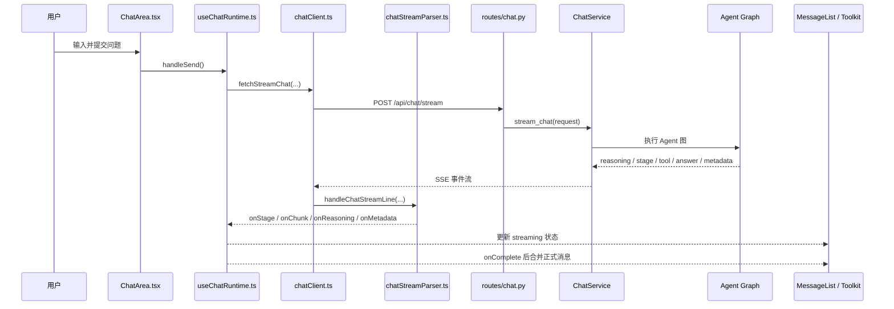

# 02. 聊天主链路与前端实现

这一章是整套教学材料里第二重要的一章。

如果说 [01-total-plan-and-learning-method.md](01-total-plan-and-learning-method.md) 负责建立地图，那么这一章负责带你沿着一条真实请求，把“页面输入 -> SSE -> FastAPI -> Agent -> UI 渲染”这条黄金主链彻底跑通。

之所以把“聊天主链路”和“前端实现”放在同一篇，是因为这个项目真正的产品体验并不是“后端返回一段文本”就结束了，而是：

- 前端如何发起请求
- 中间过程如何被持续显示
- 最终结果如何被结构化加工
- 用户如何继续操作这些结果

## 0. 5 分钟速查卡

### 本章一句话

这一章回答的是：一次聊天请求从前端怎么发起、怎么消费 SSE、怎么变成最终消息和结构化旅行结果。

### 必读 10 个文件

1. [ChatArea.tsx](D:/moyuan/moyuan-travel-agent/frontend/src/components/ChatArea.tsx)
2. [useChatRuntime.ts](D:/moyuan/moyuan-travel-agent/frontend/src/components/chat-area/useChatRuntime.ts)
3. [useStreamBuffer.ts](D:/moyuan/moyuan-travel-agent/frontend/src/components/chat-area/useStreamBuffer.ts)
4. [useArtifactRuntimeState.ts](D:/moyuan/moyuan-travel-agent/frontend/src/components/chat-area/useArtifactRuntimeState.ts)
5. [useChatRunState.ts](D:/moyuan/moyuan-travel-agent/frontend/src/components/chat-area/useChatRunState.ts)
6. [useChatSessionHydration.ts](D:/moyuan/moyuan-travel-agent/frontend/src/components/chat-area/useChatSessionHydration.ts)
7. [chatInputPolicy.ts](D:/moyuan/moyuan-travel-agent/frontend/src/components/chat-area/chatInputPolicy.ts)
8. [chatClient.ts](D:/moyuan/moyuan-travel-agent/frontend/src/services/api/chatClient.ts)
9. [chatStreamParser.ts](D:/moyuan/moyuan-travel-agent/frontend/src/services/api/chatStreamParser.ts)
10. [TravelPlanToolkit.tsx](D:/moyuan/moyuan-travel-agent/frontend/src/components/TravelPlanToolkit.tsx)

### 最常见 3 个坑

1. 把 `streamingMessage` 和正式 `messages` 混在一起。
2. 只盯最终答案，不看 `stage / tool / metadata` 中间事件。
3. 以为前端只是展示层，忽略了 `TravelPlanToolkit` 的结果加工职责。

### 改这一层前先做什么

1. 先追一遍 `ChatArea.tsx -> useChatRuntime.ts -> chatClient.ts -> chatStreamParser.ts -> chat.py -> chat_service.py -> MessageList.tsx`。
2. 先确认这次改动影响的是“事件消费”“流式状态”还是“结果加工”。
3. 先准备最小回归：`npm run lint`、`npm run build`，必要时补手工流式验证。

## 1. 本章解决什么问题

读完本章后，你应该能回答下面这些问题：

1. 一次聊天请求到底从哪个文件发起，最后落到哪个组件上。
2. 前端为什么要同时维护 `messages`、`streamingMessage`、`streamingReasoning`、`metadata`。
3. 为什么当前项目采用 SSE，而不是只返回 JSON。
4. `ChatArea.tsx`、`useChatRuntime.ts`、`useStreamBuffer.ts`、`useArtifactRuntimeState.ts`、`useChatRunState.ts`、`useChatSessionHydration.ts`、`chatInputPolicy.ts`、`chatClient.ts`、`MessageList.tsx`、`TravelPlanToolkit.tsx` 在职责上如何分工。
5. 为什么这个项目的前端不是被动展示层，而是结果加工层。

## 2. 先修要求

在读本章前，最好已经完成下面 3 件事：

1. 看过 [README.md](README.md) 或 [01-total-plan-and-learning-method.md](01-total-plan-and-learning-method.md)，知道项目有 `frontend / web / agent` 三层。
2. 知道聊天入口 API 是 `POST /api/chat/stream`。
3. 至少本地跑起过一次项目，见过页面上的聊天流式过程。

如果还没跑过，建议先跑一条最典型的问题：

`上海周末两日游，预算 1500 元以内，尽量地铁可达`

## 3. 本章核心源码入口

最关键的源码主线是：

```text
frontend/src/app/page.tsx
  -> frontend/src/components/ChatArea.tsx
  -> frontend/src/components/chat-area/useChatRuntime.ts
  -> frontend/src/services/api/chatClient.ts
  -> frontend/src/services/api/chatStreamParser.ts
  -> web/moyuan_web/routes/chat.py
  -> web/moyuan_web/services/chat_service.py
  -> agent/travel_agent/graph/builder.py / nodes.py
  -> frontend/src/components/MessageList.tsx
  -> frontend/src/components/TravelPlanToolkit.tsx
```

如果你只能精读 8 个文件，本章最推荐的就是这 8 个。

### 3.1 聊天主链总图

下面这张图建议你和源码一起看。它不是额外概念，而是 [page.tsx](D:/moyuan/moyuan-travel-agent/frontend/src/app/page.tsx)、[ChatArea.tsx](D:/moyuan/moyuan-travel-agent/frontend/src/components/ChatArea.tsx)、[useChatRuntime.ts](D:/moyuan/moyuan-travel-agent/frontend/src/components/chat-area/useChatRuntime.ts)、[chatClient.ts](D:/moyuan/moyuan-travel-agent/frontend/src/services/api/chatClient.ts)、[chatStreamParser.ts](D:/moyuan/moyuan-travel-agent/frontend/src/services/api/chatStreamParser.ts)、[chat.py](D:/moyuan/moyuan-travel-agent/web/moyuan_web/routes/chat.py)、[chat_service.py](D:/moyuan/moyuan-travel-agent/web/moyuan_web/services/chat_service.py)、[MessageList.tsx](D:/moyuan/moyuan-travel-agent/frontend/src/components/MessageList.tsx)、[TravelPlanToolkit.tsx](D:/moyuan/moyuan-travel-agent/frontend/src/components/TravelPlanToolkit.tsx) 之间的真实协作关系。

```mermaid
flowchart LR
    A["用户在 page.tsx 输入问题"] --> B["ChatArea.tsx 装配 chat workspace"]
    B --> C["useChatRuntime.ts 维护流式状态与 artifact 合并"]
    C --> D["chatClient.ts 建立 SSE 连接"]
    D --> E["chatStreamParser.ts 解析事件并分发回调"]
    E --> F["chat.py 接收 POST /api/chat/stream"]
    F --> G["chat_service.py 编排 session / memory / agent"]
    G --> H["LangGraph Agent 执行"]
    H --> I["chat_service.py 产出 stage / tool / chunk / metadata / artifact"]
    I --> J["useChatRuntime.ts 更新 streaming 状态"]
    J --> K["MessageList.tsx 渲染消息"]
    K --> L["TravelPlanToolkit.tsx 做结果加工"]
```



### 3.2 源码辅助学习：按文件和函数读

这一章最适合“边看代码边学”。推荐直接按下面顺序打开文件，并且优先盯住这些函数或逻辑块：

| 文件 | 先看什么 | 为什么先看这里 |
| --- | --- | --- |
| [page.tsx](D:/moyuan/moyuan-travel-agent/frontend/src/app/page.tsx) | `Home` 组件 | 先确认聊天区在整页产品里处于什么位置。 |
| [ChatArea.tsx](D:/moyuan/moyuan-travel-agent/frontend/src/components/ChatArea.tsx) | `ChatArea` 组件本体 | 先确认 chat workspace 现在只剩哪些装配职责。 |
| [useChatRuntime.ts](D:/moyuan/moyuan-travel-agent/frontend/src/components/chat-area/useChatRuntime.ts) | `handleSend`、`useChatSessionHydration`、`drainStreamingQueueToRefs`、`handleStop` | 这是前端主链最关键的 4 个读点，分别对应“发请求、恢复与切换、最终合并、主动停止”。 |
| [chatClient.ts](D:/moyuan/moyuan-travel-agent/frontend/src/services/api/chatClient.ts) | `fetchStreamChat`、`executeStreamRequest` | 这里回答“请求怎么发、连接怎么保、超时和重连怎么处理”。 |
| [chatStreamParser.ts](D:/moyuan/moyuan-travel-agent/frontend/src/services/api/chatStreamParser.ts) | `handleChatStreamLine` | 这里回答“事件怎么解、怎么分发到独立回调通道”。 |
| [chat.py](D:/moyuan/moyuan-travel-agent/web/moyuan_web/routes/chat.py) | `_get_chat_service`、`stream_chat` | 先确认真正的 HTTP / SSE 协议入口有多薄。 |
| [MessageList.tsx](D:/moyuan/moyuan-travel-agent/frontend/src/components/MessageList.tsx) | `MessageList`、`message-list/markdownRenderer.tsx`、`message-list/messageSections.tsx` | 这里能看清文本、`<think>`、诊断面板和最终展示是怎么被加工的。 |
| [TravelPlanToolkit.tsx](D:/moyuan/moyuan-travel-agent/frontend/src/components/TravelPlanToolkit.tsx) | `TravelPlanToolkit` 组件本体、`travel-plan-toolkit/sections.tsx` facade、`travel-plan-toolkit/sections/` | 这里最能体现“答案如何被前端继续产品化”。 |

### 3.3 源码辅助学习：建议边看边搜的关键字

如果你在编辑器里跟读源码，最推荐直接搜索下面这些词：

```text
handleSend
fetchStreamChat
handleSSELine
onStage
onMetadata
useChatSessionHydration
drainStreamingQueueToRefs
prepareMarkdownContent
extractThinkBlocks
looksLikeItineraryContent
runQuickRefine
```

这组关键字几乎能把“请求发起 -> SSE 解析 -> 状态落地 -> 文本渲染 -> 结果加工”整条前端主链串起来。

## 4. 用一条真实请求建立心智模型

最推荐观察的场景：

`上海周末两日游，预算 1500 元以内，尽量地铁可达`

你发出这个问题后，页面上通常会经历下面几类变化：

1. 用户消息立即进入消息列表。
2. 前端进入 `waiting / thinking / streaming` 的组合状态。
3. 前端开始收到阶段事件、工具事件、计划预览和内容分片。
4. 流式文本逐步增长。
5. 最终结果被合并进正式消息。
6. 助手消息下方出现结构化结果区块，例如行程卡、预算投影、冲突检测、候选池、分享等。

学习时不要只盯住最终回答内容，而要盯住这条过程：

```text
用户输入
  -> ChatArea 装配 workspace
  -> useChatRuntime 组织请求
  -> chatClient 发起 SSE
  -> chatStreamParser 解析事件
  -> chat.py 接收请求
  -> chat_service.py 编排事件
  -> Agent 产出 chunk / stage / tool / metadata
  -> 前端按不同通道消费
  -> MessageList 渲染文本消息
  -> TravelPlanToolkit 将文本加工成产品结果
```

## 5. 页面级入口怎么理解

### `frontend/src/app/page.tsx`

它主要解决的是页面级组合问题，不是聊天逻辑本身。

这里你最应该看到的是：

- 页面把聊天区、城市探索、系统状态、会话导航等模块组织在一起
- 聊天区域虽然是主角，但不是唯一模块

这说明项目不是一个“单输入框聊天页”，而是一个包含周边能力的旅行产品页面。

## 6. `ChatArea.tsx` 和 `useChatRuntime.ts` 为什么是前端主链核心

现在真正的主逻辑主要落在 `frontend/src/components/chat-area/useChatRuntime.ts`，而 `frontend/src/components/ChatArea.tsx` 已经退化成 chat workspace 的薄装配入口；同时 `useChatRuntime.ts` 也开始把流缓冲、artifact 运行态和终态 diagnostics 下沉到更细的协作器。

从当前实现看，`useChatRuntime.ts` 承担的职责非常集中：

1. 接收用户输入和快捷预设输入
2. 处理约束条件、预算上限、对比模式等交互输入
3. 发起 SSE 请求
4. 处理 `onStage / onPlanPreview / onChunk / onReasoning / onToolStart / onToolEnd / onMetadata / onComplete`
5. 维护流式状态
6. 把临时流式结果合并进正式消息列表
7. 组织运行日志、阶段历史和计划预览

其中已经被抽出来的协作器是：

1. `useStreamBuffer.ts`
   负责 `fullResponseRef/fullReasoningRef`、平滑刷新队列、滚动同步和 `drain` 语义。
2. `useArtifactRuntimeState.ts`
   负责 artifact patch merge、subagent timeline、active subagent 与 reset 语义。
3. `useChatRunState.ts`
   负责 waiting / thinking / tool / stage / runtime log 生命周期，以及 complete / fail / stop 的状态收口。
4. `useChatSessionHydration.ts`
   负责 share query 恢复、session 切换 reset、metadata ref 与 skip-next-session-reset 语义。
5. `chatInputPolicy.ts`
   负责输入校验、增强 prompt、session bootstrap name 与 stopped message 规则。
6. `runtimeMessageBuilders.ts`
   负责 final reasoning timestamp、completion diagnostics 和 stopped diagnostics 的最终拼装。

### 6.1 这份文件里最值得注意的状态

当前实现里，最关键的局部状态包括：

| 状态 | 作用 |
| --- | --- |
| `inputValue` | 存当前输入框文本 |
| `streamingMessage` | 存正在生成的答案文本 |
| `streamingReasoning` | 存推理过程文本 |
| `waitingForResponse` | 表示请求已发出但尚未开始稳定产出内容 |
| `isThinking` | 表示系统处于推理或计划阶段 |
| `currentTool` | 表示当前正在执行的工具 |
| `stageState` | 当前阶段事件 |
| `stageHistory` | 最近阶段历史 |
| `runtimeLogs` | 运行事件日志 |
| `planPreview` | 当前计划预览 |

### 6.2 为什么这里大量使用 `ref`

当前实现里不只用 `state`，还用了很多 `ref`，例如：

- `metadataRef`
- `fullResponseRef`
- `fullReasoningRef`
- `streamQueueRef`
- `flushTimerRef`

这背后反映了一个重要设计点：

前端没有在每个 token 到达时都直接触发昂贵的 UI 重渲染，而是：

1. 先把权威内容积累到 `ref`
2. 再通过一个小型队列平滑冲刷到界面

这就是 `ANSWER_CHARS_PER_TICK`、`REASONING_CHARS_PER_TICK`、`STREAM_FLUSH_INTERVAL_MS` 这些参数存在的原因。

### 6.3 为什么要做流式“平滑刷新”

因为 SSE 事件可能很密集。如果每个 chunk 都立刻全量更新 UI，常见结果是：

- 重渲染太频繁
- 页面跳动感重
- 推理文本和回答文本刷新节奏不稳定

当前实现做了一个很典型的工程优化：

- 回答和推理使用独立队列
- 推理刷新稍快于回答
- 每个 tick 只取固定字符数

这能显著改善流式体验，也是一个很值得在面试里讲的“不是只有功能，还有体验工程”的点。

### 6.4 对着 `ChatArea.tsx` 应该怎么逐段读

最推荐的读法不是从第一行顺着看，而是按下面 4 段跳着读：

1. 先读 `handleSend`
理解用户点击发送后，到底初始化了哪些状态、注册了哪些回调、发起了哪一个 API 调用。
2. 再读 `onStage / onPlanPreview / onChunk / onReasoning / onMetadata / onComplete`
理解后端不同事件分别落进了哪条前端状态链。
3. 再读 `useStreamBuffer.ts` 里的 `enqueueAnswer`、`enqueueReasoning`、`drainStreamingQueueToRefs`
理解为什么流式文本没有直接一到就 `setState`，以及最终怎样从缓冲队列落回正式消息。
4. 最后读 `drainStreamingQueueToRefs`、`handleStop`
理解停止、结束、最终合并时怎样把队列里的权威内容落进正式消息。

## 7. `chatClient.ts` 和 `chatStreamParser.ts` 里到底做了什么

`frontend/src/services/api.ts` 现在已经退化为兼容导出 facade，真正承载 SSE 行为的是 `frontend/src/services/api/chatClient.ts` 与 `frontend/src/services/api/chatStreamParser.ts`。

当前实现里你至少要看到下面 4 件事。

### 7.0 推荐的阅读顺序

如果你刚打开这条链路，最推荐按这个顺序读：

1. `SSEConnectionStatus`
先知道前端怎样理解连接生命周期。
2. `StreamCallbacks`
先知道后端事件在前端被拆成了哪些回调通道。
3. [chatClient.ts](D:/moyuan/moyuan-travel-agent/frontend/src/services/api/chatClient.ts) 里的 `fetchStreamChat`
再看真正的聊天入口。
4. `executeStreamRequest`
再看请求、超时、重试和 reader 循环。
5. [chatStreamParser.ts](D:/moyuan/moyuan-travel-agent/frontend/src/services/api/chatStreamParser.ts) 里的 `handleChatStreamLine`
最后看每一类事件到底怎么被解出来。

### 7.1 API 基础地址和环境覆盖

当前实现优先级是：

`window.ENV -> build-time env -> localhost 默认值`

这意味着分域 client 不仅是请求封装，也是运行环境适配点。

### 7.2 SSE 连接状态是有显式枚举的

代码里定义了：

- `IDLE`
- `CONNECTING`
- `STREAMING`
- `RECONNECTING`
- `ERROR`
- `DISCONNECTED`

这说明前端不是把流式请求当作一个黑盒 `fetch`，而是把连接生命周期也纳入了状态建模。

### 7.3 回调通道是分开的

当前 `StreamCallbacks` 故意把不同事件拆成独立通道：

- `onChunk`
- `onReasoning`
- `onReasoningStart`
- `onReasoningEnd`
- `onReasoningTimestamp`
- `onAnswerStart`
- `onStage`
- `onPlanPreview`
- `onToolStart`
- `onToolEnd`
- `onMetadata`
- `onComplete`

这背后对应的是一个很重要的 UI 设计原则：

不是把“所有事件都塞进一个大对象”，而是让不同语义的事件拥有不同消费路径。

### 7.4 连接控制和中断控制

当前实现还维护了：

- 请求去重键
- `AbortController`
- 最大重连次数
- 重连退避延迟

这意味着 `chatClient.ts` 不只是“发个请求”，而是在做流式连接治理。

## 8. 当前 SSE 事件心智模型

学习时一定要把“内容增长”和“过程标记”区分开。

从当前前后端实现看，事件可以按下面方式理解：

| 事件类型 | 谁产生 | 主要作用 | 前端典型落点 |
| --- | --- | --- | --- |
| `session_id` | `chat_service.py` | 告诉前端本次会话 ID / run_id | 会话状态与诊断上下文 |
| `reasoning_start` | `chat_service.py` | 推理区块开始 | `isThinking` 变为 true |
| `reasoning_chunk` | `chat_service.py` | 推理文本增长 | `streamingReasoning` |
| `reasoning_end` | `chat_service.py` | 推理区块结束 | `isThinking` 变为 false |
| `answer_start` | `chat_service.py` | 回答正文开始 | UI 从“思考中”切到“生成中” |
| `chunk` | `chat_service.py` | 答案文本增长 | `streamingMessage` |
| `stage` | `chat_service.py` | 展示当前阶段 | `stageState / stageHistory` |
| `tool_start` | `chat_service.py` | 工具执行开始 | `currentTool / runtimeLogs` |
| `tool_end` | `chat_service.py` | 工具执行结束 | `runtimeLogs` |
| `plan_preview` | `chat_service.py` | 预览计划 | `planPreview` |
| `metadata` | `chat_service.py` | 运行诊断数据 | `metadataRef` |
| `done` | `chat_service.py` | 流结束 | 触发最终合并 |

### 关键区分

- `chunk` 是内容通道
- `stage` 是过程通道
- `metadata` 是诊断通道

不要把它们理解成同一种“消息”。

## 9. 聊天请求的前端时序

你可以把当前实现抽象成下面这张简化时序图：

```text
用户
  -> ChatArea 输入并提交
  -> useChatRuntime.ts handleSend()
  -> chatClient.ts fetchStreamChat()
  -> /api/chat/stream
  -> ChatService.stream_chat()
  -> Agent / 工具执行
  -> ChatService 产出 SSE 事件
  -> chatStreamParser.ts 解析事件并分发回调
  -> ChatArea 更新 queue / stage / logs / metadata
  -> MessageList 渲染流式消息
  -> onComplete 时合并到 messages
  -> TravelPlanToolkit 对最终文本做结构化加工
```

这条时序图非常适合拿来做面试讲解。



## 10. 前端状态所有权

当前实现最值得讲的是“状态所有权”。

### 10.1 全局上下文适合放什么

`AppContext.tsx` 更适合承载：

- `messages`
- `currentSessionId`
- `chatMode`
- `isStreaming`
- 全局会话和主交互状态

而当前“会话恢复 / 历史消息回放 / 本地 session cache”这条链路，已经继续下沉到了 `frontend/src/context/useSessionHistoryState.ts`。可以把它理解成：

- `AppContext.tsx` 是 provider 装配层
- `useSessionHistoryState.ts` 是 session-history harness
- `useModelBootstrapState.ts` 是 model bootstrap harness
- `useChatSessionHydration.ts` 是 chat runtime 的 share/session reset harness

这些状态的共同特点是：

- 多组件共享
- 生命周期长
- 与当前页面整体体验强相关

### 10.2 `ChatArea` 局部适合放什么

`ChatArea.tsx` 更适合承载：

- `inputValue`
- `streamingMessage`
- `streamingReasoning`
- `currentTool`
- `stageHistory`
- `planPreview`
- `runtimeLogs`

这些状态的共同特点是：

- 与当前这次流式请求强相关
- 生命周期比整个会话短
- 更接近聊天执行中的“临时运行态”

### 10.3 为什么一定要区分 `streamingMessage` 和最终 `messages`

这是本章最重要的问题之一。

因为二者生命周期完全不同：

- `streamingMessage` 是正在生成中的临时态
- `messages` 是已经落定的正式态

如果把二者硬合并，常见问题包括：

1. 流中断和流完成的切换更难处理
2. 错误恢复时容易污染正式消息
3. UI 需要反复判断“这一条到底是不是最终版”
4. `MessageList` 会同时承担临时态和正式态逻辑，复杂度上升

当前实现的做法更稳健：

1. 流式过程中只更新临时态
2. `onComplete` 时再把权威内容落入正式消息
3. 推理、答案、metadata 也在这一时刻完成结构化合并

## 11. `MessageList.tsx` 和 `message-list/*` 不只是“把消息显示出来”

`frontend/src/components/MessageList.tsx` 现在已经是薄入口，但整组 `message-list/*` 协作器比很多人想象得更重要。

从当前实现能看出，它不只是列表渲染器，还承担了：

1. Markdown 预处理
2. 管道表格转卡片
3. `<think>` 内容提取和折叠
4. 推理区块折叠与时间戳处理
5. 复制和导出图片
6. 诊断信息展示
7. 将最终消息与 `TravelPlanToolkit` 组合

### 11.1 当前这份文件最值得注意的能力

从代码结构看，它至少做了下面几件“产品化增强”：

- 规范化 Markdown 内容
- 将 Markdown 表格转成更适合移动端浏览的卡片结构
- 抽取 `<think>` 块，避免它污染用户可见正文
- 用 `ReasoningBlock` 和 `ThinkBlock` 区分两类中间信息
- 提供 `DiagnosticsPanel` 展示 `toolsUsed / verificationPassed / staleResultCount / fallbackSteps`
- 为最终消息附加 `TravelPlanToolkit`

### 11.2 这说明什么

这说明消息渲染不是“把字符串渲一遍”，而是：

先清洗文本 -> 再提取特殊区块 -> 再做 markdown 和表格增强 -> 再附加诊断和结果加工组件

这是前端从“展示层”走向“解释层”和“产品层”的典型信号。

## 12. `TravelPlanToolkit.tsx` 和 `travel-plan-toolkit/*` 是项目产品化最强的一层

`frontend/src/components/TravelPlanToolkit.tsx` 现在主要负责装配，`travel-plan-toolkit/sections.tsx` 也已经退化成 facade，而整组 `travel-plan-toolkit/sections/` 几乎可以单独当成一个小产品来理解。

其中每日行程这一支也已经继续往下拆：`sections/itinerary/ItineraryDayCard.tsx` 现在主要负责单日卡片编排，风险提醒、景点决策卡和 tips 区块已经分别下沉到 `sections/itinerary/day-card/ItineraryConflictSection.tsx / ItinerarySpotDecisionGrid.tsx / ItineraryTipsBlock.tsx`。

从当前实现看，它已经不仅是“把答案卡片化”，而是有比较完整的二次操作能力：

- 解析日程卡 `parseDayPlanCards`
- 解析多方案 `parsePlanVariants`
- 生成 checklist、practical info、confidence summary
- 预算投影 `getBudgetProjection`
- 冲突检测 `detectDayConflicts`
- 一键修复 `applyConflictFixes`
- 路线预览 `getRoutePreview`
- 距离重排 `reorderByDistance`
- 收藏候选池
- 分享导出
- 快速 refine prompt

### 12.1 当前 Toolkit 主要提供的产品能力

可以大致分成 7 组：

1. 行程卡
2. 多方案对比
3. 冲突检测
4. 候选池
5. practical info
6. 预算投影
7. 分享与导出

### 12.2 为什么这层很适合在面试里讲

因为它能非常直观地证明：

- 你不是做了一个“能聊天”的页面
- 你把大模型文本结果继续变成了可使用的产品功能

这一点在 AI 产品项目里非常加分。

## 13. 本章最容易出问题的 8 个点

### 问题 1：有最终答案，但没有阶段提示

优先排查：

1. 后端是否发了 `stage`
2. `chatStreamParser.ts` 是否正确解析该事件
3. `ChatArea` 的 `onStage` 是否写入状态

### 问题 2：流式文字不动或断断续续

优先排查：

1. `chunk` 是否到达
2. queue 是否正常写入
3. flush timer 是否启动

### 问题 3：推理内容不显示

优先排查：

1. 是否发出了 `reasoning_start / reasoning_chunk`
2. `streamingReasoning` 是否被写入
3. 渲染层是否被 `<think>` 折叠逻辑影响

### 问题 4：流结束后消息没落进正式列表

优先排查：

1. `onComplete` 是否触发
2. `drainStreamingQueueToRefs()` 是否执行
3. `addMessage` 或最终合并逻辑是否被中断

### 问题 5：metadata 没展示

优先排查：

1. 后端是否发出 `metadata`
2. `metadataRef.current` 是否写入
3. 最终消息 `diagnostics` 是否正确挂载

### 问题 6：Toolkit 没识别出行程

优先排查：

1. 原始答案文本格式
2. `travelPlan.ts` 的解析逻辑
3. `looksLikeItineraryContent` 判定

### 问题 7：路线图或冲突检测异常

优先排查：

1. route preview 是否拿到数据
2. day cards 是否解析正确
3. `detectDayConflicts` 输入是否完整

### 问题 8：导出或分享功能异常

优先排查：

1. 导出 DOM 是否准备好
2. share API 是否成功
3. 分享 ID 是否能被页面回放加载

## 14. 高频面试题

### 题 1：为什么这里选 SSE 而不是 WebSocket

合格回答应该包含：

1. 当前核心需求是服务端单向持续推送
2. 推送内容不只是 token，还有阶段、工具和 metadata
3. SSE 更适合当前复杂度和产品阶段
4. WebSocket 适合更强双向交互，但当前会增加实现成本

### 题 2：为什么前端要区分 `streamingMessage` 和最终 `messages`

合格回答应该包含：

1. 生命周期不同
2. UI 语义不同
3. 错误恢复和完成合并更清晰
4. 能减少渲染和状态耦合

### 题 3：为什么前端还需要 `TravelPlanToolkit`

合格回答应该包含：

1. 模型输出文本本身不够可操作
2. 前端承担结果加工和结构化增强
3. 这是把聊天结果变成产品能力的关键层

### 题 4：为什么 `chatClient.ts` 不只是一个 axios 封装

合格回答应该包含：

1. 它处理连接状态
2. 它处理流式事件解析
3. 它处理请求中断和重连
4. 它把后端协议翻译成前端事件通道

## 15. 拓展设计

本章最值得继续思考的扩展方向有：

### 15.1 多流并发

如果未来允许同时打开多条流式任务，当前状态结构可能需要从“单流全局状态”升级成“按 run_id 维护的流状态映射”。

### 15.2 断点恢复

如果要支持刷新页面后继续观察执行过程，SSE 协议可能需要补：

- `run_id`
- 事件序号
- 流恢复游标

### 15.3 更强结果 schema

如果未来要支持更多结构化结果卡片，文本解析可能需要逐步演进成“后端输出更稳定 schema，前端少做猜测解析”的模式。

### 15.4 可编辑行程工作台

如果把 `TravelPlanToolkit` 升级成工作台，当前很多临时结果都要变成可持久化结构，比如：

- 已选景点
- 路线顺序
- 预算档位
- 冲突修复结果

## 补充一：本章最小必读源码

如果时间非常有限，至少精读下面 6 个文件：

1. [page.tsx](D:/moyuan/moyuan-travel-agent/frontend/src/app/page.tsx)
作用：确认聊天页在整个产品页面中的位置。
2. [ChatArea.tsx](D:/moyuan/moyuan-travel-agent/frontend/src/components/ChatArea.tsx)
作用：看清 chat workspace 的装配边界。
3. [useChatRuntime.ts](D:/moyuan/moyuan-travel-agent/frontend/src/components/chat-area/useChatRuntime.ts)
作用：看清请求发起、流式状态、阶段事件、artifact merge 与完成合并。
4. [chatClient.ts](D:/moyuan/moyuan-travel-agent/frontend/src/services/api/chatClient.ts)
作用：看清 SSE 请求生命周期、超时、中断和重连。
4. [chat.py](D:/moyuan/moyuan-travel-agent/web/moyuan_web/routes/chat.py)
作用：确认前端真正命中的 Web 入口是什么。
5. [MessageList.tsx](D:/moyuan/moyuan-travel-agent/frontend/src/components/MessageList.tsx)
作用：看清消息列表装配，以及如何把渲染委托到 `message-list/*`。
6. [TravelPlanToolkit.tsx](D:/moyuan/moyuan-travel-agent/frontend/src/components/TravelPlanToolkit.tsx)
作用：看清“聊天答案如何升级成产品结果”。

如果还有一点时间，再补：

- [AppContext.tsx](D:/moyuan/moyuan-travel-agent/frontend/src/context/AppContext.tsx)
- [travelPlan.ts](D:/moyuan/moyuan-travel-agent/frontend/src/utils/travelPlan.ts)

## 补充二：本章最值得画的 2 张图

如果你读完本章只打算亲手画 2 张图，最推荐的是下面两张：

### 图 1：聊天主链时序图

最低要画出：

- 用户提交
- `ChatArea.tsx`
- `useChatRuntime.ts`
- `chatClient.ts`
- `chatStreamParser.ts`
- `chat.py`
- `chat_service.py`
- Agent
- `MessageList.tsx`
- `TravelPlanToolkit.tsx`

这张图主要用来回答：

- 请求怎么走
- 事件怎么回
- 最终答案怎么落地

### 图 2：前端状态所有权图

最低要画出：

- `messages`
- `streamingMessage`
- `streamingReasoning`
- `metadata`
- `stageState`
- `currentTool`

这张图主要用来回答：

- 哪些状态属于全局上下文
- 哪些状态属于单次流式运行
- 为什么不能把所有东西都塞进同一个消息对象

## 补充三：改这一层最容易影响什么

改前端主链时，最容易被连带影响的是下面 5 类东西：

1. SSE 事件消费契约
例如 `chunk`、`stage`、`metadata` 的解析字段名、时机和落点。
2. 流式体验
例如 flush 节奏、打字效果、推理区块开关、滚动行为。
3. 最终消息合并逻辑
例如 `onComplete` 是否丢数据、是否重复插入消息、是否丢 `diagnostics`。
4. 结构化结果加工
例如 `TravelPlanToolkit` 是否还能识别行程、预算、候选池、分享信息。
5. 调试与观测
例如 runtime logs、stage history、metadata 面板是否还能正确显示。

一个很实用的经验是：前端这层最怕的不是“页面报错”，而是“页面还能跑，但中间过程 silently 退化了”。

## 补充四：初级 / 中级 / 高级面试追问

### 初级追问

1. 为什么聊天接口要用 SSE？
2. 为什么 `streamingMessage` 和 `messages` 不能合并？
3. `ChatArea.tsx`、`useChatRuntime.ts` 和 `chatClient.ts` 分别负责什么？

### 中级追问

1. 为什么 `chatClient.ts` 不能只是一个普通请求封装？
2. 为什么前端需要阶段事件、工具事件和 metadata，而不是只要正文文本？
3. 为什么 `TravelPlanToolkit` 说明前端不是纯展示层？

### 高级追问

1. 如果要支持多条流并发，当前状态结构要怎么改？
2. 如果要支持页面刷新后恢复流式过程，SSE 协议需要补哪些字段？
3. 如果未来要把文本解析改成稳定 schema，前后端职责边界应该怎么调整？

## 附：统一术语表（本章相关）

为和 [README.md](README.md) 以及 [01-total-plan-and-learning-method.md](01-total-plan-and-learning-method.md) 保持一致，本章建议固定使用下面这组术语。

| 术语 | 统一定义 |
| --- | --- |
| 主链路 | 指“用户输入 -> 前端请求 -> Web SSE -> Agent 执行 -> 前端渲染 -> 结果加工”这条最核心路径。 |
| SSE | 指 `text/event-stream` 协议。当前项目用它把中间阶段、工具事件、推理文本和最终答案持续推给前端。 |
| chunk | 指答案正文的增量文本片段。它属于内容通道，不等同于阶段或诊断事件。 |
| stage | 指运行阶段标记，例如当前在规划、执行、验证还是收尾。它属于过程通道。 |
| reasoning | 指模型或系统暴露给前端的推理过程文本流，主要落在 `streamingReasoning`。 |
| metadata | 指运行诊断信息、统计信息或结构化补充数据，主要用于调试、面板展示和后续加工。 |
| streamingMessage | 指前端尚未落入正式 `messages` 列表、但正在持续增长的答案正文。 |
| streamingReasoning | 指前端尚未结束的推理文本缓存，和最终答案正文是两条不同状态链。 |
| Toolkit | 指 [TravelPlanToolkit.tsx](D:/moyuan/moyuan-travel-agent/frontend/src/components/TravelPlanToolkit.tsx) 这一层。它不是简单展示组件，而是把文本答案加工成更可操作的旅行结果。 |

## 16. 本章验收标准

读完本章后，最低应该能独立完成下面 6 件事中的 4 件：

1. 画出聊天主链时序图
2. 解释 SSE 事件分类
3. 解释 `ChatArea`、`useChatRuntime` 和 `chatClient` 的分工
4. 解释为什么 `streamingMessage` 与 `messages` 必须分开
5. 解释 `MessageList` 和 `TravelPlanToolkit` 为什么不只是展示组件
6. 说出至少 3 个前端流式链路常见故障点及排查顺序

## 17. 配套练习

建议读完本章后，至少完成下面两项：

1. 去 [07-thinking-questions-homework-and-answers.md](07-thinking-questions-homework-and-answers.md) 完成 `Phase 1` 和 `Phase 2` 的题目。
2. 本地做一次“观察完整聊天事件流”的实验，并整理一张自己的 SSE 事件表。

如果你能把这两件事讲清楚，聊天主链和前端这层就已经真正入门了。
## Phase 3 补充：前端已经开始直接消费 Artifact

这一章原本强调的是：

- `ChatArea.tsx` 装配 chat workspace
- `useChatRuntime.ts` 维护流式状态
- `chatClient.ts / chatStreamParser.ts` 处理 SSE
- `MessageList.tsx` 与 `message-list/*` 渲染最终消息
- `TravelPlanToolkit.tsx` 与 `travel-plan-toolkit/*` 再把长文本加工成产品结果

现在要再补一个更贴近当前代码的认知：

前端已经不只是消费 `chunk / stage / metadata`，还会直接消费：

- `subagent_start`
- `subagent_end`
- `artifact_patch`
- `plan_preview.artifact`
- `metadata.artifact`
- `done.artifact`

建议你对着这几个真实文件一起看：

1. [`frontend/src/services/api/chatClient.ts`](/D:/moyuan/moyuan-travel-agent/frontend/src/services/api/chatClient.ts)
2. [`frontend/src/services/api/chatStreamParser.ts`](/D:/moyuan/moyuan-travel-agent/frontend/src/services/api/chatStreamParser.ts)
3. [`frontend/src/components/chat-area/useChatRuntime.ts`](/D:/moyuan/moyuan-travel-agent/frontend/src/components/chat-area/useChatRuntime.ts)
4. [`frontend/src/components/chat-area/chatRuntimeReplay.ts`](/D:/moyuan/moyuan-travel-agent/frontend/src/components/chat-area/chatRuntimeReplay.ts)
5. [`frontend/src/components/MessageList.tsx`](/D:/moyuan/moyuan-travel-agent/frontend/src/components/MessageList.tsx)
6. [`frontend/src/components/TravelPlanToolkit.tsx`](/D:/moyuan/moyuan-travel-agent/frontend/src/components/TravelPlanToolkit.tsx)
7. [`frontend/src/utils/agentArtifacts.ts`](/D:/moyuan/moyuan-travel-agent/frontend/src/utils/agentArtifacts.ts)

新的学习重点是：

1. `chatStreamParser.ts` 如何把新的 SSE 事件拆成独立回调
2. `useChatRuntime.ts` 如何在一次 streaming run 内持续 merge artifact patch
3. `MessageList.tsx` 如何把 artifact 和 subagent 轨迹带进消息级 diagnostics
4. `TravelPlanToolkit.tsx` 如何优先展示结构化 artifact 摘要，再回退到长文本 itinerary 解析

这说明项目已经从“纯文本增强 UI”开始往“artifact-first UI”演进，但还保留了文本解析 fallback，保证兼容老响应和不完整结构化结果。

## Phase 3 补充：如何用 replay / golden 锁住前端最终态

现在这条主链还有一层很关键的 harness：不是只验证“事件能不能解析”，而是验证“这些事件最后会不会变成正确的前端运行时结果”。

当前做法是：

1. 后端先通过 `scripts/export_sse_contract_snapshot.py` 导出 [`tests/golden/chat_stream_golden_fixture.json`](/D:/moyuan/moyuan-travel-agent/tests/golden/chat_stream_golden_fixture.json)，把 `direct / react / plan` 三种模式下的关键事件顺序和关键 payload 固化下来。
2. 前端通过 [`frontend/src/components/chat-area/chatRuntimeReplay.ts`](/D:/moyuan/moyuan-travel-agent/frontend/src/components/chat-area/chatRuntimeReplay.ts) 复用真实的 `chatStreamParser.ts`、`agentArtifacts.ts` 和 `runtimeMessageBuilders.ts`，把后端 fixture 重新回放成前端最终运行时快照。
3. `scripts/export_frontend_chat_runtime_golden_fixture.py` 再把这份最终快照导出为 [`tests/golden/frontend_chat_runtime_golden_fixture.json`](/D:/moyuan/moyuan-travel-agent/tests/golden/frontend_chat_runtime_golden_fixture.json)。
4. [`frontend/tests/unit/components/chatRuntimeReplay.test.ts`](/D:/moyuan/moyuan-travel-agent/frontend/tests/unit/components/chatRuntimeReplay.test.ts) 会校验 replay 结果与 golden 一致，尤其锁住 `plan_preview.validationErrors`、artifact merge、stage history 和 completion diagnostics 的最终态。

这层 harness 很重要，因为很多回归不是“事件名错了”，而是：

1. parser 把结构化字段抹平了
2. artifact merge 把空 patch 或嵌套字段吞掉了
3. completion diagnostics 在 `metadata / done` 之间拼装错了
4. reasoning/stage 最终态和真实流式过程脱节了

所以以后如果你改的是 `chatStreamParser.ts`、`useChatRuntime.ts`、`runtimeMessageBuilders.ts` 或 `agentArtifacts.ts`，不要只看单测是否还绿，也要同步检查这两份 fixture 和 replay 测试。
## Phase 3 补充：刷新后如何恢复结构化结果

当前主链已经不是“只要页面刷新，Phase 3 诊断就丢失”的状态。

新的恢复链路是：

`ChatArea.tsx` 发送 `display_message + message(enriched prompt)` -> `chat.py` -> `chat_service.py` 把 assistant `diagnostics.artifact` / `diagnostics.subagentEvents` 落入 session messages -> `session.py` 提供 `/api/session/{session_id}/messages` -> `AppContext.tsx` 在刷新或切换会话时重新拉取 -> `MessageList.tsx` 与 `TravelPlanToolkit.tsx` 继续消费恢复后的 artifact。

阅读时建议对照：

- `frontend/src/context/AppContext.tsx`
- `frontend/src/context/useModelBootstrapState.ts`
- `frontend/src/context/useSessionHistoryState.ts`
- `frontend/src/utils/sessionMessages.ts`
- `web/moyuan_web/routes/session.py`
- `web/moyuan_web/services/chat_service.py`

这一段非常适合作为面试里的“为什么你的 Agent UI 刷新后还能保留结构化计划结果”的追问材料。
