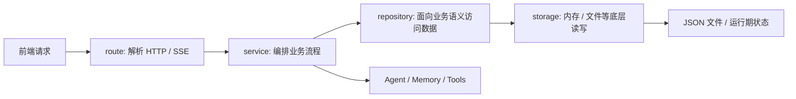
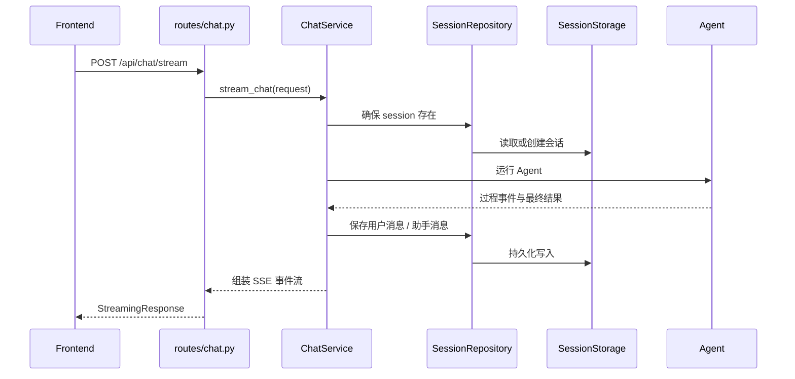

# 03. Web API、Session 与存储分层

这一章专门讲 `web/`。

如果说前端层解决的是“用户怎么与系统交互”，那 Web 层解决的就是：

- 前端请求如何被稳定接住
- 聊天主链如何被编排成标准 SSE
- session 如何被管理
- 存储如何被组织
- 非聊天模块如何复用同一套分层思路

这一章非常适合用来理解“工程分层为什么重要”，因为这里的设计不是抽象概念，而是当前项目里真实存在的 `route -> service -> repository -> storage` 链路。

## 0. 5 分钟速查卡

### 本章一句话

这一章回答的是：Web 层怎样把 HTTP / SSE、业务编排、session 生命周期和持久化边界组织成一套稳定分层。

### 必读 3 个文件

1. [chat.py](D:/moyuan/moyuan-travel-agent/web/moyuan_web/routes/chat.py)
2. [chat_service.py](D:/moyuan/moyuan-travel-agent/web/moyuan_web/services/chat_service.py)
3. [session_storage.py](D:/moyuan/moyuan-travel-agent/web/moyuan_web/storage/session_storage.py)

### 最常见 3 个坑

1. 把 route 当成业务主入口，什么都往里塞。
2. 把 repository 和 storage 当成重复抽象。
3. 以为 session 只是消息列表，而忽略模型、时间戳、排序和清理语义。

### 改这一层前先做什么

1. 先判断改动落在 route、service、repository 还是 storage。
2. 先列出这次改动是否会影响前端契约、session 生命周期和 SSE 事件。
3. 先准备最小回归：`pytest` 加前端 `lint/build`，再决定是否要补手工验证。

## 1. 本章解决什么问题

读完本章后，你应该能回答：

1. FastAPI 在这个项目里到底承担什么职责。
2. 为什么 route 层应该尽量薄。
3. 为什么聊天服务和会话服务需要分开。
4. repository 和 storage 为什么不是重复抽象。
5. 为什么“加一个字段”常常需要联动多层代码。
6. 如果未来把 JSON 存储换成数据库，希望主要改动落在哪些层。

## 2. 先修要求

在看本章前，最好已经完成下面两件事：

1. 看过 [02-chat-mainline-and-frontend.md](02-chat-mainline-and-frontend.md)，知道前端怎样调用 `/api/chat/stream`。
2. 对项目的整体目录结构已经有概念，知道 `web/` 是 API 层，不是 Agent 实现层。

## 3. 本章核心源码入口

建议先围绕下面这些文件建立心智模型：

- `web/moyuan_web/main.py`
- `web/moyuan_web/bootstrap.py`
- `web/moyuan_web/dependencies/container.py`
- `web/moyuan_web/routes/chat.py`
- `web/moyuan_web/services/chat_service.py`
- `web/moyuan_web/routes/session.py`
- `web/moyuan_web/services/session_service.py`
- `web/moyuan_web/repositories/session_repository_impl.py`
- `web/moyuan_web/storage/session_storage.py`

然后再扩展到：

- `web/moyuan_web/routes/city.py`
- `web/moyuan_web/routes/share.py`
- `web/moyuan_web/routes/map.py`
- `web/moyuan_web/routes/health.py`
- `web/moyuan_web/routes/model.py`

### 3.1 Web 分层总图

读这一章时，建议始终带着下面这张图。它能帮助你避免把 route、service、repository、storage 混成同一种代码层。



### 3.2 源码辅助学习：按分层和函数读

这一章最好不要只记层名，而是直接对着关键函数看分层边界：

| 层 | 文件 | 最值得先看的函数 | 学习重点 |
| --- | --- | --- | --- |
| route | [chat.py](D:/moyuan/moyuan-travel-agent/web/moyuan_web/routes/chat.py) | `_get_chat_service`、`stream_chat` | 看 route 为什么只做校验、取服务、返回 `StreamingResponse`。 |
| service | [chat_service.py](D:/moyuan/moyuan-travel-agent/web/moyuan_web/services/chat_service.py) | `stream_chat`、`_ensure_session`、`_stream_agent_events`、`_generate_plan_preview`、`save_message` | 看 session、memory、Agent、SSE 事件是如何在一个 service 里被编排起来的。 |
| service | [session_service.py](D:/moyuan/moyuan-travel-agent/web/moyuan_web/services/session_service.py) | `create_session`、`list_sessions`、`update_session_model`、`clear_chat` | 看“会话生命周期管理”和“聊天运行编排”为什么值得分开。 |
| repository | [session_repository_impl.py](D:/moyuan/moyuan-travel-agent/web/moyuan_web/repositories/session_repository_impl.py) | `create`、`get`、`update`、`list_all`、`cleanup_expired` | 看 repository 怎样用业务语义包装底层读写。 |
| storage | [session_storage.py](D:/moyuan/moyuan-travel-agent/web/moyuan_web/storage/session_storage.py) | `_load_from_file`、`_atomic_write_json`、`save`、`list_all` | 看底层真正处理了哪些文件级细节。 |

### 3.3 源码辅助学习：建议边看边搜的关键字

```text
stream_chat
_ensure_session
save_message
_stream_agent_events
_generate_plan_preview
create_session
list_sessions
cleanup_expired
_atomic_write_json
StreamingResponse
```

这组关键字能把“HTTP 接口 -> service 编排 -> repository 语义 -> storage 持久化”整条后端学习链串起来。

## 4. Web 层在整个系统里的位置

Web 层位于前端和 Agent 之间，但它不是简单的透传层。

你可以把它理解成系统里的“协议层 + 编排层 + 存储协调层”。

它主要负责 5 类事情：

1. 暴露 HTTP / SSE 接口
2. 做请求校验和响应组织
3. 编排会话、历史、memory、Agent 运行之间的协作
4. 管理持久化读写
5. 给前端提供稳定契约，给 Agent 提供清晰边界

## 5. 从启动入口开始读

### 5.1 `web/moyuan_web/main.py`

这一层最值得先看的通常是：

- 应用如何创建
- 路由如何注册
- 中间件和启动生命周期如何组织

你学习这个文件时，重点不是每一行配置，而是：

- FastAPI app 是如何被组装起来的
- 不同 router 是如何挂载到 `/api` 下的
- 应用初始化和依赖初始化的顺序是什么

### 5.2 `web/moyuan_web/bootstrap.py`

这个文件经常被新人忽略，但它很关键。

它主要解决的是：

- 项目根路径与模块导入的稳定性

对于这个项目尤其重要，因为：

- Web 层需要引用 Agent 层
- Agent 层也有自己的一套目录

如果没有统一的导入路径准备，不同入口下很容易出现导入不稳定。

### 5.3 `web/moyuan_web/dependencies/container.py`

这是当前 Web 层最重要的“组织者”之一。

从当前实现可以看到，它会注册：

- `SessionRepository`
- `SessionService`
- `ChatService`
- `TravelAgent`

这说明 route 层不直接 new 这些依赖，而是从容器里取。

### 为什么容器值得学

因为它体现了一个很现实的工程目标：

- route 只关心拿服务、收请求、回响应
- 实例的创建和依赖关系交给容器

这比在每个 route 里直接 new 很多对象更可维护。

## 6. 为什么当前项目采用 `route -> service -> repository -> storage`

这是本章最核心的设计。

### 6.1 route 层

负责：

- 接收请求
- 参数校验
- 调用 service
- 返回响应

不适合负责：

- 大段业务逻辑
- 存储实现细节
- 多对象协作流程

### 6.2 service 层

负责：

- 业务编排
- 跨模块协作
- 与 Agent、memory、session、storage 的协同

### 6.3 repository 层

负责：

- 面向业务语义组织数据访问
- 屏蔽底层存储差异

### 6.4 storage 层

负责：

- 真实的内存或文件读写
- 原子写、备份、恢复等底层细节

### 6.5 这四层各自回答什么问题

| 层 | 它最该回答的问题 |
| --- | --- |
| route | “HTTP 请求怎么进来、怎么出去” |
| service | “业务流程怎么协作” |
| repository | “业务要的那份数据怎么取和改” |
| storage | “数据最终怎么持久化” |

### 6.6 为什么这不是过度设计

因为这个项目真实存在下面这些复杂度：

- 聊天接口是流式 SSE，不是普通 JSON
- session 需要列表、删除、重命名、切换模型、清空消息
- 存储里有原子写和恢复逻辑
- 聊天服务还要和 Agent、memory、工具健康状态联动

这些复杂度如果都塞进 route，维护成本会很高。

## 7. 聊天主链在 Web 层怎么走

最关键的文件：

- `web/moyuan_web/routes/chat.py`
- `web/moyuan_web/services/chat_service.py`

### 7.1 `routes/chat.py`

从当前实现能看出，这一层非常薄。

它主要做：

1. 定义 `ChatRequest`
2. 校验消息非空
3. 限制消息长度不超过 `5000`
4. 从容器拿 `ChatService`
5. 返回 `StreamingResponse`

### 这一层的价值

它非常适合作为“为什么 route 要薄”的真实案例。

因为聊天链路最复杂的地方根本不在 route，而在后面的编排层。

### 7.2 `services/chat_service.py`

这是整个 Web 层最关键的 service。

当前你最值得关注的是它负责了哪些事情：

1. 初始化运行时依赖
2. 规范聊天模式
3. 确保 session 存在
4. 保存用户消息和助手消息
5. 协调 memory 写入和注入
6. 调用 Agent
7. 将 Agent 内部过程翻译成前端可消费的 SSE 事件
8. 汇总运行统计和工具健康状态

### 7.2.1 最推荐的阅读顺序

如果你第一次读 [chat_service.py](D:/moyuan/moyuan-travel-agent/web/moyuan_web/services/chat_service.py)，建议按下面顺序：

1. `stream_chat`
先看整条聊天主链从 Web 视角到底怎么被组织。
2. `_ensure_session`
再看为什么一条消息进入系统前，先要解决会话容器问题。
3. `save_message`
再看用户消息和助手消息是怎样落盘的。
4. `_stream_agent_events`
再看 service 如何把 Agent 事件流接回来。
5. `_generate_plan_preview`
最后看 `plan` 模式里为什么会有“先预览、再完整执行”的体验。

### 7.3 `ChatService` 的初始化

从当前实现看，`initialize()` 会准备：

- LLM adapter
- 主模型和 router 模型
- tools
- memory manager

这说明 `ChatService` 不是一个轻量转发器，而是聊天运行时的编排中心。

### 7.4 `ChatService` 的会话职责

在 `stream_chat()` 开头，它会做：

- 规范 mode
- `_ensure_session()`
- 生成 `run_id`
- 发出 `session_id` 事件
- 保存用户消息

这里可以看出一个很关键的现实问题：

前端虽然发的是一条消息，但后端真正要做的是“把这条消息纳入一个完整会话系统”。

### 7.5 `ChatService` 的 SSE 职责

当前实现会显式产出或转发这些事件：

- `session_id`
- `reasoning_start`
- `reasoning_chunk`
- `reasoning_end`
- `answer_start`
- `chunk`
- `stage`
- `tool_start`
- `tool_end`
- `plan_preview`
- `metadata`
- `done`

这说明 Web 层并不是简单把 Agent 原始输出直接透给前端，而是：

把内部运行过程标准化成一套更稳定的前端协议。



### 7.6 `ChatService` 的 memory 职责

从当前实现可以看到，它会处理：

- 用户消息写 memory
- 助手消息写 memory
- relevant memory 注入上下文

这也是为什么 memory 不适合直接挂在 route 里处理，因为它属于业务编排的一部分。

### 7.7 `ChatService` 的运行健康职责

它还会产出：

- `health_status`
- `tools_health_status`
- `tools_intents_health_status`

这说明它不仅处理聊天，还要承担一部分运行时观测责任。

## 8. Session 模块怎么学

最关键的文件：

- `web/moyuan_web/routes/session.py`
- `web/moyuan_web/services/session_service.py`
- `web/moyuan_web/repositories/session_repository_impl.py`
- `web/moyuan_web/storage/session_storage.py`

### 8.1 推荐的读法

先画 session 生命周期，再回源码验证：

```text
创建 session
  -> 列表读取
  -> 重命名
  -> 切换模型
  -> 清空会话
  -> 删除 session
```

### 8.2 源码辅助学习：session 要按职责读，不要按文件名猜

最常见的误区是只看到“session”这个词，却不知道每层都在做什么。更稳的读法是：

1. 先在 [session_service.py](D:/moyuan/moyuan-travel-agent/web/moyuan_web/services/session_service.py) 看 `create_session`、`list_sessions`、`update_session_model`。
2. 再去 [session_repository_impl.py](D:/moyuan/moyuan-travel-agent/web/moyuan_web/repositories/session_repository_impl.py) 看 `create / get / update / list_all`。
3. 最后去 [session_storage.py](D:/moyuan/moyuan-travel-agent/web/moyuan_web/storage/session_storage.py) 看 `_atomic_write_json`、`_load_from_file`、`save`。

这样你就会明显感受到：

- service 在讲业务
- repository 在讲语义
- storage 在讲实现

### 8.2 `session_service.py`

从当前实现看，它主要负责：

- 创建会话默认数据
- 列出会话
- 删除会话
- 更新名称
- 更新模型
- 获取模型
- 清空聊天
- 返回 session 完整信息

### 这里最值得注意的点

它不仅会操作 session repository，还会在一些场景下联动：

- memory manager

例如：

- 删除 session 时尝试清理该会话相关 memory
- 清空聊天时尝试清空 session 对应消息 memory

这说明 SessionService 并不是“纯 session 表操作”，而是业务语义更强的一层。

### 8.3 `session_repository_impl.py`

从当前实现看，它主要负责：

- 创建默认 session 结构
- 合并更新 session
- 维护 `last_active`
- 列表排序
- 空会话过滤
- 调用底层 storage

这层最适合帮助你理解：

repository 的价值不在“多包一层”，而在于它定义了“业务需要的 session 读写语义”。

### 8.4 `session_storage.py`

这一层非常适合精读。

当前实现提供了：

- `MemorySessionStorage`
- `FileSessionStorage`

并且显式处理：

- `last_active` 更新时间
- 过期清理
- 文件读写
- 原子写入
- 备份文件
- 故障恢复

### 为什么它特别值得学

因为这层能非常直观地说明：

如果没有 storage 抽象，所有文件读写细节都会往 repository 或 service 漏，最后让上层业务代码越来越脏。

## 9. 非聊天 API 模块怎么放进心智地图

Web 层不只有 chat 和 session。

### 9.1 `city`

这个模块非常适合新人上手，因为：

- 结构简单
- 风险较低
- 更容易看清 `route -> service` 的协作方式

### 9.2 `share`

这个模块适合拿来理解：

- 分享 ID 生成
- 分享内容落盘
- 分享内容回放

### 9.3 `map`

这个模块适合拿来理解：

- route preview 接口
- place / spots 到路线结果的转换

### 9.4 `health`

这个模块适合拿来理解：

- 系统就绪状态
- LLM 健康状态
- 工具健康状态

### 9.5 `model`

这个模块适合拿来理解：

- 模型配置暴露
- 会话级模型切换

### 统一视角

这些模块虽然具体业务不同，但它们都在重复同一个设计原则：

- route 层负责协议入口
- service 层负责业务语义
- 必要时再下探 repository / storage

## 10. “加一个字段”为什么经常是跨层改动

这是 Web 层最常见也最容易低估的难点。

以“给 session 增加一个 `last_used_at` 字段”为例，通常至少要考虑：

1. route 返回中要不要暴露
2. service 在什么时机更新
3. repository 如何 merge 和排序
4. storage 如何持久化
5. 前端是否要展示
6. 测试是否要加断言
7. 文档是否要同步

### 为什么这点很重要

因为很多人会误以为“后端加字段就是改个 dict”，但在有分层和前端消费的系统里，这几乎总是一个联动问题。

## 11. 如果未来从 JSON 存储迁移到数据库

这是最适合系统设计和面试拓展的问题之一。

### 11.1 理想目标

最希望主要变化集中在：

- repository
- storage

而不是：

- route
- 大部分 service

### 11.2 迁移时要关注的点

1. session 数据模型映射
2. 列表查询与排序语义
3. 并发写一致性
4. 历史数据迁移
5. 索引与性能
6. 故障恢复和回滚

### 11.3 为什么当前分层能帮上忙

如果 route 和 service 没有直接依赖 JSON 文件细节，那底层改成数据库时，影响面就能被限制住。

这也是 repository / storage 两层最有价值的地方之一。

## 12. 本章最容易踩的坑

### 坑 1：把 route 当成业务主入口

真实情况是：

route 是协议入口，不是业务逻辑主战场。

### 坑 2：把 repository 当成“多余的一层”

真实情况是：

repository 承担的是业务语义层的数据读写抽象，不等于 storage。

### 坑 3：把 session 当成单纯消息列表

真实情况是：

session 还包括：

- 名称
- 模型
- 时间戳
- 偏好
- 清理与排序语义

### 坑 4：以为 storage 只是 `json.dump`

真实情况是：

当前实现还处理了原子写、备份、恢复和清理问题。

## 13. 高频面试题

### 题 1：为什么不能把业务逻辑都写在 route

合格回答要包含：

1. route 更适合协议层工作
2. 业务逻辑放 service 更易复用和测试
3. SSE、session、memory、Agent 协调逻辑都放 route 会让边界混乱

### 题 2：为什么需要 repository 和 storage 两层

合格回答要包含：

1. repository 是业务语义层
2. storage 是底层持久化层
3. 这样更容易替换 JSON、内存、数据库等实现

### 题 3：为什么聊天服务和会话服务应该分开

合格回答要包含：

1. ChatService 关注流式聊天编排
2. SessionService 关注会话生命周期管理
3. 两者相关，但职责和变化频率不同

### 题 4：如果 session 从 JSON 改数据库，你最希望哪里不动

合格回答要包含：

1. route 基本不动
2. 业务 service 变化尽量小
3. 主要在 repository / storage 里完成替换

## 14. 拓展点

本章最值得继续思考的方向有：

1. session 数据库化
2. share 的过期和权限控制
3. map route preview 的缓存策略
4. 健康检查接入更细粒度观测
5. 给所有 Web 请求引入统一的 `trace_id / run_id`
6. Web 层日志与前端诊断字段的统一

## 补充一：本章最小必读源码

如果时间很紧，至少精读下面 6 个文件：

1. [main.py](D:/moyuan/moyuan-travel-agent/web/moyuan_web/main.py)
作用：理解 FastAPI 应用入口与 router 注册。
2. [container.py](D:/moyuan/moyuan-travel-agent/web/moyuan_web/dependencies/container.py)
作用：理解依赖如何被统一装配。
3. [chat.py](D:/moyuan/moyuan-travel-agent/web/moyuan_web/routes/chat.py)
作用：理解聊天协议入口为什么应该很薄。
4. [chat_service.py](D:/moyuan/moyuan-travel-agent/web/moyuan_web/services/chat_service.py)
作用：理解 session、memory、Agent、SSE 编排是怎么串起来的。
5. [session_service.py](D:/moyuan/moyuan-travel-agent/web/moyuan_web/services/session_service.py)
作用：理解会话生命周期与聊天编排为什么分开。
6. [session_storage.py](D:/moyuan/moyuan-travel-agent/web/moyuan_web/storage/session_storage.py)
作用：理解文件存储并不只是简单 `json.dump`。

如果还能多看 2 个文件，再补：

- [session_repository_impl.py](D:/moyuan/moyuan-travel-agent/web/moyuan_web/repositories/session_repository_impl.py)
- [session.py](D:/moyuan/moyuan-travel-agent/web/moyuan_web/routes/session.py)

## 补充二：本章最值得画的 2 张图

### 图 1：Web 分层关系图

最低要画出：

- route
- service
- repository
- storage
- Agent / memory

这张图主要用来回答：

- 为什么后端不是一团逻辑
- 各层各自解决什么问题
- 底层存储变动时理想影响面在哪里

### 图 2：session 生命周期图

最低要画出：

- 创建
- 读取
- 保存消息
- 切换模型
- 重命名
- 删除
- 持久化写入

这张图主要用来回答：

- session 不是单纯消息数组
- 会话管理和聊天编排为什么相关但不相同

## 补充三：改这一层最容易影响什么

改 Web API 层时，最容易牵动的是下面 5 类内容：

1. 前后端契约
一个字段改名、一个事件类型变化，前端消费就可能一起变。
2. session 生命周期
创建、删除、重命名、模型切换都可能被联动影响。
3. SSE 协议稳定性
聊天正文还能出来，不代表 `stage`、`tool`、`metadata` 这些事件没有退化。
4. memory 与 Agent 编排
如果 `ChatService` 改了上下文注入顺序，结果质量可能悄悄变化。
5. 持久化一致性
文件写入、备份、恢复、清理逻辑如果出问题，往往不是立即暴露，而是后面慢慢出错。

## 补充四：初级 / 中级 / 高级面试追问

### 初级追问

1. 为什么 route 要尽量薄？
2. `ChatService` 和 `SessionService` 为什么分开？
3. repository 和 storage 的区别是什么？

### 中级追问

1. 为什么聊天接口返回 `StreamingResponse` 而不是普通 JSON？
2. 为什么 Web 层不能只是把 Agent 输出原样透传给前端？
3. 为什么“加一个字段”常常是跨层改动？

### 高级追问

1. 如果 session 从 JSON 迁移到数据库，你希望哪些层基本不动？
2. 如果未来要加 `trace_id` 和完整观测链，最适合放在哪些层？
3. 如果后续要支持多租户或更多 provider，当前容器和服务边界是否足够稳？

## 附：统一术语表（本章相关）

为和 [README.md](README.md) 以及 [01-total-plan-and-learning-method.md](01-total-plan-and-learning-method.md) 保持一致，本章建议统一使用下面这组术语。

| 术语 | 统一定义 |
| --- | --- |
| route | 指 FastAPI 路由层，负责接住 HTTP 请求、做轻量校验、调用 service、返回响应。 |
| service | 指业务编排层，负责把 session、memory、Agent、SSE 响应等流程串起来。 |
| repository | 指面向业务语义的数据访问层，用“会话”“消息”这类概念组织读写，不直接暴露底层存储细节。 |
| storage | 指底层持久化实现层，例如内存存储、文件存储、原子写、备份恢复。 |
| session | 指一次或多次聊天围绕的会话容器，承载消息历史、当前模型、最后活跃时间等信息。 |
| run_id | 指一次具体运行的唯一标识。一个 session 可以包含多次 run。 |
| StreamingResponse | 指 FastAPI 用来持续返回 `text/event-stream` 的响应对象，是本项目聊天链路的 Web 输出载体。 |
| container | 指依赖容器，负责统一构造和提供 `ChatService`、`SessionService`、`TravelAgent` 等依赖。 |
| 契约 | 指前后端或层与层之间约定好的请求字段、事件类型、数据结构和行为边界。 |

## 15. 本章验收标准

读完本章后，最低应该能独立完成下面 6 件事中的 4 件：

1. 说出 `main.py / container.py / routes / services / repositories / storage` 的关系
2. 解释 `chat.py` 为什么很薄、`chat_service.py` 为什么很重
3. 画出 session 生命周期图
4. 解释 repository 和 storage 的差别
5. 解释为什么字段改动常常要联动多层
6. 说出 JSON -> DB 迁移时最理想的改动边界

## 16. 配套练习

建议读完本章后，至少完成下面两项：

1. 去 [07-thinking-questions-homework-and-answers.md](07-thinking-questions-homework-and-answers.md) 完成 `Phase 3` 的题目。
2. 自己整理一份“session 新增字段的联动清单模板”。

如果你能把 session 模块讲清楚，并能解释清楚分层边界，本章就算真正掌握了。
