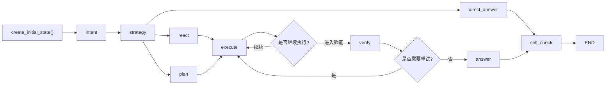
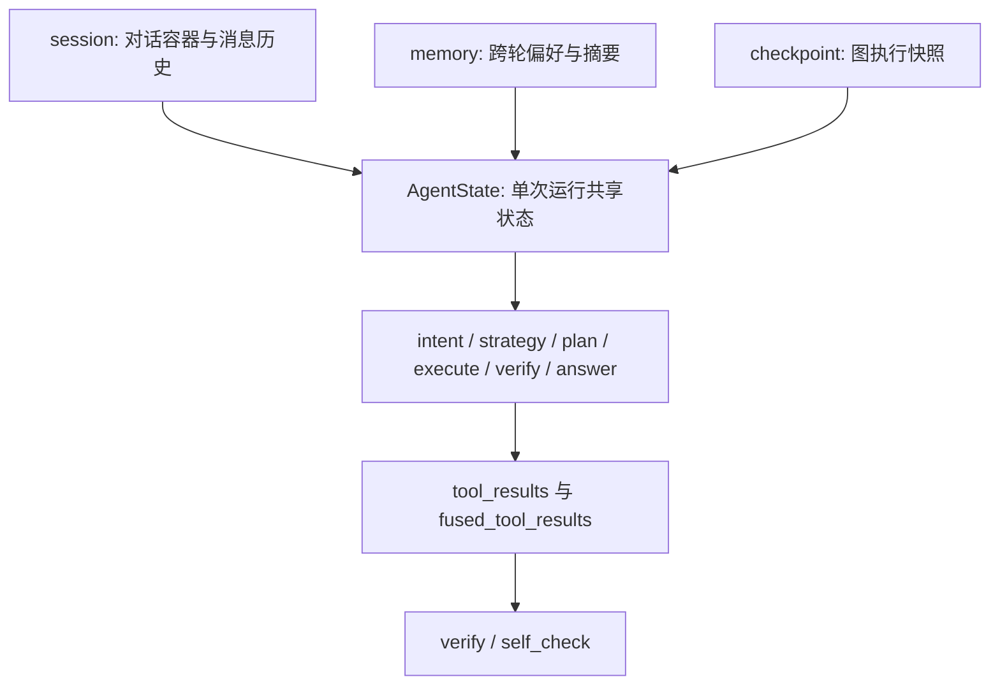

# 04. Agent 核心、Tools、Memory、Checkpoint

这是整套教学材料里最难、也最值得花时间的一章。

如果你能把这一章真正吃透，你学到的就不只是“这个项目里的 Agent 怎么写”，而是一套非常典型的 Agent 工程化思路：

- 用状态机而不是线性链表达复杂流程
- 用工具契约和 `_meta` 保护事实性输出
- 用 `verify`、`self_check`、stale、fallback 形成可靠性闭环
- 用 memory 和 checkpoint 分别解决长期记忆与运行恢复

## 0. 5 分钟速查卡

### 本章一句话

这一章回答的是：Agent 为什么是“状态机 + 工具证据链 + 验证闭环 + 记忆与恢复系统”，而不只是几个 prompt 串起来。

### 必读 3 个文件

1. [state.py](D:/moyuan/moyuan-travel-agent/agent/travel_agent/graph/state.py)
2. [builder.py](D:/moyuan/moyuan-travel-agent/agent/travel_agent/graph/builder.py)
3. [nodes.py](D:/moyuan/moyuan-travel-agent/agent/travel_agent/graph/nodes.py)

### 最常见 3 个坑

1. 一上来就从头啃 `nodes.py`。
2. 把 `session`、`memory`、`checkpoint` 混成一件事。
3. 只看最终答案，不看 `verify`、`_meta`、stale、fallback 这些可靠性机制。

### 改这一层前先做什么

1. 先明确改的是状态字段、条件边、节点逻辑，还是工具契约。
2. 先判断这次改动会影响 routing、evidence、verify 还是 memory 注入。
3. 先准备最小回归：`pytest`，高风险时再补 benchmark、golden eval 和 quality gate。

## 1. 本章解决什么问题

读完本章后，你应该能回答：

1. 这个 Agent 为什么不是普通的“prompt -> tool -> answer”。
2. `state.py`、`builder.py`、`nodes.py` 分别解决什么问题。
3. `direct / react / plan` 三种路径为什么要并存。
4. `execute -> verify -> execute` 的回环为什么存在。
5. `_meta / stale / fallback / refresh` 在工程上各自起什么作用。
6. memory、checkpoint、session 这三套概念到底怎么区分。

## 2. 先修要求

强烈建议你在读这一章之前，已经完成下面两件事：

1. 看过 [02-chat-mainline-and-frontend.md](02-chat-mainline-and-frontend.md)，知道聊天链路和 SSE 事件是怎么跑起来的。
2. 看过 [03-web-api-session-and-storage.md](03-web-api-session-and-storage.md)，知道 ChatService 是如何把 Agent 输出包装给前端的。

如果没有这两个前置知识，直接啃 Agent 很容易“局部都认识，整体不成系统”。

## 3. 本章核心源码入口

建议固定围绕下面这些文件来学：

- `agent/travel_agent/graph/state.py`
- `agent/travel_agent/graph/builder.py`
- `agent/travel_agent/graph/nodes.py`
- `agent/travel_agent/tools/travel_tools.py`
- `agent/travel_agent/tools/travel_api.py`
- `agent/travel_agent/graph/memory_integration.py`
- `agent/travel_agent/graph/persistent_checkpointer.py`
- `agent/travel_agent/llm/`

如果你只能精读 5 个文件，优先级建议是：

1. `state.py`
2. `builder.py`
3. `nodes.py`
4. `memory_integration.py`
5. `travel_api.py`

### 3.1 Agent 图总览

学习 Agent 时，不要把它理解成“一个超长函数”。更好的方式是先看图，再看状态，再看节点实现。



### 3.2 源码辅助学习：按状态 -> 图 -> 节点的顺序读

这一章最怕“函数很多但不知道先抓什么”。最推荐直接按下面这个顺序对着源码看：

| 阅读阶段 | 文件 | 最值得先看的符号 | 学习目标 |
| --- | --- | --- | --- |
| 第一步：看状态 | [state.py](D:/moyuan/moyuan-travel-agent/agent/travel_agent/graph/state.py) | `AgentState`、`create_initial_state` | 先搞清一次运行里到底共享了哪些信息。 |
| 第二步：看图 | [builder.py](D:/moyuan/moyuan-travel-agent/agent/travel_agent/graph/builder.py) | `build`、`_build_thread_config` | 先搞清节点怎么连、session 怎样和 graph thread 绑定。 |
| 第三步：看节点 | [nodes.py](D:/moyuan/moyuan-travel-agent/agent/travel_agent/graph/nodes.py) | `intent_node`、`strategy_node`、`routing_decision`、`plan_node`、`execute_node`、`verify_node`、`verify_decision`、`answer_node`、`self_check_node`、`direct_answer_node`、`should_continue` | 逐段理解状态机每一步的职责和决策点。 |
| 第四步：看工具契约 | [travel_api.py](D:/moyuan/moyuan-travel-agent/agent/travel_agent/tools/travel_api.py) | 与 `_meta`、stale、fallback 相关的返回结构 | 看“证据链”到底怎么被表达。 |
| 第五步：看长期上下文 | [memory_integration.py](D:/moyuan/moyuan-travel-agent/agent/travel_agent/graph/memory_integration.py) | memory 写入、摘要、上下文构建相关逻辑 | 看长期记忆怎样进入一次运行。 |
| 第六步：看恢复能力 | [persistent_checkpointer.py](D:/moyuan/moyuan-travel-agent/agent/travel_agent/graph/persistent_checkpointer.py) | 初始化、保存、恢复入口 | 看 checkpoint 为什么不等于 memory。 |

### 3.3 源码辅助学习：建议边看边搜的关键字

```text
AgentState
create_initial_state
build
routing_decision
should_continue
verify_decision
execute_node
tool_results
_meta
build_context_messages
checkpoint
```

这组关键字能帮助你把“状态定义 -> 图连接 -> 节点执行 -> 证据与验证 -> 记忆与恢复”完整串起来。

## 4. 先建立正确的 Agent 心智模型

当前项目里的 Agent 不是一条普通的线性调用链，而是一个有状态、有路由、有回环、有验证、有自检的执行系统。

可以先把它抽象成下面这条主流程：

```text
输入上下文
  -> intent
  -> strategy
  -> direct / react / plan
  -> execute
  -> verify
  -> answer
  -> self_check
```

从工程视角看，真正重要的不是“用了 LangGraph”这件事，而是：

- 为什么这里需要图而不是链
- 为什么状态要跨节点共享
- 为什么会有条件边
- 为什么验证失败后要回跳
- 为什么最终答案之前还要自检

## 5. 正确的阅读顺序

Agent 最忌讳的读法是：

上来直接打开 `nodes.py` 从第一行看到最后一行。

这会非常容易迷路。

### 最推荐的阅读顺序

1. 先读 `state.py`
2. 再读 `builder.py`
3. 再读 `nodes.py`
4. 再读 tools
5. 再读 memory
6. 最后读 checkpoint 和 LLM 适配

### 为什么一定要先看 `state.py`

因为它定义了整张图里“共享状态的形状”。

### 为什么一定要再看 `builder.py`

因为它定义了“节点怎么连起来”。

### 5.1 `builder.py` 最推荐的读法

打开 [builder.py](D:/moyuan/moyuan-travel-agent/agent/travel_agent/graph/builder.py) 后，最推荐只盯 3 个块：

1. `graph.add_node(...)`
先确认系统到底有哪些核心阶段。
2. `graph.add_conditional_edges(...)`
再确认哪些地方存在分叉和回环。
3. `_build_thread_config(...)`
最后理解 session 和 checkpoint 为什么能绑定到同一个 graph thread。

### 为什么最后才看 `nodes.py`

因为 `nodes.py` 里是最细、最多、最容易让人沉进局部的实现细节。

## 6. `state.py` 应该怎么学

`agent/travel_agent/graph/state.py` 里最重要的不是某一个字段，而是：

`AgentState` 这份共享状态到底表达了什么。

从当前代码看，`AgentState` 至少包含这些字段：

- `messages`
- `chat_mode`
- `intent`
- `intent_detail`
- `strategy`
- `strategy_detail`
- `routing`
- `plan_id`
- `plan_explanation`
- `plan`
- `validation_status`
- `validation_errors`
- `current_step`
- `execution_round`
- `parallelism`
- `max_parallelism`
- `execution_state`
- `execution_stats`
- `execution_summary`
- `execution_trace`
- `execution_budget`
- `fused_tool_results`
- `early_stop_reason`
- `verify_retry_count`
- `verify_result`
- `self_check_result`
- `tools_used`
- `tool_results`
- `answer`
- `reasoning`
- `session_id`
- `run_id`
- `error`

### 6.1 最推荐的字段分组法

不要背字段，按下面 6 组来理解：

| 字段组 | 代表什么 |
| --- | --- |
| 输入上下文 | 用户输入、消息列表、会话信息、运行标识 |
| 意图与策略 | 系统认为用户在问什么、打算怎么做 |
| 计划与执行 | 要执行哪些步骤、执行到哪里、执行预算如何 |
| 工具与证据 | 调过哪些工具、拿到哪些结果、证据怎样聚合 |
| 验证与质量控制 | 是否通过验证、是否需要重试、是否有错误 |
| 最终输出 | reasoning、answer、自检结果 |

### 6.2 `create_initial_state()` 为什么重要

这个函数会把：

- `system_message`
- 用户消息
- `session_id`
- `run_id`
- `chat_mode`

注入成一次图执行的初始状态。

你可以把它理解成：

“一次 Agent 运行的起始世界状态”。

## 7. `builder.py` 应该看什么

`agent/travel_agent/graph/builder.py` 解决的是：

这张状态图是怎么搭起来的。

### 7.1 当前最核心的节点

从当前实现看，图上有这些核心节点：

- `intent`
- `strategy`
- `plan`
- `react`
- `execute`
- `verify`
- `answer`
- `direct_answer`
- `self_check`

### 7.2 当前最关键的边

从 `build()` 里的图构建逻辑看，核心边可以概括成：

```text
intent -> strategy
strategy -> plan/react/direct_answer
plan -> execute
react -> execute
execute -> execute 或 verify
verify -> execute 或 answer
answer -> self_check
direct_answer -> self_check
self_check -> END
```

### 7.3 这张图最重要的两个决策点

#### 决策点一：`strategy`

决定：

- 走 `plan`
- 走 `react`
- 还是直接回答

#### 决策点二：`verify`

决定：

- 回去再执行一次
- 还是已经可以生成答案

### 7.4 这说明了什么

这说明当前 Agent 不是普通链式调用，而是一个真正的状态机。

这也是为什么面试里问“为什么用图而不是链”时，不能只回答“因为 LangGraph 很方便”，而要回答：

- 这里有条件边
- 这里有回环
- 这里有多阶段质量控制



## 8. `nodes.py` 怎么拆着学

`agent/travel_agent/graph/nodes.py` 很大，但从当前函数定义你可以抓住最关键的入口：

- `intent_node`
- `strategy_node`
- `routing_decision`
- `plan_node`
- `execute_node`
- `verify_node`
- `verify_decision`
- `self_check_node`
- `should_continue`
- `answer_node`
- `direct_answer_node`

除此之外，文件里还有一组结构化输出模型或辅助类，非常值得注意：

- `IntentResult`
- `PlanStep`
- `ExecutionResult`
- `ToolOrchestratorDecision`
- `ToolOrchestrator`
- `StrategyResult`
- `VerifyIssue`
- `VerifyResult`
- `SelfCheckResult`
- 各阶段输出模型

这说明当前节点不是“写点 prompt 字符串”那么简单，而是尝试把关键阶段结构化。

## 9. 节点逐个怎么学

### 9.0 节点阅读建议

读 [nodes.py](D:/moyuan/moyuan-travel-agent/agent/travel_agent/graph/nodes.py) 时，最稳的方法不是一口气顺着看，而是每读一个节点都固定回答 4 个问题：

1. 它读了哪些状态字段？
2. 它改了哪些状态字段？
3. 它依赖了哪些工具或模型能力？
4. 它把决策权交给了哪一个后继节点？

### 9.1 `intent_node`

作用：

- 识别用户到底在问什么

你要重点关注：

- intent 的候选类型
- 是否优先尝试 structured output
- structured output 失败时如何 fallback

这一层写入的核心状态通常是：

- `intent`
- `intent_detail`
- 相关 reasoning

### 9.2 `strategy_node`

作用：

- 决定系统接下来走哪条回答路径

你要重点关注：

- `routing`
- `required_tools`
- `optional_tools`
- `requires_verification`

这一步真正决定的是：

- 这个问题是不是必须调工具
- 是不是应该先做计划
- 是不是高风险到必须做验证

### 9.3 `routing_decision`

作用：

- 把 `strategy_node` 的结果正式映射成 `plan / react / direct`

这一层虽然小，但它非常关键，因为它把“策略分析”变成了“图路由”。

### 9.4 `plan_node`

作用：

- 把复杂问题拆成步骤化执行计划

你要重点关注：

- 计划结构如何生成
- required tools 是否被补齐
- 非法步骤和非法工具如何处理
- `plan_id`、`plan_explanation`、`validation_status`、`validation_errors` 如何写入状态

### 9.5 `execute_node`

这是最工程化的节点之一。

它真正解决的是：

- 工具怎么执行
- 哪些步骤可以继续
- 哪些步骤要重试
- 哪些步骤需要 fallback
- 哪些 stale 结果要 refresh

当前从类和字段命名里能看出，它关心的东西已经不只是“调工具”，而更像一个轻量调度器：

- pending steps
- `depends_on`
- 并发度
- timeout
- retry
- cooldown
- loop detection
- execution budget

这是整个 Agent 层最能体现“工程味”的地方之一。

### 9.6 `should_continue`

作用：

- 判断 `execute` 之后是继续执行，还是进入验证

这一步很重要，因为它把 execute 变成了一个可以多轮推进的阶段，而不是一次性动作。

### 9.7 `verify_node`

作用：

- 验证当前执行结果是不是已经足够可靠

你要重点看的是：

- 高风险问题是否拿到了必须工具结果
- stale 数据是否需要刷新
- 当前结果是否满足回答条件
- 是否需要把问题打回 `execute`

### 9.8 `verify_decision`

作用：

- 把验证结果正式映射成“继续执行”或“进入回答”

这是整个可靠性闭环里最关键的路由点之一。

### 9.9 `answer_node`

作用：

- 基于执行证据生成最终回答

你要重点关注：

- 工具结果如何融合进 prompt
- 为什么这里不是让模型自由发挥
- 高风险信息为什么应该显式保留证据痕迹

### 9.10 `direct_answer_node`

作用：

- 处理可以直接回答的问题

它的存在说明：

- 不是所有问题都值得进入完整工具执行链
- 系统在做复杂度和成本控制

### 9.11 `self_check_node`

作用：

- 在最终输出前再做一次轻量质量检查

你要重点思考：

- 为什么 answer 之后还不直接结束
- 为什么系统还要再检查一遍完整性和最低质量

这说明当前 Agent 明显偏向“工程可控”，而不只是“尽快出一个回答”。

## 10. `direct / react / plan` 三种模式怎么理解

这是最典型的面试难点之一。

### 10.1 `direct`

适合：

- 风险低
- 不需要事实查询
- 可以直接回答的问题

### 10.2 `react`

适合：

- 需要边推理边用工具
- 不一定要完整计划
- 问题复杂度中等

### 10.3 `plan`

适合：

- 约束很多
- 需要先拆步骤
- 任务更复杂、更偏组合式执行

### 10.4 三种模式并存的工程意义

它们不是“多写了几种花样”，而是在做：

1. 成本控制
2. 风险分级
3. 执行复杂度分流
4. 用户体验优化

如果所有问题都走最复杂路径，会更慢、更贵、更难维护。

## 11. tools 层应该怎么学

关键文件：

- `agent/travel_agent/tools/travel_tools.py`
- `agent/travel_agent/tools/travel_api.py`

### 11.1 最重要的学习视角：工具契约

不要把 tools 当成一堆函数，而要把它们当成“有输入、有输出、有元信息、有失败语义”的契约。

每个工具都应该问：

1. 输入参数是什么
2. 文本输出是什么
3. `_meta` 里有什么
4. 会不会返回 stale 数据
5. 会不会 fallback
6. 是否支持 refresh

### 11.2 `travel_tools.py` 体现了什么

从当前代码可以看到：

- 有 LangChain `@tool`
- 部分工具支持真实 API 和 mock 双模式
- 当真实 API 调用成功时，工具可能返回：
  - 文本报告
  - `_meta`

这说明工具层不是只给模型一句自然语言，而是同时面向：

- 模型继续消费
- 系统诊断
- 前端展示
- 验证与刷新逻辑

### 11.3 `_meta` 为什么这么重要

它是当前系统事实性和可观测性的关键接口之一。

没有 `_meta`，系统很难可靠地知道：

- 这份结果是不是 stale
- 是否走了 fallback
- 数据来自哪里
- 需不需要 refresh
- 前端该展示哪些诊断信息

## 12. stale / fallback / refresh / verify 形成了什么闭环

这是整个项目最有工程味的一组设计。

### `stale`

表示：

- 这份工具结果可能不是最新的，或者可信度不够高

### `fallback_used`

表示：

- 主路径失败后用了兜底路径

### `refresh_success`

表示：

- 系统在尝试刷新结果时是否真的拿到了更新数据

### `verify`

表示：

- 系统会结合上面这些信号决定：能不能安全进入回答

### 这组机制的工程意义

它防止系统做出一种最危险的事：

把“半可靠结果”当成“完全可信事实”继续生成答案。

## 13. memory、checkpoint、session 的边界

这是当前项目最容易混淆的一组概念。

### 13.1 session

更偏：

- 会话元数据
- 消息历史
- 模型选择

典型落盘：

- `data/sessions.json`

### 13.2 memory

更偏：

- 长期偏好
- 摘要
- 待澄清信息
- 跨轮次和跨会话的稳定信息

典型落盘：

- `data/agent_memory.json`

### 13.3 checkpoint

更偏：

- 图执行过程中的恢复点
- 运行状态的持久化

典型落盘：

- `data/langgraph_checkpoints.sqlite3`

### 13.4 一句话区分

- session：这次会话长什么样
- memory：系统长期记住了用户什么
- checkpoint：图执行到哪一步，如何恢复

## 14. `memory_integration.py` 应该怎么看

`agent/travel_agent/graph/memory_integration.py` 比较大，但最推荐的读法非常固定：

1. 什么时候写入
2. 写什么
3. 什么时候读取
4. 读取后怎么注入

### 14.1 当前实现里最值得注意的点

从代码结构可以看到：

- 有 `MemoryMessage`
- 有 `ConversationSummarizer`
- 有 `AgentMemoryManager`
- 总结器是确定性的，不依赖额外 LLM 调用

这说明当前 memory 设计并不是“每次都让模型自己总结”，而是优先走一个更稳定、更可控的本地总结机制。

### 14.2 `AgentMemoryManager` 的作用

它至少承担了：

- 持久化会话 memory
- 维护最近消息
- 维护 summary
- 维护 profile
- 控制 session TTL 和最大 session 数
- 磁盘落盘和恢复

### 14.3 为什么 memory 值得单独学

因为它回答的不是“这次运行怎么办”，而是：

- 用户长期偏好怎么被沉淀
- 长对话怎么被压缩
- 下次执行怎样带着过去的理解继续工作

## 15. `persistent_checkpointer.py` 应该怎么看

`agent/travel_agent/graph/persistent_checkpointer.py` 体现的是另一种能力：

运行恢复。

### 15.1 当前实现的几个关键点

从代码结构看，它是基于 SQLite 的持久化 saver，并且有：

- `checkpoints` 表
- `blobs` 表
- `writes` 表
- `checkpoint_meta` 表

这说明 checkpoint 不是一条简单的“最后状态快照”，而是在存：

- checkpoint 本身
- 增量 blob
- 写入记录
- 元信息

### 15.2 为什么 checkpoint 不等于 memory

因为 checkpoint 解决的是：

- 单次图执行中的恢复与重放

而 memory 解决的是：

- 长期用户信息的累积与注入

它们的时间尺度和恢复目标完全不同。

## 16. LLM 适配层怎么理解

关键目录：

- `agent/travel_agent/llm/`

这层存在的意义不是“多包一层”，而是：

- 把配置映射为 LangChain ChatModel
- 把模型选择从业务节点里抽离
- 让主模型和 router 模型可以分开演进

这也是后续做多模型路由和成本控制的基础。

## 17. Agent 常见问题排查顺序

如果你怀疑问题出在 Agent，不要直接盲改 prompt，建议按下面顺序排查：

```text
先看用户现象
  -> 再看 ChatService 发出的 stage / tool / metadata
  -> 再看 state 里 intent / routing / plan 是否符合预期
  -> 再看 execute 是否真的拿到了工具结果
  -> 再看 verify 为什么通过或失败
  -> 再看 answer / self_check 是否丢失关键信息
  -> 最后再看 memory / checkpoint 是否影响了上下文
```

### 最容易误判的点

1. 以为“答案怪”一定是 prompt 问题
2. 以为“没回答好”一定是工具没调好
3. 以为 memory、session、checkpoint 互相可以替代

实际情况往往更复杂，是状态、执行、验证、证据、上下文共同作用的结果。

## 18. 高频面试题

### 题 1：为什么 Agent 要用状态机而不是普通链式调用

合格回答要包含：

1. 这里有多阶段决策
2. 这里有条件路由
3. 这里有执行回环
4. 这里有验证和自检
5. 线性链很难自然表达这种流程

### 题 2：为什么 `verify` 会回跳 `execute`

合格回答要包含：

1. 验证失败时最合理的动作是补证据或重做执行
2. 不应该直接继续生成答案
3. 这体现了系统对结果质量的控制

### 题 3：为什么要同时存在 memory 和 checkpoint

合格回答要包含：

1. memory 偏长期偏好和摘要
2. checkpoint 偏单次图运行恢复
3. 两者时间尺度不同、恢复目标不同

### 题 4：为什么工具层需要 `_meta`

合格回答要包含：

1. 工具结果不只是给模型看
2. 还要给验证、前端、刷新、诊断和回放看
3. `_meta` 是系统事实性与可观测性的关键桥梁

## 19. 拓展点

本章最值得继续思考的扩展方向有：

### 19.1 多模型路由

将来可以让：

- intent / strategy 用更轻模型
- answer / verify 用更强模型

### 19.2 更强工具缓存

把 stale、新鲜度和 refresh 策略做得更统一。

### 19.3 更强 guardrail

例如：

- prompt injection 防护
- 风险问题分级验证
- 引用和来源约束

### 19.4 更强 replay 和 trace

让每次执行都更容易复盘：

- 哪一步路由了
- 哪个工具 fallback 了
- 为什么 verify 没过

### 19.5 成本控制

在 plan / react / direct 之间做更精细的成本和质量平衡。

## 补充一：本章最小必读源码

如果时间有限，至少精读下面 6 个文件：

1. [state.py](D:/moyuan/moyuan-travel-agent/agent/travel_agent/graph/state.py)
作用：理解共享状态到底长什么样。
2. [builder.py](D:/moyuan/moyuan-travel-agent/agent/travel_agent/graph/builder.py)
作用：理解节点和边是怎么接起来的。
3. [nodes.py](D:/moyuan/moyuan-travel-agent/agent/travel_agent/graph/nodes.py)
作用：理解每个阶段具体做什么。
4. [travel_api.py](D:/moyuan/moyuan-travel-agent/agent/travel_agent/tools/travel_api.py)
作用：理解工具结果和 `_meta` 的事实性边界。
5. [memory_integration.py](D:/moyuan/moyuan-travel-agent/agent/travel_agent/graph/memory_integration.py)
作用：理解长期记忆如何写入、清理、注入。
6. [persistent_checkpointer.py](D:/moyuan/moyuan-travel-agent/agent/travel_agent/graph/persistent_checkpointer.py)
作用：理解图执行恢复和长期记忆不是一回事。

如果还能多看一点，再补：

- [travel_tools.py](D:/moyuan/moyuan-travel-agent/agent/travel_agent/tools/travel_tools.py)
- [llm_adapters.py](D:/moyuan/moyuan-travel-agent/agent/travel_agent/llm/llm_adapters.py)

## 补充二：本章最值得画的 2 张图

### 图 1：节点与边关系图

最低要画出：

- `intent`
- `strategy`
- `direct_answer`
- `plan`
- `react`
- `execute`
- `verify`
- `answer`
- `self_check`

这张图主要用来回答：

- Agent 为什么是图不是链
- 决策点在哪里
- 回环为什么存在

### 图 2：session / memory / checkpoint 边界图

最低要画出：

- session
- memory
- checkpoint
- AgentState
- tool results

这张图主要用来回答：

- 哪些东西是长期保留
- 哪些东西只属于一次运行
- 为什么三者不能混用

## 补充三：改这一层最容易影响什么

改 Agent 层时，最容易被影响的是下面 6 类东西：

1. 路由决策
例如 `direct / react / plan` 的选择条件变化。
2. 工具证据链
例如工具结果结构、`_meta`、stale 标记、fallback 信息。
3. 质量控制
例如 `verify` 和 `self_check` 的门槛变化。
4. 记忆注入
例如 relevant memory 的写入、过滤、清理和提示注入顺序。
5. 恢复与回放
例如 checkpoint 结构变化后，replay 或恢复语义是否还成立。
6. 质量基线
例如 benchmark、golden eval、quality gate 是否开始退化。

Agent 这一层最常见的风险不是“代码直接报错”，而是“回答还能生成，但证据、稳定性或成本结构已经变了”。

## 补充四：初级 / 中级 / 高级面试追问

### 初级追问

1. 为什么 Agent 要用状态机而不是普通链式调用？
2. `state.py`、`builder.py`、`nodes.py` 分别做什么？
3. `verify` 为什么会回跳 `execute`？

### 中级追问

1. 为什么 `direct / react / plan` 三种模式要并存？
2. 为什么工具层必须带 `_meta`？
3. memory 和 checkpoint 为什么不能合并成一个概念？

### 高级追问

1. 如果要做多模型路由，你会把模型选择落在哪些节点？
2. 如果工具结果 stale 较多，系统应该在哪些阶段显式处理？
3. 如果要把 Agent 做成更强可观测系统，trace、replay、quality gate 应该怎样协同？

## 附：统一术语表（本章相关）

为和 [README.md](README.md) 以及 [01-total-plan-and-learning-method.md](01-total-plan-and-learning-method.md) 保持一致，本章建议固定使用下面这组术语。

| 术语 | 统一定义 |
| --- | --- |
| AgentState | 指 LangGraph 运行时共享状态对象，承载输入上下文、路由决策、执行过程、工具结果和最终输出。 |
| routing | 指 Agent 在 `strategy` 或 `verify` 等节点做出的路径选择，例如进入 `direct`、`react`、`plan` 或回到 `execute`。 |
| plan | 指先生成明确步骤再执行的模式，适合多约束、多步骤、需要显式计划解释的任务。 |
| react | 指边想边调工具的执行路径，通常比 plan 更轻，但结构化程度更弱。 |
| execute | 指实际调用工具、汇总结果、推进执行轮次的阶段。 |
| verify | 指对当前执行结果做质量检查，决定是否可以进入答案生成，或是否需要回跳继续执行。 |
| self_check | 指答案成稿后的自检阶段，用于再做一次质量把关。 |
| tool_results | 指每个工具调用返回的结果集合，是后续 answer、verify、diagnostics 的共同输入。 |
| `_meta` | 指工具结果附带的结构化元信息，用来描述来源、新鲜度、错误、fallback、诊断细节等。 |
| stale | 指结果可能过期或新鲜度不足，需要在展示、验证或 refresh 决策中被显式对待。 |
| fallback | 指主路径失败后退到备用实现或降级结果的行为。 |
| checkpoint | 指图执行过程中的持久化快照，重点是“恢复一次运行”，不是长期用户记忆。 |
| memory | 指跨轮次保留的用户偏好、摘要、待确认信息等长期上下文。 |

## 20. 本章验收标准

读完本章后，最低应该能独立完成下面 8 件事中的 5 件：

1. 说出 `state.py`、`builder.py`、`nodes.py` 的分工
2. 画出 Agent 关键节点与边
3. 解释 `direct / react / plan` 三种模式
4. 解释 `execute -> verify -> execute` 回环的意义
5. 解释 `_meta / stale / fallback / refresh` 的工程作用
6. 区分 memory、checkpoint、session
7. 说出至少 3 个 Agent 层常见故障排查点
8. 讲清为什么当前 Agent 更偏工程可控而不是“只求快答”

## 21. 配套练习

建议读完本章后，至少完成下面三项中的两项：

1. 去 [07-thinking-questions-homework-and-answers.md](07-thinking-questions-homework-and-answers.md) 完成 `Phase 4` 和 `Phase 5` 的题目。
2. 自己画一张状态字段分组表和节点边关系图。
3. 自己做一张 tools / memory / checkpoint / session 对照表。

如果你能把这三类图表讲清楚，Agent 这层就真的不再是“看着很吓人但说不清”的黑盒了。
