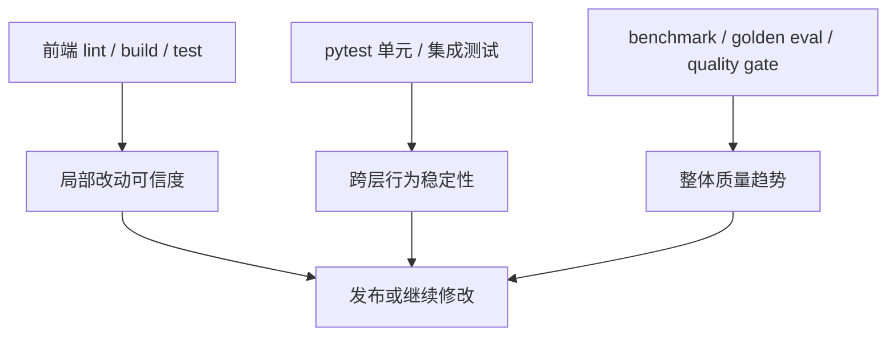
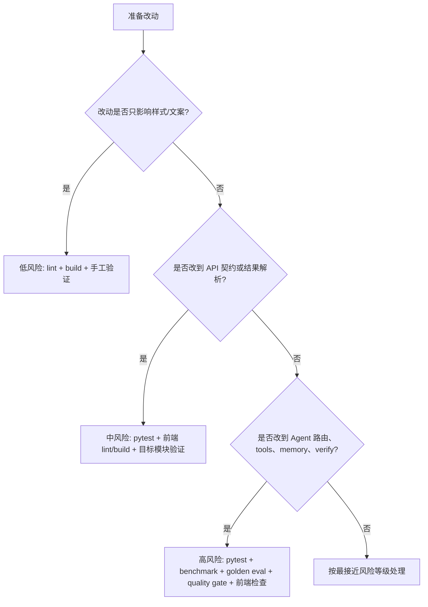

# 05. 测试、调试与改动实战

这一章的目标是把前面几章的“看懂”推进到“能安全地动手”。

很多人学项目时会停留在：

- 能讲主链路
- 能说状态机
- 能看懂前后端分层

但一到真实改动，就会暴露另外一层能力差距：

- 不知道先跑什么测试
- 不知道哪些改动算高风险
- 不知道排障时从哪一层开始看
- 不知道怎么证明自己的改动没有带来退化

这一章就是专门用来补齐这层能力的。

## 0. 5 分钟速查卡

### 本章一句话

这一章回答的是：面对真实改动时，怎样选验证动作、怎样定位问题、怎样把一次修改做成可交付的工程动作。

### 必读 3 个文件

1. [test_sse_streaming.py](D:/projects/shuai/ShuaiTravelAgent/tests/test_sse_streaming.py)
2. [test_api_integration.py](D:/projects/shuai/ShuaiTravelAgent/tests/test_api_integration.py)
3. [agent_quality_gate.py](D:/projects/shuai/ShuaiTravelAgent/scripts/agent_quality_gate.py)

### 最常见 3 个坑

1. 只点页面，不跑分层验证。
2. 所有改动都跑同一套回归，既慢又不准。
3. 还没定位问题在哪一层，就直接改代码。

### 改这一层前先做什么

1. 先给改动分低、中、高风险。
2. 先决定本次需要的最小回归矩阵。
3. 先写 6 行设计说明：目标、影响层、文件、风险、验证、文档同步。

## 1. 本章解决什么问题

读完本章后，你应该能回答：

1. 为什么测试不只是质量门禁，也是设计说明书。
2. 这个项目的测试为什么要分成 unit、integration、benchmark、golden eval。
3. 改前端、改 API、改 Agent 时，回归动作为什么不一样。
4. 问题排查时为什么要先看现象，再看事件、状态、存储和测试。
5. 如何把一次小改动写成“有设计、有验证、有文档同步”的完整工程动作。

## 2. 先修要求

建议你已经读过：

- [02-chat-mainline-and-frontend.md](02-chat-mainline-and-frontend.md)
- [03-web-api-session-and-storage.md](03-web-api-session-and-storage.md)
- [04-agent-core-tools-memory-checkpoint.md](04-agent-core-tools-memory-checkpoint.md)

因为本章默认你已经知道：

- 聊天主链怎么跑
- Web 层怎么分层
- Agent 状态机大致怎么工作

否则你会知道“该跑什么”，但不一定知道“为什么要跑这些”。

## 3. 为什么测试也是教学材料

很多项目里的测试确实只是兜底，但在这个项目里，测试同时还扮演另外一个角色：

设计说明书。

原因很简单：

- 测试会告诉你系统保护的行为边界是什么
- 测试会告诉你哪些地方最容易退化
- 测试文件的组织方式本身就在映射架构分层

所以读测试时，最重要的问题不是：

“这个测试测了什么功能？”

而是：

- 它在防什么退化？
- 如果这条测试没了，系统最可能坏在哪？
- 它更像是在保护局部逻辑、模块协作，还是整体质量趋势？

## 4. 当前测试版图怎么理解

结合 [testing-guide.md](D:/projects/shuai/ShuaiTravelAgent/docs/testing/testing-guide.md) 和当前测试目录，可以把测试版图分成 4 层。

### 4.1 后端 / 集成测试

主要目录：

- `tests/`

关注点：

- FastAPI 路由
- Agent 执行链路
- guardrails
- stale / verification / fallback
- 工具结果聚合与健康统计

### 4.2 前端测试与构建检查

主要目录：

- `frontend/`

当前最关键的本地检查是：

```bash
cd frontend
npm run lint
npm run test:run
npm run build
```

这里要注意：

- `lint` 在当前项目里不仅是样式检查，还会触发类型与静态问题暴露
- `build` 非常重要，因为它会暴露很多 SSR、导入链、编码和类型问题

### 4.3 Agent 质量脚本

当前项目里更工程化的一层是这些脚本：

```bash
python scripts/agent_benchmark.py --output-dir docs/benchmarks
python scripts/agent_benchmark_trend.py --current docs/benchmarks/agent_benchmark_latest.json --baseline docs/benchmarks/agent_benchmark_baseline.json --output docs/benchmarks/agent_benchmark_trend_latest.md
python scripts/agent_golden_eval.py --dataset tests/golden/agent_react_golden.json --report docs/benchmarks/agent_golden_eval_latest.json --min-pass-rate 0.0
python scripts/agent_quality_gate.py --golden-report docs/benchmarks/agent_golden_eval_latest.json --benchmark-report docs/benchmarks/agent_benchmark_latest.json --baseline-benchmark-report docs/benchmarks/agent_benchmark_baseline.json
```

这一层解决的已经不是“代码能不能运行”，而是：

- 质量是否退化
- benchmark 是否掉了
- 关键样本行为是否跑偏
- 质量门禁能不能通过

### 4.4 Replay / 故障回放

当前项目还支持：

```bash
python scripts/agent_replay.py --session-id <session_id> --db data/langgraph_checkpoints.sqlite3
```

这说明项目不仅能做测试，还能做运行复盘。

### 4.5 源码辅助学习：测试文件要和实现文件对着看

这一章最适合“测试文件 + 实现文件”成对阅读，而不是只看测试名。

| 测试文件 | 推荐对照看的实现文件 | 读这一对时最该问的问题 |
| --- | --- | --- |
| [test_sse_streaming.py](D:/projects/shuai/ShuaiTravelAgent/tests/test_sse_streaming.py) | [chat.py](D:/projects/shuai/ShuaiTravelAgent/web/shuai_web/routes/chat.py)、[chat_service.py](D:/projects/shuai/ShuaiTravelAgent/web/shuai_web/services/chat_service.py)、[api.ts](D:/projects/shuai/ShuaiTravelAgent/frontend/src/services/api.ts) | SSE 契约到底由谁发、由谁解、由谁保证结束？ |
| [test_api_integration.py](D:/projects/shuai/ShuaiTravelAgent/tests/test_api_integration.py) | [chat.py](D:/projects/shuai/ShuaiTravelAgent/web/shuai_web/routes/chat.py)、[chat_service.py](D:/projects/shuai/ShuaiTravelAgent/web/shuai_web/services/chat_service.py) | 参数校验、模式切换、session 复用是谁在负责？ |
| [test_agent_memory_unit.py](D:/projects/shuai/ShuaiTravelAgent/tests/test_agent_memory_unit.py) | [memory_integration.py](D:/projects/shuai/ShuaiTravelAgent/agent/travel_agent/graph/memory_integration.py) | memory 真正在保护哪些长期行为边界？ |
| [test_agent_execution_optimization_integration.py](D:/projects/shuai/ShuaiTravelAgent/tests/test_agent_execution_optimization_integration.py) | [builder.py](D:/projects/shuai/ShuaiTravelAgent/agent/travel_agent/graph/builder.py)、[nodes.py](D:/projects/shuai/ShuaiTravelAgent/agent/travel_agent/graph/nodes.py) | 执行轮次、验证回环和结果聚合有没有退化？ |
| [test_agent_p0_guardrails_unit.py](D:/projects/shuai/ShuaiTravelAgent/tests/test_agent_p0_guardrails_unit.py) | [nodes.py](D:/projects/shuai/ShuaiTravelAgent/agent/travel_agent/graph/nodes.py)、相关工具与验证逻辑 | 当前系统最不允许坏掉的底线是什么？ |

### 4.6 源码辅助学习：建议边看边搜的关键字

```text
text/event-stream
StreamingResponse
stream_chat
handleSSELine
verify_decision
quality_gate
agent_replay
fallback_steps
```

如果你边看测试边搜这些词，会比只跑命令更容易建立“断言在保护哪层行为”的感觉。



## 5. 推荐的测试阅读顺序

如果你要通过测试反学设计，最推荐的顺序是：

1. `tests/test_sse_streaming.py`
2. `tests/test_api_integration.py`
3. `tests/test_agent_memory_unit.py`
4. `tests/test_agent_execution_optimization_integration.py`
5. `tests/test_agent_p0_guardrails_unit.py`
6. `docs/testing/testing-guide.md`

## 6. 关键测试文件在保护什么

### 6.1 `tests/test_sse_streaming.py`

从当前测试名可以看出，它至少在保护：

- SSE 连接是否建立成功
- 返回的 `content-type` 是否是 `text/event-stream`
- 流式响应是否真的以多个 chunk 到达
- 是否能收到 `answer_start`
- 是否能收到 `done`
- `session_id` 是否保持一致

这类测试保护的是：

聊天主链最外层的事件协议和流式体验，不是某个局部函数。

### 6.2 `tests/test_api_integration.py`

从当前测试内容可以看出，它在保护：

- 空消息与缺字段时的错误处理
- 超长消息处理
- session_id 在多次请求间的持久性
- `direct / react / plan` 三种模式是否都能跑通
- 无效 mode 的降级行为
- SSE 基础事件格式

这类测试保护的是：

API 契约和主要聊天模式的协作稳定性。

### 6.3 `tests/test_agent_memory_unit.py`

从测试名就能看到它覆盖了很多关键行为：

- 过期 session 清理
- session 容量淘汰
- profile 抽取
- 同义词合并
- budget 冲突误判规避
- stale 低置信属性清理
- 跨 session hints 注入
- pending clarification
- time decay
- 原子持久化与备份恢复
- Top-K 注入裁剪
- context budget guardrail

这类测试保护的是：

memory 语义本身，而不是 UI。

### 6.4 `tests/test_agent_execution_optimization_integration.py`

从测试名可以看出，它在保护：

- 并行步骤执行时机
- stale weather 是否触发 refresh retry
- refresh 失败时是否产生降级说明

这类测试非常关键，因为它保护的是 Agent 的“执行优化与可靠性行为”。

### 6.5 `tests/test_agent_p0_guardrails_unit.py`

从测试名可以看出，它在保护：

- step 参数校验
- execution summary 聚合
- tool result 的 source metadata 和 fallback
- 参数自动修正
- loop detection
- early stop
- 最大 plan 步数限制
- 高风险查询强制走计划
- verifier 失败后的 retry
- round budget
- strategy 主次工具列表

这类测试最能体现：

这个 Agent 不是“想怎么答就怎么答”，而是有一整套工程 guardrail。

## 7. 测试分层到底怎么讲

### 7.1 unit

保护对象：

- 单点逻辑
- 规则
- 参数归一化
- 数据转换
- 边界条件

适合回答的问题：

- 这个函数 / 规则本身对不对

### 7.2 integration

保护对象：

- 模块协作
- route 和 service 的联动
- Web 与 Agent 的契约
- 流式链路

适合回答的问题：

- 这些模块配合起来还能不能按预期工作

### 7.3 benchmark

保护对象：

- 整体质量趋势
- 稳定性表现
- 性能和行为变化

适合回答的问题：

- 优化后系统整体表现有没有掉

### 7.4 golden eval

保护对象：

- 一组关键样本上的输出质量

适合回答的问题：

- 对最关键的题目集合，行为是不是偏了

### 7.5 quality gate

保护对象：

- 绝对阈值
- 相对基线回归

从当前 `scripts/agent_quality_gate.py` 看，至少会关注：

- golden pass rate
- golden hallucination rate
- benchmark success rate
- benchmark hallucination rate
- fallback steps total
- 相对 baseline 的退化幅度

这说明质量门禁已经不是“全靠人眼看看结果”，而是有定量阈值。

## 8. 风险等级与回归矩阵

最常见的工程失误是：

所有改动都跑同一套命令。

这看起来省事，实际上既浪费时间，也不一定真正覆盖风险。

### 8.1 低风险改动

典型例子：

- 纯前端样式调整
- 低耦合文案调整
- 某个静态展示字段排版优化

推荐回归：

```bash
cd frontend
npm run lint
npm run build
```

必要时再补：

- 相关页面手工验证

### 8.2 中风险改动

典型例子：

- API 新增或修改某个字段
- `city / share / session` 这类非 Agent 核心模块联动
- 结果解析逻辑调整

推荐回归：

```bash
python -m pytest tests -q
cd frontend
npm run lint
npm run build
```

必要时再补：

- 与该模块相关的手工验证

### 8.3 高风险改动

典型例子：

- Agent 路由策略变化
- tools 契约变化
- `verify / self_check` 规则变化
- memory / checkpoint 逻辑变化

推荐回归：

```bash
python -m pytest tests -q
python scripts/docstring_audit.py --strict
python scripts/agent_benchmark.py --output-dir docs/benchmarks
python scripts/agent_golden_eval.py --dataset tests/golden/agent_react_golden.json --report docs/benchmarks/agent_golden_eval_latest.json --min-pass-rate 0.0
python scripts/agent_quality_gate.py --golden-report docs/benchmarks/agent_golden_eval_latest.json --benchmark-report docs/benchmarks/agent_benchmark_latest.json --baseline-benchmark-report docs/benchmarks/agent_benchmark_baseline.json
cd frontend
npm run lint
npm run test:run
npm run build
```

### 8.4 发版前建议

如果是比较完整的一轮发布前检查，建议按 [testing-guide.md](D:/projects/shuai/ShuaiTravelAgent/docs/testing/testing-guide.md) 的完整顺序跑一遍。

### 8.5 风险到回归的决策图



## 9. 代码阅读检查清单

很多人“看过很多文件”，但不一定真的读懂。最稳的判断方式不是自我感觉，而是看你能不能回答对应层的问题。

### 9.1 聊天主链

你至少应该能回答：

1. 请求从哪里发起
2. SSE 由谁消费
3. Web 层在哪里把 Agent 过程转成前端事件
4. 最终答案如何落进消息列表

### 9.2 前端

你至少应该能回答：

1. `messages` 和 `streamingMessage` 为什么分开
2. metadata 走的是哪条状态链
3. `TravelPlanToolkit` 如何消费文本结果

### 9.3 Web API

你至少应该能回答：

1. 为什么 route 层要薄
2. session 改字段为什么要联动多层
3. storage 层到底解决了什么底层问题

### 9.4 Agent

你至少应该能回答：

1. 为什么先看 `state.py` 和 `builder.py`
2. `verify` 为什么会回跳 `execute`
3. memory、checkpoint、session 的区别

## 10. 标准排查顺序

遇到问题时，最不推荐的动作是：

直接打开某个文件开始瞎改。

最稳的排查顺序应该是：

```text
先看现象
  -> 再看前端有没有收到事件
  -> 再看后端 route / service 有没有正确执行
  -> 再看 Agent 状态和节点走向
  -> 再看 tool result 和 _meta
  -> 再看 memory / storage / checkpoint
  -> 最后看测试是否已有保护
```

### 10.1 为什么这条顺序有效

因为它符合真实系统定位的顺序：

- 先确认问题发生在哪一层
- 再确认是哪类状态出了偏差
- 最后再决定改代码还是补测试

### 10.2 一个标准排障问题模板

你可以强迫自己按下面 6 个问题来写排障记录：

1. 用户可见现象是什么
2. 对应事件有没有到达前端
3. 后端服务有没有执行到预期步骤
4. Agent 状态或工具结果哪里偏了
5. 当前测试有没有覆盖到这个问题
6. 修复后应该补哪种验证

## 11. 最推荐的 8 个练习实验

这一组实验的设计原则是：

- 从外到内
- 从低风险到高风险
- 从“观察系统”到“安全改动系统”

### 实验 1：观测一轮完整聊天事件流

目标：

- 看懂一次聊天过程中前端到底收到了哪些事件

入口：

- `frontend/src/components/ChatArea.tsx`
- `frontend/src/services/api.ts`
- `web/shuai_web/services/chat_service.py`

步骤：

1. 本地启动前后端
2. 发送一条 `plan` 模式的旅行问题
3. 记录 `plan_preview / stage / tool_start / tool_end / metadata / done`
4. 把每个事件的来源层标出来

验收：

- 至少说清 6 种事件的来源和用途

### 实验 2：给前端执行面板增加一个小字段

目标：

- 练习一次 metadata 到 UI 的小联动

推荐题目：

- 把 `run_id` 或 `plan_id` 展示得更明显

入口：

- `frontend/src/services/api.ts`
- `frontend/src/components/ChatArea.tsx`

建议回归：

```bash
cd frontend
npm run lint
npm run build
```

验收：

- 字段可见
- 构建通过
- 不破坏原有流式体验

### 实验 3：调整 `TravelPlanToolkit` 的一个规则

目标：

- 理解文本结果为什么能继续变成产品功能

推荐题目：

1. 调整冲突阈值
2. 调整预算档位标签
3. 优化候选池提示文案

入口：

- `frontend/src/components/TravelPlanToolkit.tsx`
- `frontend/src/utils/travelPlan.ts`

验收：

- 能解释这是组件层逻辑还是工具函数层逻辑

### 实验 4：给 `city` 模块补一个小字段

目标：

- 练习一次简单的 `route -> service -> 前端` 联动

入口：

- `web/shuai_web/routes/city.py`
- `web/shuai_web/services/city_service.py`
- `frontend/src/components/CityExplorer.tsx`

建议回归：

```bash
python -m pytest tests -q
cd frontend
npm run lint
npm run build
```

验收：

- 字段从后端到前端全链路打通

### 实验 5：给 session 或 share 做一个小改动

目标：

- 熟悉非聊天核心模块的开发节奏

典型题目：

1. 给 session 列表新增展示字段
2. 给 share 增加一个更友好的时间字段

验收：

- 能清楚区分 route、service、repository、storage 的职责

### 实验 6：调整一个工具策略或默认计划

目标：

- 第一次轻量触碰 Agent 主链

典型题目：

1. 增加一个 optional tool
2. 调整默认 plan 步骤顺序
3. 给某类高风险问题强制 verification

入口：

- `agent/travel_agent/graph/nodes.py`
- `agent/travel_agent/graph/runtime_config.py`

验收：

- 能说明影响的是哪个节点或哪条条件边

### 实验 7：跟踪一次 stale / fallback / verify 闭环

目标：

- 真正看懂执行可靠性机制

入口：

- `agent/travel_agent/tools/travel_api.py`
- `agent/travel_agent/graph/nodes.py`
- `web/shuai_web/services/chat_service.py`

验收：

- 能画出 stale / verify / retry / metadata 的传递链

### 实验 8：毕业任务

目标：

- 完成一次接近真实开发的完整联动改动

要求：

- 改动跨至少两层
- 有回归验证
- 有文档更新

## 11.1 一个完整实战案例

如果你想把前面所有原则真正连起来，最推荐做下面这个中风险案例：

### 题目

给 session 列表新增一个更友好的 `last_active_label` 展示字段，并把它从 Web API 到前端页面完整打通。

### 为什么推荐这个案例

它刚好满足四个条件：

1. 会跨前端和 Web 两层。
2. 会接触 session 语义，但不需要一上来改最复杂的 Agent 主链。
3. 能练习“字段新增为什么是跨层改动”。
4. 能自然带出回归矩阵和文档同步。

### 可能涉及的文件

- [session.py](D:/projects/shuai/ShuaiTravelAgent/web/shuai_web/routes/session.py)
- [session_service.py](D:/projects/shuai/ShuaiTravelAgent/web/shuai_web/services/session_service.py)
- [session_repository_impl.py](D:/projects/shuai/ShuaiTravelAgent/web/shuai_web/repositories/session_repository_impl.py)
- [session_storage.py](D:/projects/shuai/ShuaiTravelAgent/web/shuai_web/storage/session_storage.py)
- 相关前端 session 列表组件
- [03-web-api-session-and-storage.md](D:/projects/shuai/ShuaiTravelAgent/docs/teaching/03-web-api-session-and-storage.md)
- [07-thinking-questions-homework-and-answers.md](D:/projects/shuai/ShuaiTravelAgent/docs/teaching/07-thinking-questions-homework-and-answers.md)

### 建议步骤

1. 先确认 `last_active` 当前在哪一层存在、在哪一层缺失。
2. 再决定 `last_active_label` 是后端直接给，还是前端格式化。
3. 列出影响文件和风险点。
4. 先补或先想好测试，再动代码。
5. 完成后补文档同步。

### 风险点

1. 时间字段格式和时区解释不一致。
2. session 列表排序或展示被连带影响。
3. 前端字段名和后端响应字段不一致。
4. 旧数据兼容性没有处理好。

### 推荐回归

```bash
python -m pytest tests -q
cd frontend
npm run lint
npm run build
```

### 完成后的最低交付

1. 一页改动设计说明。
2. 一份回归记录。
3. 一次文档同步说明。
4. 一段能口头讲清楚“为什么这是跨层改动”的复盘。

## 12. 改动设计模板

每次动手前，建议先写一个极短设计说明，最少包含下面 6 项：

1. 改动目标
2. 影响层级
3. 受影响文件
4. 风险点
5. 验证方式
6. 是否要改文档

### 12.1 一个简单模板

```text
目标：
影响层：
文件：
风险：
验证：
文档同步：
```

### 12.2 为什么这个模板重要

因为它能逼你在改代码前先想清边界，而不是“先写了再说”。

## 13. 面试视角下怎么讲测试和调试

很多人讲项目时只讲功能链路，不讲验证体系，结果会显得工程深度不够。

更好的讲法是至少覆盖：

1. 如何保护 SSE 事件协议
2. 如何区分 unit / integration / benchmark / golden eval
3. 如何做高风险改动后的回归
4. 如何做失败定位和跨层排查
5. 如何用质量门禁控制 regression

### 一个合格的讲法例子

“这个项目里我们不是只靠人工点页面。低风险改动主要跑前端 lint/build，中高风险改动会跑 pytest，高风险 Agent 改动还会补 benchmark、golden eval 和 quality gate。因为系统里不仅有 UI，还有 SSE 协议、状态机路由、memory 与验证逻辑，很多退化不是页面第一眼能看出来的。”

## 14. 常见误区

### 误区 1：页面能跑就算改动安全

问题在于：

- 可能破坏了中间事件
- 可能破坏了工具元信息
- 可能破坏了 memory 或 verify 逻辑

### 误区 2：所有改动都跑同一套回归

问题在于：

- 成本不合理
- 风险覆盖不准确

### 误区 3：测试只是给 CI 看的

问题在于：

- 会错过很多通过测试理解设计的机会

### 误区 4：排障就是从代码开始改

问题在于：

- 你甚至还没确认问题发生在哪一层

## 补充一：本章最小必读源码

如果时间有限，至少精读下面 6 个文件：

1. [test_sse_streaming.py](D:/projects/shuai/ShuaiTravelAgent/tests/test_sse_streaming.py)
作用：理解聊天主链最外层 SSE 契约在保护什么。
2. [test_api_integration.py](D:/projects/shuai/ShuaiTravelAgent/tests/test_api_integration.py)
作用：理解 API 契约、模式和会话行为的集成验证。
3. [test_agent_memory_unit.py](D:/projects/shuai/ShuaiTravelAgent/tests/test_agent_memory_unit.py)
作用：理解 memory 相关边界和回归点。
4. [test_agent_execution_optimization_integration.py](D:/projects/shuai/ShuaiTravelAgent/tests/test_agent_execution_optimization_integration.py)
作用：理解执行优化、并发和结果聚合的协作验证。
5. [test_agent_p0_guardrails_unit.py](D:/projects/shuai/ShuaiTravelAgent/tests/test_agent_p0_guardrails_unit.py)
作用：理解高风险 guardrail 的底线在哪里。
6. [agent_quality_gate.py](D:/projects/shuai/ShuaiTravelAgent/scripts/agent_quality_gate.py)
作用：理解 benchmark 和 golden eval 最终怎样变成门禁。

如果还能多看一点，再补：

- [testing-guide.md](D:/projects/shuai/ShuaiTravelAgent/docs/testing/testing-guide.md)
- [agent_replay.py](D:/projects/shuai/ShuaiTravelAgent/scripts/agent_replay.py)

## 补充二：本章最值得画的 2 张图

### 图 1：测试版图图

最低要画出：

- 前端 lint / build / test
- pytest
- benchmark
- golden eval
- quality gate

这张图主要用来回答：

- 不同验证动作分别保护什么
- 为什么不能只靠手工点页面

### 图 2：排障顺序图

最低要画出：

- 现象
- 事件
- 状态
- 存储
- 测试
- 回放

这张图主要用来回答：

- 为什么排障不是先改代码
- 为什么定位顺序比“经验直觉”更重要

## 补充三：改这一层最容易影响什么

改测试与验证体系时，最容易被影响的是下面 5 类东西：

1. 回归覆盖范围
删掉一条测试可能不是少一条断言，而是少了一层保护。
2. 风险分级准确性
如果所有改动都跑同一套回归，时间成本和风险覆盖都会失真。
3. 质量基线可比性
benchmark、golden eval、baseline 一旦不一致，趋势判断就会失真。
4. 排障效率
如果没有 replay、没有标准排查路径，跨层故障会非常难复盘。
5. 团队协作信心
验证体系一旦不稳，后续所有改动都会变得更保守、更慢。

## 补充四：初级 / 中级 / 高级面试追问

### 初级追问

1. 为什么这个项目不能只靠手工点页面？
2. unit test 和 integration test 的区别是什么？
3. 为什么改动风险要分低、中、高？

### 中级追问

1. benchmark、golden eval、quality gate 各自保护什么？
2. 为什么测试既是质量门禁，也是设计说明书？
3. 为什么改动验证应该按影响层级来选，而不是固定跑一套命令？

### 高级追问

1. 如果质量门禁经常误报，你会先排查数据集、阈值还是执行脚本？
2. 如果一个 Agent 改动功能没坏，但 benchmark 下降，你会如何定位？
3. 如果团队想把 replay、trace、quality gate 连成闭环，你会怎么设计最小方案？

## 附：统一术语表（本章相关）

为和 [README.md](README.md) 以及 [01-total-plan-and-learning-method.md](01-total-plan-and-learning-method.md) 保持一致，本章建议统一使用下面这组术语。

| 术语 | 统一定义 |
| --- | --- |
| unit test | 指针对局部函数、局部模块或单一职责做的快速验证，重点是隔离性和定位精度。 |
| integration test | 指跨模块协作测试，重点验证 route、service、Agent、storage 等组合行为是否稳定。 |
| benchmark | 指用固定样本度量执行成功率、耗时、fallback 等整体趋势的质量测试。 |
| golden eval | 指对关键样本做“答案行为是否符合预期”的对照评估，重点是行为正确性和回归检测。 |
| quality gate | 指把 benchmark 和 golden eval 的阈值固化成门禁，避免退化悄悄进入主线。 |
| regression | 指原本正常的行为在改动后退化，包括协议退化、性能退化、质量退化和工具链退化。 |
| replay | 指基于 session 或 checkpoint 对一次运行过程进行重放或复盘，用于定位失败原因。 |
| 风险等级 | 指改动可能影响范围和失败后代价的综合判断，当前教学里通常分为低、中、高三档。 |
| 回归矩阵 | 指“某类改动 -> 需要跑哪些验证动作”的对应表。 |

## 15. 本章验收标准

读完本章后，最低应该能独立完成下面 7 件事中的 5 件：

1. 解释当前测试为什么要分层
2. 说出 3 个关键测试文件分别在保护什么
3. 为低、中、高风险改动选择不同回归动作
4. 按固定顺序描述一次排障路径
5. 设计一个小改动并写出验证计划
6. 解释 benchmark / golden eval / quality gate 的区别
7. 用工程语言讲清“为什么我们不能只靠手工点页面”

## 16. 本章学习产出

建议至少完成下面四项中的两项：

1. 一份风险等级到回归命令的对照表
2. 一份标准排查顺序卡片
3. 一次实验记录
4. 一份毕业任务设计说明

## 17. 配套练习

建议读完本章后，至少完成下面两项：

1. 去 [07-thinking-questions-homework-and-answers.md](07-thinking-questions-homework-and-answers.md) 完成 `Phase 6` 和 `Phase 7` 的题目。
2. 从当前项目里任选一个小改动，自己先写一页“改动目标 + 影响层级 + 回归矩阵”。

如果你能做到这一步，你就已经不只是“会看代码”，而是开始具备真实工程协作里的改动与验收能力了。
