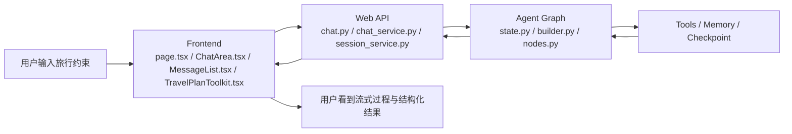
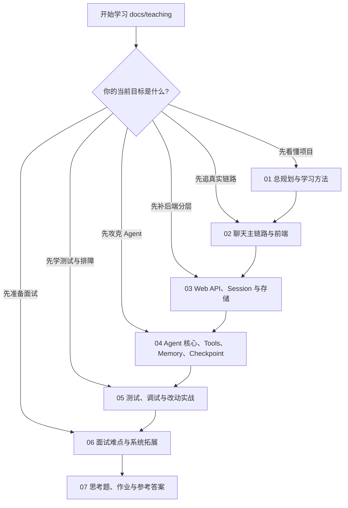

# moyuan-travel-agent 教学总入口

`docs/teaching/` 现在保持为 `README + 7 篇主文档` 的结构。

目标不是把源码拆成很多零碎教程，而是让你围绕稳定的 7 个主题，完成下面四种能力升级：

1. 看懂项目。
2. 独立改动。
3. 面试讲清。
4. 维护和扩展。

## 这套教学材料适合谁

它最适合下面 4 类人：

1. 第一次接触这个项目，想快速建立源码地图的人。
2. 已经能跑起项目，但一改功能就不知道该动哪层的人。
3. 想把这个项目讲成面试工程案例的人。
4. 未来要长期维护本项目的人。

## 先看这一页时最该知道的事

这套教学材料不是按“目录树”组织的，而是按“工程心智模型”组织的。

你真正要学会的不是“文件名”，而是下面这几件事：

1. 聊天主链怎么跑。
2. 前端、Web API、Agent 三层怎么分工。
3. SSE、session、memory、checkpoint 这些词分别在系统里扮演什么角色。
4. 改动时应该如何验证和排障。
5. 如何把项目讲成一个有取舍、有演进路线的工程案例。

## 一张总地图



## 如果你现在只想知道“先看哪篇”

按你当前目标选：

- 想先建立地图：
  看 [01-total-plan-and-learning-method.md](01-total-plan-and-learning-method.md)
- 想先追一条真实请求：
  看 [02-chat-mainline-and-frontend.md](02-chat-mainline-and-frontend.md)
- 想先补后端分层：
  看 [03-web-api-session-and-storage.md](03-web-api-session-and-storage.md)
- 想先攻克 Agent：
  看 [04-agent-core-tools-memory-checkpoint.md](04-agent-core-tools-memory-checkpoint.md)
- 想先学测试与排障：
  看 [05-testing-debugging-and-change-practice.md](05-testing-debugging-and-change-practice.md)
- 想准备面试：
  看 [06-interview-highlights-and-system-evolution.md](06-interview-highlights-and-system-evolution.md)
- 想做题和验收：
  看 [07-thinking-questions-homework-and-answers.md](07-thinking-questions-homework-and-answers.md)

## 按任务场景找文档

如果你现在不是“系统学习”，而是带着一个明确任务来，最推荐按下面方式找入口：

- `30 分钟速览`
  先看 [01-total-plan-and-learning-method.md](01-total-plan-and-learning-method.md) 的项目定义、三层地图、黄金主链，再看本页的术语总览。
- `半天上手`
  先看 [01-total-plan-and-learning-method.md](01-total-plan-and-learning-method.md)，再读 [02-chat-mainline-and-frontend.md](02-chat-mainline-and-frontend.md) 和 [03-web-api-session-and-storage.md](03-web-api-session-and-storage.md)。
- `改 Bug 前先找主链`
  优先看 [02-chat-mainline-and-frontend.md](02-chat-mainline-and-frontend.md) 里的主链段落，再根据故障落点跳到 [03-web-api-session-and-storage.md](03-web-api-session-and-storage.md)、[04-agent-core-tools-memory-checkpoint.md](04-agent-core-tools-memory-checkpoint.md)、[05-testing-debugging-and-change-practice.md](05-testing-debugging-and-change-practice.md)。
- `面试前 2 小时复习`
  先看 [01-total-plan-and-learning-method.md](01-total-plan-and-learning-method.md) 的总纲，再看 [06-interview-highlights-and-system-evolution.md](06-interview-highlights-and-system-evolution.md)，最后去 [07-thinking-questions-homework-and-answers.md](07-thinking-questions-homework-and-answers.md) 做口头题快练。
- `我要改前端`
  优先看 [02-chat-mainline-and-frontend.md](02-chat-mainline-and-frontend.md) 和 [05-testing-debugging-and-change-practice.md](05-testing-debugging-and-change-practice.md)。
- `我要改 Web API`
  优先看 [03-web-api-session-and-storage.md](03-web-api-session-and-storage.md) 和 [05-testing-debugging-and-change-practice.md](05-testing-debugging-and-change-practice.md)。
- `我要改 Agent`
  优先看 [04-agent-core-tools-memory-checkpoint.md](04-agent-core-tools-memory-checkpoint.md) 和 [05-testing-debugging-and-change-practice.md](05-testing-debugging-and-change-practice.md)。

## 文档地图

### 1. [01-total-plan-and-learning-method.md](01-total-plan-and-learning-method.md)

总规划与学习方法。

适合先建立全局地图、目录职责、学习顺序、能力分级和 7 天 / 14 天 / 4 周路线。

### 2. [02-chat-mainline-and-frontend.md](02-chat-mainline-and-frontend.md)

聊天主链路与前端实现。

把最重要的请求链从页面输入一直讲到 SSE 消费、消息渲染和 `TravelPlanToolkit` 的结果加工。

### 3. [03-web-api-session-and-storage.md](03-web-api-session-and-storage.md)

Web API、Session 与存储分层。

重点讲 `route -> service -> repository -> storage`、聊天服务、会话服务、文件存储和字段联动。

### 4. [04-agent-core-tools-memory-checkpoint.md](04-agent-core-tools-memory-checkpoint.md)

Agent 核心、Tools、Memory、Checkpoint。

这是最核心也最难的一篇，覆盖 `state.py`、`builder.py`、`nodes.py`、工具契约、记忆和持久化恢复。

### 5. [05-testing-debugging-and-change-practice.md](05-testing-debugging-and-change-practice.md)

测试、调试与改动实战。

把原来的测试路线、阅读清单和实验练习合并成一篇，帮助你从“看懂”走到“会改、会测、会排障”。

### 6. [06-interview-highlights-and-system-evolution.md](06-interview-highlights-and-system-evolution.md)

面试难点与系统拓展。

集中处理高频追问、答题框架、架构取舍，以及这个项目未来可以如何演进。

### 7. [07-thinking-questions-homework-and-answers.md](07-thinking-questions-homework-and-answers.md)

思考题、作业与参考答案。

前半部分是题目，后半部分是答案和优秀答案要点，方便自学和带教复盘。

## 按角色阅读

### 前端开发者路线

优先看：

1. [01-total-plan-and-learning-method.md](01-total-plan-and-learning-method.md)
2. [02-chat-mainline-and-frontend.md](02-chat-mainline-and-frontend.md)
3. [05-testing-debugging-and-change-practice.md](05-testing-debugging-and-change-practice.md)
4. [06-interview-highlights-and-system-evolution.md](06-interview-highlights-and-system-evolution.md)

### 后端开发者路线

优先看：

1. [01-total-plan-and-learning-method.md](01-total-plan-and-learning-method.md)
2. [03-web-api-session-and-storage.md](03-web-api-session-and-storage.md)
3. [05-testing-debugging-and-change-practice.md](05-testing-debugging-and-change-practice.md)
4. [06-interview-highlights-and-system-evolution.md](06-interview-highlights-and-system-evolution.md)

### Agent 开发者路线

优先看：

1. [01-total-plan-and-learning-method.md](01-total-plan-and-learning-method.md)
2. [04-agent-core-tools-memory-checkpoint.md](04-agent-core-tools-memory-checkpoint.md)
3. [05-testing-debugging-and-change-practice.md](05-testing-debugging-and-change-practice.md)
4. [06-interview-highlights-and-system-evolution.md](06-interview-highlights-and-system-evolution.md)

## 四种阅读模式

### 模式一：2-3 小时快速总览

适合：

- 第一次接触项目
- 代码走读前预热
- 想先知道项目全貌

顺序：

1. `README.md`
2. [01-total-plan-and-learning-method.md](01-total-plan-and-learning-method.md)
3. [02-chat-mainline-and-frontend.md](02-chat-mainline-and-frontend.md)
4. [03-web-api-session-and-storage.md](03-web-api-session-and-storage.md)

### 模式二：7 天上手改动

适合：

- 新加入项目的开发者
- 需要尽快开始做中小改动的人

顺序：

1. [01-total-plan-and-learning-method.md](01-total-plan-and-learning-method.md)
2. [02-chat-mainline-and-frontend.md](02-chat-mainline-and-frontend.md)
3. [03-web-api-session-and-storage.md](03-web-api-session-and-storage.md)
4. [04-agent-core-tools-memory-checkpoint.md](04-agent-core-tools-memory-checkpoint.md)
5. [05-testing-debugging-and-change-practice.md](05-testing-debugging-and-change-practice.md)
6. [07-thinking-questions-homework-and-answers.md](07-thinking-questions-homework-and-answers.md)

### 模式三：面试准备

适合：

- 想把项目讲成自己的工程案例
- 需要准备前端、后端、Agent、系统设计类面试

顺序：

1. [01-total-plan-and-learning-method.md](01-total-plan-and-learning-method.md)
2. [02-chat-mainline-and-frontend.md](02-chat-mainline-and-frontend.md)
3. [03-web-api-session-and-storage.md](03-web-api-session-and-storage.md)
4. [04-agent-core-tools-memory-checkpoint.md](04-agent-core-tools-memory-checkpoint.md)
5. [06-interview-highlights-and-system-evolution.md](06-interview-highlights-and-system-evolution.md)
6. [07-thinking-questions-homework-and-answers.md](07-thinking-questions-homework-and-answers.md)

### 模式四：维护者与架构演进

适合：

- 后续要长期维护项目的人
- 需要参与稳定性治理和架构演进的人

建议：

完整读完本目录全部文档，并结合：

- `docs/architecture/system-architecture.md`
- `docs/architecture/agent-memory-mechanisms.md`
- `docs/architecture/data-storage.md`
- `docs/testing/testing-guide.md`

## 一张学习决策图



## 最推荐的学习闭环

每个阶段都走一次固定闭环：

1. 先读对应主文档。
2. 跑一次真实场景或追一次真实链路。
3. 去 [07-thinking-questions-homework-and-answers.md](07-thinking-questions-homework-and-answers.md) 的题目部分做练习。
4. 再对照同一文档后半部分的参考答案自查。
5. 最后做一次小实验或小改动，把理解固化下来。

## 统一术语总览

这套文档里最常出现的术语，建议先统一理解：

| 术语 | 统一含义 |
| --- | --- |
| 主链路 | 指从页面输入到最终结果渲染的关键运行路径 |
| SSE | 服务端事件流，用于把 token、阶段、工具、metadata 持续推给前端 |
| stage | 描述当前执行阶段的过程事件，不等于答案内容 |
| metadata | 一次运行的附加诊断信息，如 `run_id`、`plan_id`、验证结果等 |
| session | 会话级数据与消息历史，强调“这次会话”的边界 |
| memory | 长期偏好、摘要、澄清信息等跨轮或跨会话记忆 |
| checkpoint | 图执行过程的恢复点和运行状态持久化 |
| route | FastAPI 路由层，负责协议入口 |
| service | 业务编排层，负责跨对象协作 |
| repository | 面向业务语义的数据访问抽象 |
| storage | 最底层的数据持久化实现 |
| direct / react / plan | Agent 的三种回答模式，分别对应不同复杂度和风险等级 |
| verify | 对工具结果和证据充分性做检查的阶段 |
| self_check | 最终输出前的轻量质量检查 |
| stale | 工具结果可能过期或新鲜度不足 |
| fallback | 主路径失败时启用的替代路径 |
| quality gate | 基于 benchmark 和 golden eval 的质量门禁 |

## 黄金主链

整个项目最重要的教学主线是：

```text
页面输入
  -> ChatArea
  -> api.ts 发起 SSE
  -> FastAPI /api/chat/stream
  -> ChatService 编排
  -> LangGraph Agent 执行
  -> SSE 事件回推前端
  -> MessageList / TravelPlanToolkit 渲染
```

只要这条主链读通了，再扩展到 session、share、map、memory、checkpoint、测试和架构演进，就不会迷路。

## 最容易卡住的地方

新人最容易卡住的通常不是前端，而是下面三个点：

1. 一上来就啃 `agent/travel_agent/graph/nodes.py`
2. 没先建立 SSE 事件心智模型
3. 把 `session`、`memory`、`checkpoint` 混成同一件事

正确顺序始终是：

1. 先抓聊天主链
2. 再理解前端状态与 API 分层
3. 再进 Agent 状态机
4. 最后才深挖 memory、checkpoint 和复杂验证逻辑

## 文档维护建议

后续如果继续扩写这套教材，最推荐遵守下面 4 条规则：

1. 不随意增加文档数量，优先继续做厚现有主文档。
2. 每篇都尽量同时覆盖“实现、面试、拓展、练习”。
3. 术语定义优先与本页统一，避免不同章节出现含义漂移。
4. 文档中的链路、字段和模块名尽量绑定真实代码文件，不写抽象空话。

## 代码改动与文档同步矩阵

后续继续迭代项目时，最容易被忽略的不是代码，而是“哪篇教学文档也应该同步改”。最推荐按下面这张表执行：

| 如果你改了什么 | 至少同步哪些教学文档 |
| --- | --- |
| SSE 事件名、事件字段、流式消费方式 | [02-chat-mainline-and-frontend.md](02-chat-mainline-and-frontend.md)、[03-web-api-session-and-storage.md](03-web-api-session-and-storage.md)、[05-testing-debugging-and-change-practice.md](05-testing-debugging-and-change-practice.md) |
| 前端消息渲染、`TravelPlanToolkit`、状态所有权 | [02-chat-mainline-and-frontend.md](02-chat-mainline-and-frontend.md)、[05-testing-debugging-and-change-practice.md](05-testing-debugging-and-change-practice.md)、[07-thinking-questions-homework-and-answers.md](07-thinking-questions-homework-and-answers.md) |
| route / service / repository / storage 分层、session 生命周期 | [03-web-api-session-and-storage.md](03-web-api-session-and-storage.md)、[05-testing-debugging-and-change-practice.md](05-testing-debugging-and-change-practice.md)、[07-thinking-questions-homework-and-answers.md](07-thinking-questions-homework-and-answers.md) |
| Agent 节点、状态字段、routing、verify、自检 | [04-agent-core-tools-memory-checkpoint.md](04-agent-core-tools-memory-checkpoint.md)、[05-testing-debugging-and-change-practice.md](05-testing-debugging-and-change-practice.md)、[06-interview-highlights-and-system-evolution.md](06-interview-highlights-and-system-evolution.md)、[07-thinking-questions-homework-and-answers.md](07-thinking-questions-homework-and-answers.md) |
| tools 契约、`_meta`、stale、fallback、refresh | [04-agent-core-tools-memory-checkpoint.md](04-agent-core-tools-memory-checkpoint.md)、[05-testing-debugging-and-change-practice.md](05-testing-debugging-and-change-practice.md)、[06-interview-highlights-and-system-evolution.md](06-interview-highlights-and-system-evolution.md) |
| memory、checkpoint、replay、质量门禁 | [04-agent-core-tools-memory-checkpoint.md](04-agent-core-tools-memory-checkpoint.md)、[05-testing-debugging-and-change-practice.md](05-testing-debugging-and-change-practice.md)、[06-interview-highlights-and-system-evolution.md](06-interview-highlights-and-system-evolution.md) |

如果不确定该改哪篇，一个保守做法是：

1. 先改对应实现层文档。
2. 再改测试与改动文档。
3. 如果这次改动会影响讲法或题目，再补 06 和 07。

## 这套重构后的设计原则

`docs/teaching/` 现在强调三件事：

1. 少文件，但每篇都围绕一个稳定主题。
2. 每篇都同时覆盖“实现、面试、拓展、练习”。
3. 所有内容都尽量绑定当前项目的真实代码和真实文件，而不是写成抽象教程。
