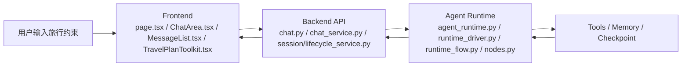

# moyuan-travel-agent Teaching 面试问答总入口

这一组文档不再按课程推进，而是统一按“面试高频问题 + 工程答案”组织。

如果 teaching 文档和 `docs/reference/`、`docs/architecture/` 的当前实现说明冲突，以当前实现为准；teaching 的职责是把当前实现讲清楚，不是替代实现真相源。

## 问题 1：这组 teaching 文档现在是拿来干什么的？

答案：

它主要解决 4 件事：

1. 帮你快速建立 `frontend -> backend -> agent runtime` 的主链地图。
2. 帮你把当前代码讲成可以面试复述的工程案例。
3. 帮你把高频追问和真实代码锚点绑定起来。
4. 帮你在改动前知道应该回到哪一层看实现、测试和风险。

## 问题 2：这组文档最适合谁？

答案：

最适合下面 4 类人：

1. 第一次接触项目，想快速建立源码地图的人。
2. 已经能跑起项目，但讲不清三层边界的人。
3. 想把这个项目讲成面试项目经历的人。
4. 未来要长期维护本项目的人。

## 问题 3：如果我只想知道先看哪篇，应该怎么选？

答案：

- 想先建立全局地图：
  看 [01-total-plan-and-learning-method.md](01-total-plan-and-learning-method.md)
- 想先追一条真实聊天主链：
  看 [02-chat-mainline-and-frontend.md](02-chat-mainline-and-frontend.md)
- 想先补 Backend API 分层：
  看 [03-backend-api-session-and-persistence.md](03-backend-api-session-and-persistence.md)
- 想先攻克 Agent：
  看 [04-agent-core-tools-memory-checkpoint.md](04-agent-core-tools-memory-checkpoint.md)
- 想先讲测试、回归和排障：
  看 [05-testing-debugging-and-change-practice.md](05-testing-debugging-and-change-practice.md)
- 想直接准备面试：
  看 [06-interview-highlights-and-system-evolution.md](06-interview-highlights-and-system-evolution.md)
- 想集中刷高频面试题：
  看 [07-thinking-questions-homework-and-answers.md](07-thinking-questions-homework-and-answers.md)

## 问题 4：如果我只有 30 分钟、2 小时、半天，最推荐怎么读？

答案：

### 30 分钟

先读：

1. [01-total-plan-and-learning-method.md](01-total-plan-and-learning-method.md) 的项目定义、三层分工、黄金主链
2. [06-interview-highlights-and-system-evolution.md](06-interview-highlights-and-system-evolution.md) 的 30 秒 / 2 分钟讲法

### 2 小时

先读：

1. [01-total-plan-and-learning-method.md](01-total-plan-and-learning-method.md)
2. [02-chat-mainline-and-frontend.md](02-chat-mainline-and-frontend.md)
3. [03-backend-api-session-and-persistence.md](03-backend-api-session-and-persistence.md)
4. [04-agent-core-tools-memory-checkpoint.md](04-agent-core-tools-memory-checkpoint.md)
5. [06-interview-highlights-and-system-evolution.md](06-interview-highlights-and-system-evolution.md)

### 半天

按下面顺序最稳：

1. [01-total-plan-and-learning-method.md](01-total-plan-and-learning-method.md)
2. [02-chat-mainline-and-frontend.md](02-chat-mainline-and-frontend.md)
3. [03-backend-api-session-and-persistence.md](03-backend-api-session-and-persistence.md)
4. [04-agent-core-tools-memory-checkpoint.md](04-agent-core-tools-memory-checkpoint.md)
5. [05-testing-debugging-and-change-practice.md](05-testing-debugging-and-change-practice.md)
6. [06-interview-highlights-and-system-evolution.md](06-interview-highlights-and-system-evolution.md)
7. [07-thinking-questions-homework-and-answers.md](07-thinking-questions-homework-and-answers.md)

## 问题 5：如果我面试方向不同，阅读顺序要怎么调？

答案：

| 方向 | 最短路径 |
| --- | --- |
| 前端 | [01-total-plan-and-learning-method.md](01-total-plan-and-learning-method.md) -> [02-chat-mainline-and-frontend.md](02-chat-mainline-and-frontend.md) -> [05-testing-debugging-and-change-practice.md](05-testing-debugging-and-change-practice.md) -> [06-interview-highlights-and-system-evolution.md](06-interview-highlights-and-system-evolution.md) |
| Backend | [01-total-plan-and-learning-method.md](01-total-plan-and-learning-method.md) -> [03-backend-api-session-and-persistence.md](03-backend-api-session-and-persistence.md) -> [05-testing-debugging-and-change-practice.md](05-testing-debugging-and-change-practice.md) -> [06-interview-highlights-and-system-evolution.md](06-interview-highlights-and-system-evolution.md) |
| Agent / AI 工程 | [01-total-plan-and-learning-method.md](01-total-plan-and-learning-method.md) -> [04-agent-core-tools-memory-checkpoint.md](04-agent-core-tools-memory-checkpoint.md) -> [05-testing-debugging-and-change-practice.md](05-testing-debugging-and-change-practice.md) -> [06-interview-highlights-and-system-evolution.md](06-interview-highlights-and-system-evolution.md) |
| 全栈 / 系统设计 | [01-total-plan-and-learning-method.md](01-total-plan-and-learning-method.md) -> [02-chat-mainline-and-frontend.md](02-chat-mainline-and-frontend.md) -> [03-backend-api-session-and-persistence.md](03-backend-api-session-and-persistence.md) -> [04-agent-core-tools-memory-checkpoint.md](04-agent-core-tools-memory-checkpoint.md) -> [06-interview-highlights-and-system-evolution.md](06-interview-highlights-and-system-evolution.md) |

## 问题 6：这个项目的三层结构应该怎么记？

答案：



一句话记忆：

- `frontend` 负责交互、SSE 消费、结构化结果产品化。
- `backend` 负责 HTTP / SSE 协议、业务编排、session 和持久化边界。
- `agent` 负责状态机、工具执行、验证、自检、memory 和 checkpoint。

## 问题 7：整个项目最重要的黄金主链是什么？

答案：

```text
页面输入
  -> ChatArea
  -> useChatRuntime
  -> chatClient.ts 发起 SSE
  -> FastAPI /api/chat/stream
  -> chat_service.py 编排
  -> agent_runtime.py
  -> runtime_driver.py
  -> runtime_flow.py
  -> chatStreamParser.ts 消费事件
  -> MessageList / TravelPlanToolkit 渲染
```

只要这条链路能顺着讲下来，后面的 session、memory、checkpoint、质量门禁和系统演进都能挂回主干。

## 问题 8：这组 teaching 文档里最值得统一记住的术语是什么？

答案：

| 术语 | 统一含义 |
| --- | --- |
| 主链路 | 从页面输入到最终结果渲染的关键执行路径 |
| SSE | 服务端事件流，用于持续推送 token、阶段、工具和诊断信息 |
| stage | 描述当前执行阶段的过程事件，不等于最终答案 |
| metadata | 一次运行的附加诊断信息，如 `run_id`、验证结果、artifact 等 |
| session | 产品会话边界和消息历史 |
| memory | 长期偏好、摘要、跨轮上下文 |
| checkpoint | 图运行恢复点和 replay 基础 |
| route | FastAPI 路由层，负责协议入口 |
| service | 业务编排层，负责跨对象协作 |
| repository | 面向业务语义的数据访问层 |
| persistence | 最底层持久化实现 |
| direct / react / plan | Agent 的三种策略路径 |
| verify | 执行结果的质量检查阶段 |
| self_check | 最终回答前的轻量自检 |
| quality gate | benchmark 和 golden eval 的质量门禁 |

## 问题 9：如果我要继续改代码，teaching 里哪些文档最容易需要同步？

答案：

| 如果你改了什么 | 至少同步哪些 teaching 文档 |
| --- | --- |
| SSE 事件、流式消费方式 | [02-chat-mainline-and-frontend.md](02-chat-mainline-and-frontend.md)、[03-backend-api-session-and-persistence.md](03-backend-api-session-and-persistence.md)、[05-testing-debugging-and-change-practice.md](05-testing-debugging-and-change-practice.md) |
| 前端消息渲染、`TravelPlanToolkit`、artifact 消费 | [02-chat-mainline-and-frontend.md](02-chat-mainline-and-frontend.md)、[05-testing-debugging-and-change-practice.md](05-testing-debugging-and-change-practice.md)、[06-interview-highlights-and-system-evolution.md](06-interview-highlights-and-system-evolution.md) |
| route / service / repository / persistence 分层 | [03-backend-api-session-and-persistence.md](03-backend-api-session-and-persistence.md)、[05-testing-debugging-and-change-practice.md](05-testing-debugging-and-change-practice.md)、[06-interview-highlights-and-system-evolution.md](06-interview-highlights-and-system-evolution.md) |
| Agent runtime seam、状态机、tools、memory、checkpoint | [04-agent-core-tools-memory-checkpoint.md](04-agent-core-tools-memory-checkpoint.md)、[05-testing-debugging-and-change-practice.md](05-testing-debugging-and-change-practice.md)、[06-interview-highlights-and-system-evolution.md](06-interview-highlights-and-system-evolution.md)、[07-thinking-questions-homework-and-answers.md](07-thinking-questions-homework-and-answers.md) |
| 测试、benchmark、golden eval、quality gate | [05-testing-debugging-and-change-practice.md](05-testing-debugging-and-change-practice.md)、[06-interview-highlights-and-system-evolution.md](06-interview-highlights-and-system-evolution.md)、[07-thinking-questions-homework-and-answers.md](07-thinking-questions-homework-and-answers.md) |

## 问题 10：如果我现在就要开始准备面试，应该先看什么？

答案：

先按这个顺序：

1. [01-total-plan-and-learning-method.md](01-total-plan-and-learning-method.md)
2. [06-interview-highlights-and-system-evolution.md](06-interview-highlights-and-system-evolution.md)
3. [07-thinking-questions-homework-and-answers.md](07-thinking-questions-homework-and-answers.md)

如果你还有时间，再回跳：

1. [02-chat-mainline-and-frontend.md](02-chat-mainline-and-frontend.md)
2. [03-backend-api-session-and-persistence.md](03-backend-api-session-and-persistence.md)
3. [04-agent-core-tools-memory-checkpoint.md](04-agent-core-tools-memory-checkpoint.md)

这就是 teaching 现在最推荐的使用方式：先建立讲法，再回到代码锚点补细节。
